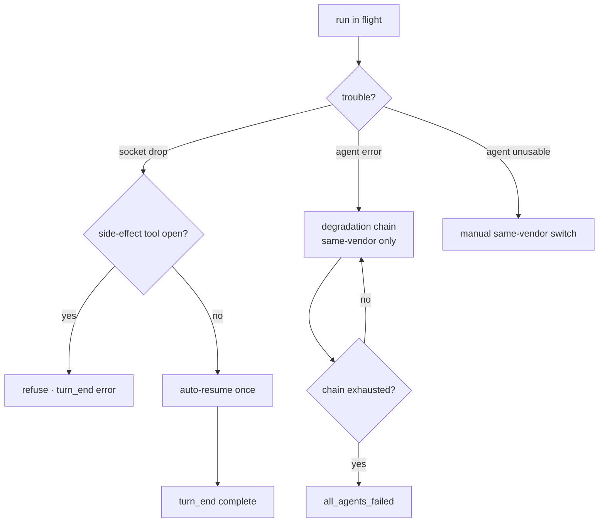

# Flow — 运行的韧性

**场景。** 运行途中传输断连、智能体故障或当前智能体不可用。c3 恢复上下文，或诚实失败；从不挂起。

**领域。** agent-session · agent-config · permission-gateway。

加固 [prompt → gated run](flow-prompt-to-gated-run.md)。断线不进降级链；team / intent 不自动 resume。

## 流程图

```mermaid
flowchart TD
    RUN[run in flight] --> D{trouble?}
    D -- socket drop --> GATE{side-effect tool open?}
    GATE -- yes --> ERR[refuse · turn_end error]
    GATE -- no --> RES[auto-resume once]
    RES --> OK[turn_end complete]
    D -- agent error --> CH[degradation chain<br/>same-vendor only]
    CH --> EXH{chain exhausted?}
    EXH -- no --> CH
    EXH -- yes --> AF[all_agents_failed]
    D -- agent unusable --> SW[manual same-vendor switch]
```

## 步骤

1. **agent-session — 套接字断连。** keepalive 默认降低断线率，与 resume 解耦（`AS-R20`）。未闭合的副作用工具则拒绝自动 resume（`AS-R19`）。普通会话对同一运行自动 resume 一次（状态 `reconnecting`）；拒绝、已用过、无真实 id、或 team / intent 则以 `turn_end` 错误结束，用户手动继续（`AS-R18`，[AVAIL-7](../non-functional/availability.md)）。
2. **agent-session → agent-config — 降级链。** 仅同厂商条目入链，跨厂商跳过且从不启动；每次回退开全新会话，不 resume。耗尽则 `all_agents_failed`（`AS-R22`、`AC-R19`）。内核事件不取代线上帧与运行循环（`AS-R25`）。
3. **web-console → agent-session — 手动切换。** `set_session_agent` 只改同厂商绑定，不立刻重跑；跨厂商拒绝。下一 `user_prompt` 用新智能体 resume 同一次运行（`AS-R23`、`AC-R17`、`AC-R19`）。

## 分支与异常

- **从不挂起。** 麻烦必达终态 `turn_end`（`AS-R18`，[AVAIL-1](../non-functional/availability.md)）。
- **可能写入则不自动 resume。** 宁可错过自动恢复，也不在副作用未闭合时续跑（`AS-R19`）。
- **每轮至多一次。** team / intent 不自动 resume（`AS-R18`）。
- **无跨厂商降级或切换。** 冻结厂商不可变（`AS-R22`、`AS-R23`、`AC-R17`）。
