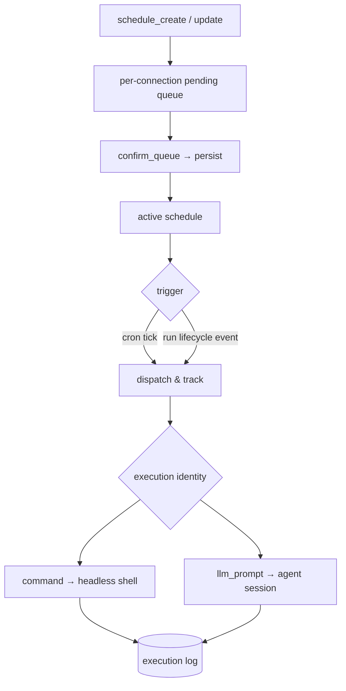

# Flow — Schedule Execution

**Scenario.** A schedule's trigger fires — a cron wall-clock match or a subscribed run-lifecycle
event — and c3 executes its task (a shell command or an LLM prompt) in the bound workspace's
context under the schedule's execution identity, recording the outcome in an execution log.

**Domains.** schedules · session-registry · agent-session (+ kernel event bus, ADR-0018).

Schedules are **workspace-scoped**: a schedule runs with its workspace's `cwd`, settings, sessions,
and agent config — like a user-initiated run from that workspace. The execution runs under the
**schedule's own** execution identity, not the creating user's (`SCH-R*` boundary). Writes flow
through a confirmation queue _before_ they take effect.

## Flow graph

## Write path — propose → confirm

1. **web-console → schedules.** Any mutation (`schedule_create` / `schedule_update` /
   `schedule_pause` / `schedule_resume`) is captured as a **pending change** in the per-connection
   write queue and is **not** yet persisted or scheduled (`SCH-R6`, `SCH-R15`).
2. **Confirm.** `schedule_confirm_queue` commits all pending changes atomically (`SCH-R6`). The
   queue is ephemeral — a refresh/reconnect loses it (`SCH-R15`).
3. **Exception.** `schedule_archive` / `schedule_delete` bypass the queue — immediate on a
   single-prompt confirmation (`SCH-R6`, `SCH-R14`); delete cascades the logs (hard delete).
4. **Validation.** A schedule must reference an existing workspace at create time (`SCH-R1`); task
   type is immutable `command | llm_prompt` (`SCH-R2`); an `event` trigger without an `eventTopic`
   is rejected (`SCH-R17`).

## Trigger path

A schedule's trigger is one of two (`SCH-R17`):

- **`cron`.** The 10 s tick loop matches `cronExpression` in the **system IANA time zone**
  (`SystemSettings.timezone`, DST-aware, `SCH-R3a`), then recomputes `nextRunAt`. Only `active`
  schedules are evaluated (`SCH-R5`).
- **`event`.** A `run:started` / `run:settled`, `pr:operation`, or `intent:lifecycle` kernel-bus event (published by the relevant domain on
  every run, ADR-0018) fires the schedule when **all** hold: the event's run `kind` is `session`
  (internal intent/discussion runs never fire user schedules), the workspace matches, and — for
  `run:settled` — the terminal `reason` passes the optional `eventReasonFilter` (`SCH-R18`). Event
  schedules carry no `cronExpression`/`nextRunAt` and are never tick-evaluated (`SCH-R17`).

Both reuse the **same** dispatch-and-track → execute path, three-tier execution identity, and write
queue (`SCH-R17`).

Intent lifecycle subscriptions match only the same workspace and, when configured, the selected
phase. The payload contains a stable intent identity, title, module, phase, and resulting status.
These events are process-local, best-effort, non-persistent, and never replayed. A schedule run does
not modify an intent and cannot publish another intent lifecycle event.

## Execution path

1. **Workspace check.** If the workspace was removed between create and trigger, the execution fails
   immediately with `workspace_removed` (`SCH-R8`); its `pending` log is set `failed` (`SCH-R10`).
2. **Serial per schedule.** At most one execution in-flight per schedule; a trigger firing while the
   previous run is still going is **skipped, not queued** — this also throttles event storms
   (`SCH-R7`, `SCH-R18`).
3. **`command` ⇒ headless shell.** A shell process spawns in the workspace `cwd`; stdout+stderr are
   captured; exit 0 ⇒ `success`, non-zero ⇒ `failed` (`SCH-R12`). No permission prompts.
4. **`llm_prompt` ⇒ agent session.** A fresh agent session starts via agent-session with the
   workspace context; the prompt is the first user turn. The agent `sessionId` is captured from the
   first SDK event and persisted on the log immediately (so the transcript stays reachable even if
   the run later fails). The run streams into the log; terminal `complete`/`error` maps to
   `success`/`failed` (`SCH-R13`). Vendor routing resolves the first enabled agent of
5. **Execution identity governs permissions (`SCH-R9`).** `read-only` ⇒ `plan`-equivalent, any write
   tool denied; `sandboxed` ⇒ a curated allowlist, off-list tools denied silently; `full-access` ⇒
   the workspace session's mode, all tools auto-allowed. **No `permission_request` ever reaches the
   browser for a schedule run** — prompts are resolved entirely server-side.

## Log & read path

- Execution logs are **append-only** once `startedAt` is set, advancing `pending → running →
success | failed | cancelled` (`SCH-R10`). A `schedules` broadcast on completion re-fetches the
  selected schedule's history so finished runs appear without a manual refresh.
- The three-column view (schedule list → execution-history list → execution detail) shows config,
  log rows, and a tabbed detail. The **Session** tab (llm only) replays the execution's transcript
  read-only through the shared chat-message renderer via `get_execution_transcript` (`SCH-R16`);
  a sessionless/command execution shows no Session tab and returns an empty replay, never an error.

## Branches & exceptions (anti-scenarios)

- **Confirm before effect.** A trigger time or command change must never take effect before the user
  confirms the queue — an accidental save must not cause a 3 AM run (`SCH-R6`).
- **Workspace deletion archives, never deletes silently.** Removing the workspace archives its
  schedules (logs preserved) and cancels in-flight executions (`SCH-R1`, `SCH-R8`).
- **No concurrent execution per schedule.** A second trigger during an in-flight run never starts a
  second concurrent execution (`SCH-R7`).
- **Archive/delete are final.** An archived schedule can only be deleted, never reactivated
  (`SCH-R14`); event/cron fields are mutually exclusive (`SCH-R17`).
