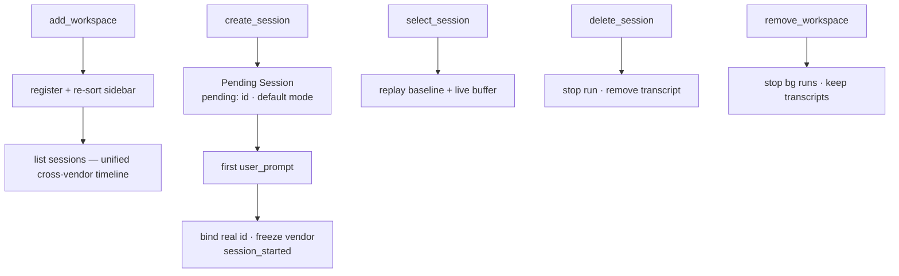

# Flow — Workspace & Session Lifecycle

**场景。** 用户管理侧边栏:注册一个项目目录、创建一个新会话、
选择一个既有会话(重放其历史)、重命名或删除它。一个新会话的首次运行
将其绑定到一个真实的 SDK id,并终身冻结其厂商。

**领域。** web-console · session-registry · agent-session · agent-config。

这个流程产出 [prompt → gated run](flow-prompt-to-gated-run.md) 所消费的**当前查看会话**。
它是纯粹的注册表/绑定工作 — 它绝不驱动 `query()`,也绝不停止一次运行。

## 流程图

## 添加一个工作区

1. **web-console → session-registry。** `add_workspace { path }`。一个非目录路径
   会被 `error` 拒绝,不改变任何东西(`SR-R1`)。
2. 该工作区被注册,侧边栏按 `lastAccessed` 降序重新排序(`SR-R2`,这
   一个现在是最新的),其会话列表被返回(`workspaces`、`sessions`)。
3. 会话从 `session_metadata` 投影中列出,按最新优先,一个统一的
   跨厂商时间线,按 `c3_id` 去重(`SR-R4`、`SR-R12`)。会话页面请求一个
   `sessionKind` 切片(work / intent / spec / discussion / automation / tool),并从同一个
   投影读取运行中的计数,必要时辅以领域存活状态;work、intent、spec、discussion
   和 automation 在本阶段是活跃的,而 tool 仍是一个占位标签页。Spec 行携带
   `ownerKind='intent'` / `ownerId=<intent.id>`,并跳回到意图详情的规格会话
   标签页。Discussion 行携带 `ownerKind='discussion'` / `ownerId=<discussion.id>`,
   并跳回到讨论页面,而不是作为可编辑工作会话打开。Automation 行携带
   `ownerKind='automation'` / `ownerId=<automation.id>`,并跳回到自动化页面。每一行
   都携带其所属的 `vendor` 标签、`state`、`sessionKind`,以及供客户端跳转用的
   可选 `ownerKind`/`ownerId`。该列表按 `last_modified`(`SR-R14`)**游标分页**:
   首次回复是最新页;"加载更多"通过一个 `{lastModified,
sessionId}` 的键集游标拉取下一个较旧的页;周期性刷新只重新拉取
   已展示的范围(`last_modified >= since`)。回复的 `page.kind` 告诉客户端
   如何合并它(`first`/`older`/`window`/`live`)。

## 创建 → 绑定一个会话

1. **web-console → session-registry。** `create_session`(可选带 `{ agentId }`)
   使一个**待定会话**成为当前查看的会话:空历史,一个 `pending:` id,按厂商的
   默认模式(`SR-R6`、`AC-R8`)。一个 `agentId` 被记录为该会话的**意向**
   (`AC-R18`、`AC-R6`);缺失 ⇒ Auto(运行时解析 `defaultAgentId`)。它不在磁盘上,
   也不停止任何其他运行。
2. **首次 `user_prompt`** 启动该运行([prompt → gated run](flow-prompt-to-gated-run.md))。
3. **agent-session → session-registry → agent-config。** 该次运行的 `init` 把 `pending:` id
   绑定到真实的 SDK `sessionId`(`SR-R7`、`AS-R10`):注册表把模式持久化到
   该真实 id 下,运行时重新加键,而待定的**意向变为事实**,其**厂商被冻结**
   (`AC-R16`)。`session_started` 被发出;投影被打上绑定时间的戳,使该行
   排到**最上面**(`SR-R13`)。投影在绑定后写入 `session_kind='work'` 和
   `bound=1`;手动会话保持 owner 为 null,而由意图启动的开发会话被
   回链上 `owner_kind='intent'` 和该意图 id。一个从未运行过的待定会话保持
   一个仅工作类型的 `bound=0` 占位符,7 天后被回收(`AC-R17`)。

## 选择/查看一个会话

1. **web-console → session-registry。** `select_session` 使其成为当前查看的会话,
   并重放其完整记录:`session_selected.history`(磁盘上的基线)+ 运行时
   实时缓冲的尾部,对应任何进行中/后台的轮次(`SR-R8`)。它报告存储的模式
   与权威的运行时 `status`,使输入框立即锁定(`SR-R8`)。它不停止任何运行(`AS-R8`)。
2. **Codex 本地重放。** 一个被追踪的 Codex 会话(`read: 'full'`)从
   `~/.codex/sessions/` 重放其本地 JSONL 基线,加上运行时实时缓冲的尾部
   (`SR-R8`)。未知的 Codex JSONL 事件形态会被跳过,而不是使会话选择失败。
3. **选择另一个会话**会取消订阅旧视图,订阅新视图;旧运行在后台继续
   运行(`SR-R8`、`AS-R8`)。

## 重命名/删除/移除

- **rename_session** 只更新标题。服务端**不**推回会话列表
  (`SR-R14`):发起操作的客户端乐观地更新该行的标题;其他客户端在其
  下一次 `since` 刷新时获取更新。
- **delete_session** 停止该会话的运行,通过 SDK 移除转录,删除其模式
  条目,并在它是被查看/最后活动的会话时清除它(`SR-R9`)。它也**不**
  推送列表(`SR-R14`,以避免破坏一个已加载更多的窗口);发起操作的客户端
  乐观地丢弃该行。
- **remove_workspace** 取消注册该目录,并停止其下任何后台运行,但
  **绝不**删除磁盘上的转录(`SR-R10`);其中一个被查看的会话会被清除。

## 分支与例外(反场景)

- **每会话模式隔离。** 更改会话 A 的模式绝不能改变 B 的模式(`SR-R5`)。
- **切换/创建绝不停止一次运行。** `select_session` / `create_session` 绝不能停止
  另一个会话的运行(`SR-R6`/`SR-R8`、`AS-R8`)。
- **厂商一旦冻结即不可变。** 重新定向一个真实会话的智能体只有在
  同厂商内才能成功;跨厂商变更会被拒绝(`AC-R17`) — 其转录只存在于
  那个厂商的原生存储中。
- **不持久化权限状态。** 只有工作区/会话元数据被持久化;决策与
  批准从不持久化(`SR-R11`,ADR-0004/0001)。
- **移除 ≠ 删除。** `remove_workspace` 保留磁盘上的会话(`SR-R10`)。
