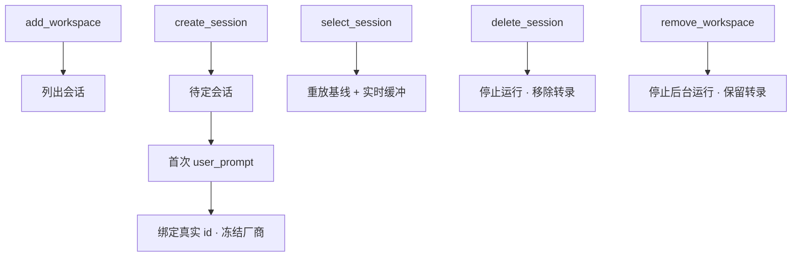

# Flow — 工作区与会话生命周期

**场景。** 登记项目目录；创建、选择、重命名或删除会话。新会话的首次提示词绑定真实 id，并冻结厂商。

**领域。** web-console · session-registry · agent-session · agent-config。

产出 [prompt → gated run](flow-prompt-to-gated-run.md) 所消费的当前查看会话。本流程只做登记与绑定，不驱动受门控运行循环。

## 流程图

```mermaid
flowchart TD
    AW[add_workspace] --> LS[列出会话]
    CS[create_session] --> PEND[待定会话]
    PEND --> UP[首次 user_prompt]
    UP --> BIND[绑定真实 id · 冻结厂商]
    SEL[select_session] --> REPLAY[重放基线 + 实时缓冲]
    DEL[delete_session] --> STOP[停止运行 · 移除转录]
    RW[remove_workspace] --> ARCH[停止后台运行 · 保留转录]
```

## 步骤

1. **web-console → session-registry。** `add_workspace` 登记已存在的目录；非目录以 `error` 拒绝且无变更（`SR-R1`）。工作区按最近访问排序（`SR-R2`）。列出该工作区已跟踪会话，跨厂商一条时间线（`SR-R4`、`SR-R12`）。
2. **web-console → session-registry。** `create_session` 把待定会话设为当前查看：空历史、按厂商默认模式（`SR-R6`、`AC-R8`）。可指定智能体为意图，省略则 Auto（`AC-R18`、`AC-R6`）。不停止其他运行。
3. **首次 `user_prompt`** 启动运行，见 [prompt → gated run](flow-prompt-to-gated-run.md)。**agent-session → session-registry → agent-config。** 首次运行把待定会话绑到真实 id，发出 `session_started`，意向固化为事实并冻结厂商（`SR-R7`、`AS-R10`、`AC-R16`）。
4. **web-console → session-registry。** `select_session` 设为当前查看，重放原生存储基线加上 runtime 实时缓冲（`SR-R8`）。不停止运行（`AS-R8`）。切到另一会话只换本连接的视图。
5. **rename_session** 只改标题。**delete_session** 停止该会话运行，并按厂商能力移除转录与模式（`SR-R9`）。**remove_workspace** 取消登记并停止其下后台运行，不删除磁盘转录；已查看会话清除（`SR-R10`）。

## 分支与异常

- **模式按会话隔离。** 改 A 不影响 B（`SR-R5`）。
- **切换/创建不停止运行。** 本流程仅 `delete_session` 与 `remove_workspace` 停止运行（`SR-R6`、`SR-R8`、`AS-R6`、`AS-R8`）。
- **厂商冻结后不可变。** 同厂商可换绑，跨厂商拒绝（`AC-R17`）。
- **不持久化权限决策。** 只持久化工作区与会话元数据（`SR-R11`）。
- **移除 ≠ 删除。** `remove_workspace` 保留磁盘上的会话（`SR-R10`）。
