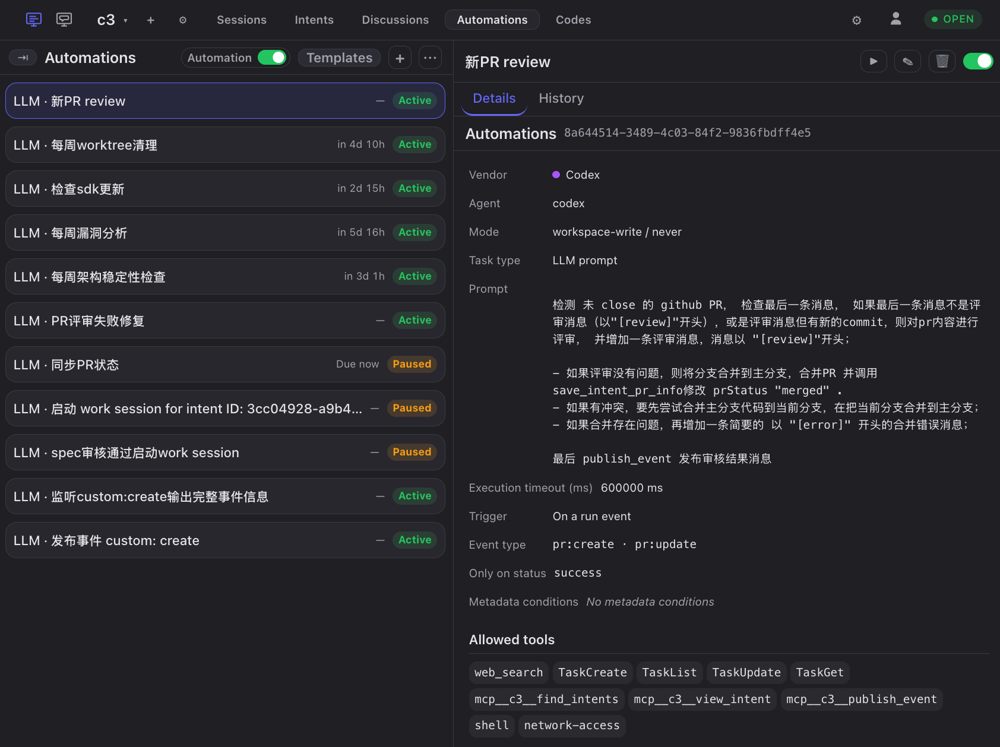
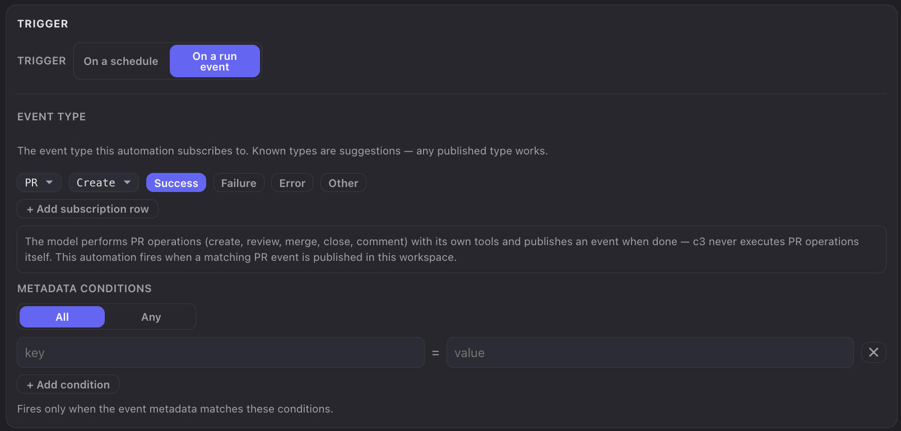

# Automation Engineering

Agents can already complete individual tasks independently. But between "finishing one task" and "running an entire pipeline" there is still a person: every handoff and every round of rework requires someone to click the next button. **Automation engineering** addresses this gap. It uses **event-driven execution and schedules** as the foundation, connects agents into **workflows**, and then closes those workflows into **loops** that converge on a verified result by themselves. People only step in where a decision is actually needed.

> We recommend reading the [c3 Getting Started Guide](c3-get-start.md) first. This guide frequently uses [intents](requirement-to-intent.md) and [SDD](sdd.md) as examples, but automation itself does not depend on either.

---

## 1. What is automation engineering?

### Background: people have become the slowest part of the pipeline

When development, testing, review, release, and other stages are all handled by agents, several problems emerge:

1. **Every handoff requires a person.** An agent stops after finishing its part. It does not know who should take over, nor can it hand the work off by itself. Someone must manually start a review after a development session or trigger verification after a PR is created. The person becomes the only connector between agents.
2. **A one-off conversation is not engineering.** Asking an agent to "run the tests and fix any failures" may work once, but you must ask again next time. It is neither repeatable nor reusable or observable. Engineering means a process can be repeated, inspected, and improved.
3. **Quality convergence is naturally a loop, and manually driving it is expensive.** Real development follows "develop → verify → find problems → fix → verify again" until everything passes. If a person must decide whether each round passed and who should take over, the most mechanical part of the process consumes the most attention.
4. **Routine work should not consume human attention.** Dependency checks, PR reconciliation, security scans, stale-branch cleanup, and weekly architecture reviews have clear schedules and criteria, yet still occupy calendars and reminders.

### Three progressive layers

Automation engineering is more than writing a few scheduled scripts. It is a bottom-up structure with three layers:

```text
Layer 3  Loop Engineering       ┌─► Develop ──► Verify ──┐
         Close the workflow     └────── Fix ◄────────────┘  until convergence
                                        ▲
Layer 2  Workflow                      │
         Connect agents          A finishes ─event─► B continues ─event─► C
                                        ▲
Layer 1  Trigger foundation             │
         Schedules + events       ⏰ time arrives     📣 something happens
```

1. **Foundation** — answers "when should something happen?" The two trigger sources are **schedules**, which start routine work at a specified time, and **events**, which start handoffs and loops when something happens.
2. **Workflow** — answers "when one agent finishes, who continues?" The upstream stage publishes an event, and a downstream stage subscribes and takes over automatically. The upstream stage does not need to know who the downstream stage is. Events decouple them, so stages can be added or removed without changing existing ones.
3. **Loop engineering** — answers "how can the process converge by itself?" When downstream output can trigger an upstream stage again, the workflow becomes a loop. "Develop → verify → fix → verify again" can continue until verification passes or an exit condition is reached. A person changes from participating in every round to appearing only when the loop cannot make progress.

### Benefits

1. **Decoupling.** Upstream reports what happened; downstream decides whether to respond. Adding a stage only requires another subscription.
2. **Reuse.** Define an automation once, and it runs by the same standard whenever its conditions are met.
3. **Observability.** Every trigger leaves a record of when and why it ran, what the agent did, and how it ended.
4. **Convergence.** Loops make additional iterations nearly free, allowing quality to improve through repeated verification.
5. **People return to the right role.** They design pipelines and resolve exceptional decisions instead of acting as the handoff mechanism.

### Suitable and unsuitable cases

**Good candidates for automation:**

- **Handoffs with explicit trigger conditions** — review after development, checks after PR creation, or documentation updates after an intent is completed;
- **Loops with machine-verifiable pass criteria** — tests can pass or fail, and lint can be clean or report problems;
- **Periodic routine work** — checks, reconciliation, scans, cleanup, and weekly reports;
- **Actions that need an audit trail** — each execution must show what triggered it and what it did.

**Poor candidates for automation:**

- **Work without a clear decision standard** — automation only amplifies an ambiguous judgment when there is no machine-verifiable success condition;
- **Irreversible, high-risk operations** — directly changing production data, releasing, or merging to the main branch, unless permission modes and the tool allowlist tightly constrain the operation;
- **One-time work** — when defining the automation costs more than performing the task once.

**Automation is supervised, not inherently unattended.** Sensitive operations still go through the normal permission flow. If nobody responds, the execution waits. For genuinely unattended execution, use the **permission mode** and **allowed tools** to authorize the required capabilities in advance. This is explicit, bounded authorization—not a blanket approval.

---

## 2. Automation engineering in c3

In c3, automations are organized by **workspace**. Each automation belongs to exactly one workspace and uses that workspace's directory, project settings, and agent configuration, just like a run you start there yourself.

### Prerequisites

- Complete installation and startup in the [c3 Getting Started Guide](c3-get-start.md), and create a workspace that points to your project directory.
- Configure at least one available agent for LLM-based automations.

### 1. Foundation: what an automation contains

Open **Automations** from the left navigation. The page has an automation list on the left and **Details** and **History** tabs for the selected item on the right. Click **+** to create an automation. The form has five sections:



| Section                                | Configuration                                                                                                       |
| -------------------------------------- | ------------------------------------------------------------------------------------------------------------------- |
| **Basic information**                  | Title (generated when left blank), task type (command or LLM prompt), command or prompt body, and execution timeout |
| **Trigger**                            | Schedule or run event, with its schedule or event subscription conditions                                           |
| **Labels**                             | Free-form key-value metadata used to label the automation                                                           |
| **Execution identity and permissions** | Vendor, agent, and permission mode                                                                                  |
| **Tool permissions**                   | Tools allowed for the run, divided into read-only and write groups, with select-all and clear-all actions           |

Several fields deserve special attention:

- **Task type** is either **Command** (run a shell command in the workspace, capture stdout/stderr, and fail on a nonzero exit code) or **LLM prompt** (start an agent session in the workspace and use the prompt as its first input; the session ends when that turn ends). **The type cannot be changed after creation.**
- **Execution timeout** is the maximum wall-clock duration of one execution. Leaving it blank uses the default: 30 seconds for commands and 60 seconds for LLM prompts. An explicit value can range from 1 second to 24 hours. **Always increase it explicitly for tests and builds**, or they may be marked failed due to timeout.
- **Permission mode and allowed tools** jointly define the execution boundary. Read-only inspections should receive only read tools; grant write tools only when the task must change code. For unattended runs, the tool list is the upper bound of what the automation can do.

The top-right of the list also has a workspace-wide **Enable automations** switch. Turning it off silences **all schedule and event triggers** in the workspace: nothing is queued or replayed later. Individual enabled/paused states remain unchanged, and **Run now** remains available. This is a useful master switch while investigating problems.

> The **Templates** menu includes ready-made automations for PR status reconciliation, weekly architecture stability checks, weekly vulnerability analysis, and stale worktree cleanup. The **⋯** menu supports JSON **import/export** for copying a pipeline to another workspace. Imported automations are always created in the **paused** state and must be reviewed individually before being enabled.

### 2. Schedule triggers: the entry point for routine work

Select **On a schedule** to configure a visual schedule: choose a **frequency** (every N minutes, every N hours, daily, or weekly with selected weekdays) and a **time**. The form previews the generated cron expression and the **next run**, while each list row shows a countdown.

Important rules:

- **Schedules use the system time zone.** Cron expressions are interpreted using the time zone in system settings, such as `Asia/Shanghai`, rather than UTC, and account for daylight saving time.
- **Each automation runs serially.** If the previous execution is still running, a new trigger is **skipped**, not queued.
- **Old missed runs are not replayed.** If service downtime makes a trigger more than five minutes late, c3 records a failure and calculates the next run from the current time.
- **You can always run it manually.** **Run now** starts one execution without affecting the schedule or enabled state. It also works for paused automations and is the primary debugging tool.

### 3. Event triggers: the entry point for handoffs and loops

Select **On a run event** to configure event subscriptions. This is the core mechanism of automation engineering.

#### Event structure

c3 event names use `<category>:<action>` and may also carry a `status` (the outcome) and `metadata` (additional context). Known event types include:

**`run` — run lifecycle**

- Types: `run:started` and `run:settled`
- Status: only `run:settled` has one—completed, errored, or aborted
- Published by c3 for the start and end of every run

**`pr` — PR operations**

- Types: `pr:create`, `pr:review`, `pr:merge`, `pr:close`, `pr:comment`, and `pr:update`
- Status: success, failure, or error. Error means the operation itself failed, such as a CI timeout or tool error, rather than a review simply not passing.
- Published by agents after they perform PR operations; c3 also publishes `pr:create` after successfully creating a PR itself

**`intent` — intent lifecycle**

- Types: `intent:created`, `intent:dev_started`, `intent:done`, `intent:failed`, `intent:cancelled`, and `intent:spec_approve`
- Status: none
- Published by c3 at intent lifecycle milestones

Two details are critical:

- **Event types are open-ended, not a closed enum.** The cascading selector suggests known categories and actions, but each level has an **Other** option. Agents can publish custom events such as `custom:verify`, and automations can subscribe to them. This is the primary extension point for defining your own pipeline semantics.
- A category wildcard such as **`pr:*` or `intent:*` matches every action in that category**. Wildcards are supported only at the category level.

For PR events, remember that **c3 does not itself perform PR operations**. Agents create, review, merge, close, or comment using their own tools, such as the `gh` CLI or GitHub MCP, and then call c3's MCP tool to publish a PR event. **No published event means no trigger.** Tell upstream agents explicitly to publish an event after completing the operation.

#### Subscription conditions

An automation can have **multiple subscription rows, combined with OR**: any matching row triggers it. Each row contains three dimensions:

1. **Event type** — category and action; selecting all actions creates a wildcard;
2. **Status filter** — accepts multiple values; **empty means any status**, while a nonempty filter requires an exact, case-sensitive match;
3. **Metadata conditions** — key-value conditions combined with **all (AND)** or **any (OR)**; empty means no metadata filtering. Values use exact matches without case folding, regular expressions, or substring matching.

Subscriptions to `run:started` or `run:settled` also offer a **session type** multi-select: work, intent, discussion, automation, consensus, tool, or specification. **Empty means all session types.**

> Session type is both a filter that prevents discussion runs from triggering development workflows and the switch that makes loops possible. **Automation is itself a session type**; selecting it allows one automation's completion to trigger another.

Matching follows a fixed order: **workspace → session type (only for run events when nonempty) → event type → status → metadata**. A mismatch at any stage prevents the trigger.



### 4. Workflow: let another agent continue automatically

With the event foundation in place, a workflow is simply "upstream publishes, downstream subscribes." The upstream stage does not need to know the downstream stage exists.

#### Example 1: completed development session → automatic code review

| Setting          | Value                                                                               |
| ---------------- | ----------------------------------------------------------------------------------- |
| Trigger          | Run event                                                                           |
| Event type       | `run:settled`                                                                       |
| Status           | Completed, avoiding meaningless reviews for errored or aborted runs                 |
| Session type     | Work                                                                                |
| Task type        | LLM prompt                                                                          |
| Prompt           | Review the changes produced by this work session and list issues and suggestions... |
| Tool permissions | Read-only tools only                                                                |

#### Example 2: PR created successfully → automatic review

| Setting    | Value                                                                            |
| ---------- | -------------------------------------------------------------------------------- |
| Event type | `pr:create`                                                                      |
| Status     | Success                                                                          |
| Task type  | LLM prompt                                                                       |
| Prompt     | Review this PR and provide a verdict; publish a PR review event when finished... |

#### Example 3: intent completed → synchronize documentation

| Setting    | Value                                                                                                 |
| ---------- | ----------------------------------------------------------------------------------------------------- |
| Event type | `intent:done`                                                                                         |
| Prompt     | Review and update the documentation affected by this intent, keeping it synchronized with the code... |

#### Give the downstream agent the triggering event

How does the agent in example 3 know which intent "this intent" refers to? With an **event trigger and LLM prompt**, the form displays **Embed triggering event in prompt**. When selected, c3 serializes the complete matching event—type, status, description, metadata, and data—and appends it to the prompt, explicitly marking it as data rather than new instructions. The downstream agent receives context such as an intent ID, PR number, or failure summary without hardcoding it.

> The event is added only to that execution and does not modify the saved configuration. It consumes extra tokens, so enable it only when the downstream task needs the event content.

#### Directed handoffs with labels

As the workspace gains more automations, broadcasting every completed work session to every downstream stage creates noise. Use **labels (metadata)** to target handoffs:

- Add a key-value pair to the upstream automation's **Labels**, such as `stage = build`.
- c3 adds those labels to run events produced by that automation.
- Add `stage = build` to the downstream subscription's metadata conditions.

Multiple independent pipelines can then share the same `run:settled` stream. **Labels appear only on run events produced by that automation.** Manually started work sessions and discussions do not carry them and therefore cannot match nonempty metadata conditions.

### 5. Loop engineering: close the workflow

A workflow becomes a loop when downstream completion triggers an upstream stage again. The key mechanism is simple: **automation runs also publish `run:started` and `run:settled`, with the session type Automation**. Include Automation in a subscription so A can trigger B and B can trigger A.

#### A develop → verify → fix loop

Build it with three automations, starting when a development session ends:

**A · Verify**

- Trigger: `run:settled`; status = completed; session type = **Work + Automation**; metadata `stage = fix` where applicable
- LLM task: run tests and lint. If everything passes, publish `custom:verify` with status `success`; otherwise publish it with status `failure` and include a failure summary
- Label: `stage = verify`

**B · Fix**

- Trigger: `custom:verify` with status `failure`; embed the triggering event in the prompt
- LLM task: diagnose and fix the attached failures, then commit
- Label: `stage = fix`

**C · Finish**

- Trigger: `custom:verify` with status `success`
- LLM task: summarize the result, create or update the PR, and publish a PR event
- Label: `stage = done`

```text
Development ends ──► A Verify ──failure──► B Fix ──completed──► A Verify ──► …
                         │
                         └──success──► C Finish (exit loop)
```

Notice that A reports its business result through `custom:verify`, not the run event's status. `run:settled` describes whether the execution ended normally, not whether tests passed. A verification task can complete successfully even when every test fails. Use a custom business event to express the actual outcome.

#### Every loop needs brakes

**c3 does not detect cycles or limit chain depth.** Whether a loop stops depends entirely on its design. Apply all of these safeguards:

1. **Put exit conditions in the prompt.** For example: "If this failure already appeared earlier in this cycle, or three fix attempts have been made, stop fixing and publish `custom:verify` with status `stuck`." c3 has no round counter, so the agent must maintain one in an agreed temporary file or PR comment.
2. **Provide an exit for `stuck`.** Add an automation that summarizes `custom:verify` events with status `stuck`, or leave them unhandled so the loop stops for human inspection. Never route `stuck` back into fixing.
3. **Branch on status and prevent self-triggering.** In the example, A accepts only `stage=fix` or work sessions, while B accepts only `failure`. **Any subscription broad enough to match events produced by the same automation creates an infinite loop.** Review every automation's output events against its own conditions.
4. **Set execution timeouts.** Give every automation an explicit maximum duration.
5. **Use serial execution as a fallback.** New events are skipped while the same automation is running, preventing event backlogs. This prevents stacking, **not looping**; a slow cycle can still run forever.
6. **Keep the master switch available.** If something goes wrong, turn off **Enable automations** to silence all schedule and event triggers immediately, without later replay.

#### Observe the loop

- **Execution history** — open **History**, then browse an execution record. It shows execution information (status, start/end time, duration, exit code, output, and error), a read-only session replay for LLM tasks, and command logs for command tasks. A running execution refreshes automatically.
- **Automation tab on the Works page** — automation sessions appear here with live run state and messages. They are read-only.

### 6. End to end: build a pipeline from scratch

For "verify automatically after development, and fix automatically on failure":

1. **Run it manually first.** Ask an agent in a normal work session to run the tests and confirm the command, directory, and dependencies work.
2. **Create the Verify automation.** Choose an LLM prompt and state what to run, what passing means, and how to publish the result. Initially use a schedule far in the future instead of an event trigger. Set an explicit timeout and grant only required tools.
3. **Debug with Run now.** Inspect the session record and confirm it ran the tests and published the agreed event. Refine the prompt until this is reliable.
4. **Connect the event trigger.** Change the trigger to `run:settled`, status completed, session type Work. Run a real development session and confirm the automation starts.
5. **Create the Fix automation.** Subscribe to `custom:verify` with status `failure`, embed the event, and clearly define the fix scope and exit conditions.
6. **Close the loop.** Add Automation to Verify's session types and use metadata so it accepts only `stage=fix`.
7. **Install the brakes before letting go.** Review all six safeguards above and observe several rounds in a low-risk workspace before wider use.

---

## FAQ

**Q: Can a loop run out of control or damage my code?**

A: c3 does not detect cycles, so stopping depends on your exit conditions, status branches, timeouts, and master switch. The boundary for code changes is the **permission mode and allowed tools**. Without write tools, the automation cannot edit code. Follow least privilege.

**Q: I configured an event trigger, but it never runs.**

A: Check in matching order: the workspace master switch; the automation's paused state; the case-sensitive `<category>:<action>` event type; exact status matching (try clearing it); the real session type; exact metadata matching and the rule that only an automation's own run events carry its labels; and, for PR events, whether the upstream agent actually published the event. **c3 does not poll PR state.**

**Q: Can an automation trigger itself?**

A: Mechanically, yes—its own run publishes events. **This is almost always a configuration error.** Use status or metadata conditions to exclude its own output.

**Q: Are missed scheduled runs replayed?**

A: Runs more than five minutes late are not replayed. c3 records a failure and recalculates the next run. Triggers silenced by the workspace master switch are not considered missed and are never replayed.

**Q: Who answers permission requests during automation execution?**

A: Someone must answer in the browser, or the execution waits until it times out. For unattended operation, pre-authorize only the required capabilities through the **permission mode** and **allowed tools**.

**Q: Should I use a command or an LLM prompt?**

A: Ask whether the result requires understanding. Use a **command** for builds, cleanup, and exports with deterministic success criteria; it is faster, cheaper, and more predictable. Use an **LLM prompt** when the task must read code, make judgments, or write content. They can also be combined: a command runs the work and an LLM interprets it.

**Q: Why does my verification task always time out?**

A: The default LLM timeout is only 60 seconds, which is usually insufficient for tests. Set an explicit **execution timeout**, up to 24 hours.

**Q: How can I temporarily stop every automation?**

A: Turn off **Enable automations** in the automation list header. It silences all schedule and event triggers in the workspace while preserving individual enabled states and keeping **Run now** available.

## References

- [c3 Getting Started Guide](c3-get-start.md)
- [From Requirements to Intents](requirement-to-intent.md)
- [Spec-Driven Development (SDD)](sdd.md)
- [Multi-agent Consensus](multi-agent-consensus.md)
