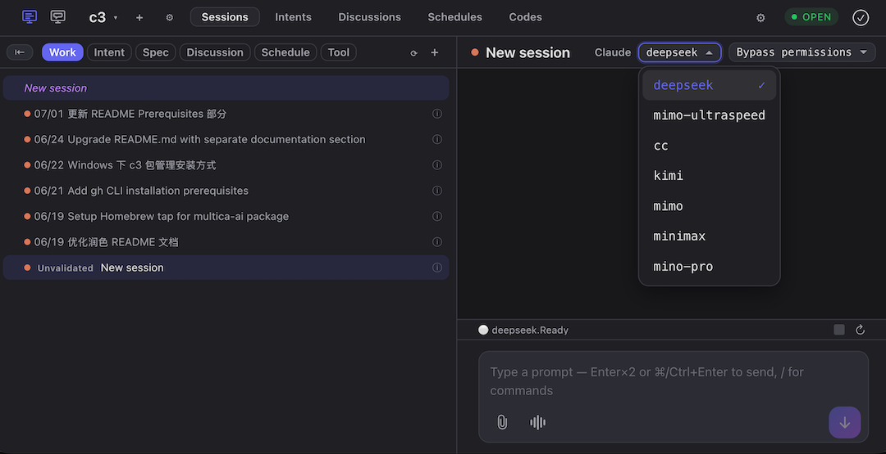

# c3 Getting Started Guide

## What is c3

c3 (Code Creative Center) is an AI coding platform that gives Claude Code a browser-based permission console. Every time an agent is about to perform a sensitive operation (write a file, edit code, run a shell command), an approval panel pops up in your browser tab showing exactly which tool is involved and what the input is, and you choose to allow or deny — no more mixing approvals into terminal prompts.

Beyond permission control, c3 also brings the following capabilities into your software engineering process:

- Intent management — express an idea in natural language, and c3 breaks it down into structured intents, each with a clear scope, dependencies, and verifiable completion criteria
- Automation loops — planning, implementation, and verification run automatically as a repeatable, auditable process
- Multi-agent discussions — let several AI perspectives collide and converge on an approach before coding starts
- Consensus voting — critical decisions are gated by a multi-agent vote
- Worktree isolation — parallel tasks run in isolated git worktrees
- Sandboxed execution — untrusted code runs in a restricted environment
- Circuit breaker — automatic token rate limiting and recovery for agents
- Schedules — long-running or periodic work advances on its own
- Native SDD support — spec-driven development as a first-class workflow




---

## Prerequisites

### Optional tools

The following tools are not required, but if you use the matching code hosting platform, installing them gives you better Git integration:

- GitHub CLI — `brew install gh`, or visit [cli.github.com](https://cli.github.com/)
- GitLab CLI — `brew install glab`, or visit [gitlab.com/gitlab-org/cli](https://gitlab.com/gitlab-org/cli)

---

## Installation

Pick whichever method suits you.

Homebrew (recommended on macOS / Linux):

```bash
brew install sequencestream/tap/c3
```

Install script (macOS / Linux):

```bash
curl -fsSL https://raw.githubusercontent.com/sequencestream/c3/main/install.sh | sh
```

Installs into `~/.local/bin`. Use `C3_INSTALL_DIR` to customize the directory and `C3_VERSION` to pin a version.

Install script (Windows PowerShell):

```powershell
irm https://raw.githubusercontent.com/sequencestream/c3/main/install.ps1 | iex
```

Installs into `%LOCALAPPDATA%\c3\bin`.

Manual download:

Download the archive for your platform from the [releases page](https://github.com/sequencestream/c3/releases/), extract it, and run:

```bash
tar -xzvf c3-cli-v0.8.0-macos-arm64.tar.gz
./c3 --port 9000
```

First launch on macOS: a manually downloaded app may trigger an "unverified developer" warning. Go to System Settings → Privacy & Security, find c3, and click "Open Anyway". Homebrew installs do not hit this issue.

---

## Upgrading

```bash
c3 upgrade              # download the latest version and replace the binary (does not restart the process)
c3 upgrade --check      # only compare version numbers
c3 upgrade --force      # reinstall the current version
```

After upgrading, run `c3 restart`, or quit and start again, to load the new version.

Other options: `brew upgrade c3` (Homebrew), or re-run the install script.

---

## Starting c3

```bash
c3 --port 9000
```

Open http://localhost:9000 in your browser.

| Scenario                   | Command                         |
| -------------------------- | ------------------------------- |
| Run in the background      | `c3 --port 9000 --daemon`       |
| OS service (start at boot) | `c3 install --port 9000`        |
| Show help                  | `c3 --help` / `c3 start --help` |

`c3 --port 9000` is shorthand for `c3 start --port 9000`.

---

## Configuring agents

c3 drives coding work through agents. On first launch, c3 automatically creates a default `claude` agent that uses your local Claude Code configuration and login state.

### Viewing and configuring

1. Open http://localhost:9000 in your browser
2. Click the Settings button in the top-right corner
3. Under the Agent configuration you will see the existing `claude` agent

### Adding a custom agent

On the Settings page you can add more agents, for example to point at a different model or API endpoint:

| Field       | Description                                                         |
| ----------- | ------------------------------------------------------------------- |
| Name        | Display name, e.g. "Claude Sonnet"                                  |
| Vendor      | `claude` (uses Claude Code) or `codex`                              |
| Config mode | `system` (use the local CLI configuration) or `custom` (custom API) |
| Base URL    | Custom API endpoint (custom mode only)                              |
| API Key     | API key (custom mode only)                                          |
| Model       | Model name (custom mode only)                                       |

If you only use your local Claude Code default configuration, you do not need to add an agent — the default one created automatically works out of the box.

---

## Your first run: a minimal end-to-end flow

### Step 1: Start c3

```bash
c3 --port 9000
```

When the terminal prints `c3 running at http://localhost:9000`, startup succeeded.

### Step 2: Open the browser

Visit http://localhost:9000 to enter the c3 UI.

### Step 3: Create a workspace

Click New Workspace, give it a name (for example `hello-c3`), and point the directory at the project folder you want c3 to work on. After creation you enter the workspace automatically.

### Step 4: Create a session

Click New Session, then select it to open the conversation view.

### Step 5: Enter a requirement

Describe your idea in natural language in the input box at the bottom, for example:

> Analyze the current project directory and generate a README.md describing the project's purpose and structure.

### Step 6: Watch the agent run

Once c3 launches the agent, you will see in real time:

- Assistant messages streaming in token by token
- Tool calls — reading files, writing files, running commands, every step shown in the UI
- Permission requests — sensitive operations (`Write`, `Edit`, `Bash`, and so on) open an approval panel where you choose Allow or Deny

### Step 7: Check the result

When the task finishes, review the final result in the UI, or find the generated code files in your project directory.

### The whole flow at a glance

```
install → start c3 → open the browser → create a workspace → create a session
    → enter a requirement → watch it run → approve tool calls → done
```

For your first run, pick a small requirement (such as generating a README) — the whole flow takes a minute or two. After that you can explore advanced features such as [intent management](requirement-to-intent.md) (breaking complex requirements into a trackable task list), multi-agent discussions, and schedules.

---

## FAQ

**Q: I get `command not found` when starting c3.**

A: Homebrew installs add the PATH automatically; the script installs into `~/.local/bin`, so add it manually:

```bash
export PATH="$HOME/.local/bin:$PATH"
```

Write it into `~/.zshrc` to make it permanent.

**Q: macOS warns about an "unverified developer".**

A: Go to System Settings → Privacy & Security, find c3, and click "Open Anyway".

**Q: Do I need to restart after upgrading?**

A: Yes. `c3 upgrade` only replaces the binary. After upgrading, run `c3 restart`, or quit and start again.

**Q: How do I stop c3?**

- Running in the foreground: `Ctrl+C`
- Running in the background / as an OS service: `c3 stop`

**Q: How does c3 relate to Claude Code?**

A: c3 wraps the Claude Code SDK, moves terminal permission prompts into the browser, and adds engineering capabilities such as intent management, discussions, and schedules. Claude Code's login state is independent of c3.

---

> Sync note: the installation, upgrade, and startup commands in this document take the English README as their source of truth. When the README changes, this document should be updated to match.
