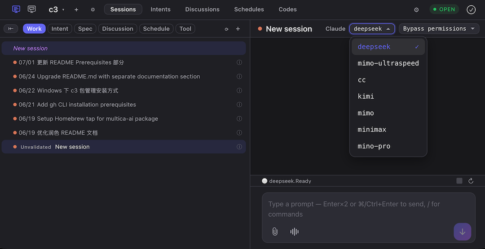
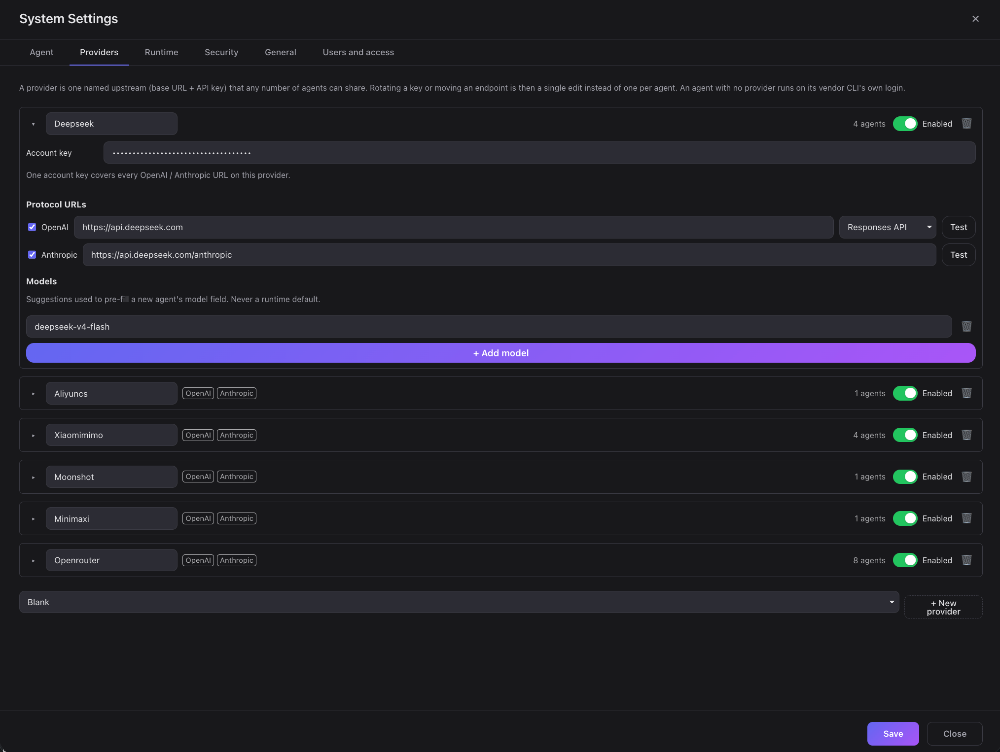

# c3 Getting Started Guide

## What is c3

c3 (Code Creative Center) is an **AI workbench**: one browser UI that centrally manages and drives multiple AI coding agents (Claude Code, Codex, Cursor, and more). Every time an agent is about to perform a sensitive operation (write a file, edit code, run a command), an approval panel pops up in your browser showing exactly which tool is involved and what the input is, and you choose to allow or deny — no more mixing approvals into terminal prompts.

Beyond permission control, c3 also brings the following capabilities into your software engineering process:

- **Intents** — express an idea in natural language, break it into verifiable tracked items, then drive spec, development, and PRs
- **Intent queue** — intents marked `automate` develop in priority and dependency order; failures back off and park
- **Spec-driven development (SDD)** — write a spec, run a read-only review, get human (or optional machine) approval, then code
- **Delivery** — a batch of intents integrates on a delivery branch; after verification, one delivery PR takes it to the mainline
- **Multi-agent discussions** — let several AI perspectives collide and converge on an approach before coding starts
- **Consensus voting** — critical permission decisions can be voted on by multiple agents first, falling back to you when they cannot agree
- **Automations** — run command or agent work on a schedule or on system events
- **Worktree isolation** — parallel tasks run in isolated git worktrees (the workspace default)
- **Sandboxed runs** — opted-in sessions run in process-level isolation; if the driver is unavailable the run fails instead of going unsandboxed
- **Workcenter** — a cross-workspace dashboard and notification inbox for answering permission prompts in one place
- **Chat robots** — `@` an agent in a Feishu group, c3 runs one unattended turn, and only the final answer goes back to the chat
- **External MCP** — let your own agents or CI reach this deployment with a long-lived key, scoped to the workspaces you grant




---

## Prerequisites

### Optional tools

The following tools are not required, but if you use the matching code hosting platform, installing them gives you better Git integration:

- GitHub CLI — `brew install gh`, or visit [cli.github.com](https://cli.github.com/)
- GitLab CLI — `brew install glab`, or visit [gitlab.com/gitlab-org/cli](https://gitlab.com/gitlab-org/cli)

---

## Installation

Pick whichever method suits you.

### CLI single binary

Homebrew (recommended on macOS / Linux):

```bash
brew install sequencestream/tap/c3
```

Install script (macOS / Linux):

```bash
curl -fsSL https://raw.githubusercontent.com/sequencestream/c3/main/install.sh | sh
```

Installs into `~/.local/bin`. Use `C3_INSTALL_DIR` to customize the directory and `C3_VERSION` to pin a version.

Install script (Windows PowerShell):

```powershell
irm https://raw.githubusercontent.com/sequencestream/c3/main/install.ps1 | iex
```

Installs into `%LOCALAPPDATA%\c3\bin`.

Manual download:

Download the archive for your platform from the [releases page](https://github.com/sequencestream/c3/releases/) (`.tar.gz` on macOS and Linux, `.zip` on Windows), verify the sha256 checksum, extract it, and run. Filenames look like `c3-cli-<version>-macos-arm64.tar.gz`.

```bash
tar -xzvf c3-cli-<version>-macos-arm64.tar.gz
./c3 --port 3000
```

First launch on macOS: a manually downloaded app may trigger an "unverified developer" warning. Go to System Settings → Privacy & Security, find c3, and click "Open Anyway". Homebrew installs do not hit this issue.

### Desktop app

The same GitHub Release also ships a desktop installer. Double-click to launch; it stays in the tray, with no terminal or browser of your own. The desktop shell and the CLI binary share the same instance directory. Desktop login-at-boot is independent of the `c3 install` OS service.

---

## Upgrading

The console header shows self-update progress; only an administrator confirming restart replaces the binary and relaunches according to how this process is owned. Package-manager installs are upgraded by that manager, and console self-update stands aside. The desktop channel upgrades the whole app; it does not replace the sidecar on its own.

From a terminal:

```bash
c3 upgrade              # download the latest version and replace the binary (does not restart the process)
c3 upgrade --check      # only compare version numbers
c3 upgrade --force      # reinstall the current version
```

After upgrading, run `c3 restart`, or quit and start again, to load the new version.

Other options: `brew upgrade sequencestream/tap/c3` (Homebrew), or re-run the install script.

---

## Starting c3

```bash
c3 --port 3000
```

Open http://localhost:3000 in your browser.

c3 listens on `127.0.0.1` only unless you say otherwise. To accept LAN or remote connections, choose the interface explicitly:

```bash
c3 --port 3000 --host 0.0.0.0
```

| Scenario                   | Command                         |
| -------------------------- | ------------------------------- |
| Run in the background      | `c3 --port 3000 --daemon`       |
| OS service (start at boot) | `c3 install --port 3000`        |
| Show help                  | `c3 --help` / `c3 start --help` |

`c3 --port 3000` is shorthand for `c3 start --port 3000`. Use `--db` to relocate the instance database (default `~/.c3/c3.db`), which relocates the whole instance's configuration with it.

---

## Configuring agents

c3 drives coding work through agents. The vendor decides which client to launch (Claude / Codex / Cursor); the connection comes from a named Model Provider or that vendor's CLI login. The model is an independent override, orthogonal to the connection. Cursor always uses CLI login and does not bind a provider.

The registry is never empty: when there is no real profile yet, c3 synthesizes a Claude + CLI-login fallback. On a cold start, if usable vendors are already probed on this host, you can also auto-configure one CLI-login profile per available vendor.

### Viewing and configuring

1. Open http://localhost:3000 in your browser
2. Click the Settings button in the top-right corner
3. Under Agent configuration you will see profiles, named providers, the default agent, and per-role routing (communication, spec, review, work, PR review, fix, automation, and so on)



### Adding an agent

On the Settings page you can add more agents — for example to point at a different model, share a provider, or group same-vendor profiles into a fallback chain:

| Field      | Description                                                                                          |
| ---------- | ---------------------------------------------------------------------------------------------------- |
| Name       | Display name, e.g. "Claude Sonnet"                                                                   |
| Vendor     | `claude`, `codex`, or `cursor`                                                                       |
| Connection | A named provider, or that vendor's CLI login                                                         |
| Model      | Optional override; empty means no override                                                           |
| Group      | Same-vendor profiles can be grouped and tried in list order; an empty group fails a new run outright |

A vendor whose host CLI is unavailable cannot be chosen to start a new run. After a session's vendor is frozen, only same-vendor rebinding is allowed.

If you only use your local Claude Code CLI login, the fallback profile works out of the box.

---

## Your first run: a minimal end-to-end flow

### Step 1: Start c3

```bash
c3 --port 3000
```

When the terminal prints `c3 running at http://localhost:3000`, startup succeeded.

### Step 2: Open the browser

Visit http://localhost:3000 to enter the c3 UI. The console has two views: **Workspace** (that project's sessions and ledgers) and **Workcenter** (notifications, overview, and chat robots). Switching views does not stop a running session.

### Step 3: Create a workspace

Click New Workspace, give it a name (for example `hello-c3`). The directory is chosen with the host's folder picker (a one-shot text field appears only if picking fails). After creation you enter the workspace automatically.

### Step 4: Create a session

Click New Session, optionally pick an agent or keep the default, then select it to open the conversation view.

### Step 5: Enter a requirement

Describe your idea in natural language in the input box at the bottom, for example:

> Analyze the current project directory and generate a README.md describing the project's purpose and structure.

While a run is in progress you can still edit the next message; it is sent automatically when the run finishes.

### Step 6: Watch the agent run

Once c3 launches the agent, you will see in real time:

- Assistant messages streaming in token by token
- Tool calls — reading files, writing files, running commands, every step shown in the UI
- Permission requests — sensitive operations open an approval panel where you choose Allow or Deny; Workcenter can answer them too

### Step 7: Check the result

When the task finishes, review the final result in the UI, or find the generated code files in your project directory.

### The whole flow at a glance

```
install → start c3 → open the browser → create a workspace → create a session
    → enter a requirement → watch it run → approve tool calls → done
```

For your first run, pick a small requirement (such as generating a README) — the whole flow takes a minute or two. After that you can explore engineering features such as [intent management](requirement-to-intent.md), [SDD](sdd.md), [delivery](delivery.md), multi-agent discussions, and automations.

---

## FAQ

**Q: I get `command not found` when starting c3.**

A: Homebrew installs add the PATH automatically; the script installs into `~/.local/bin`, so add it manually:

```bash
export PATH="$HOME/.local/bin:$PATH"
```

Write it into `~/.zshrc` to make it permanent.

**Q: macOS warns about an "unverified developer".**

A: Go to System Settings → Privacy & Security, find c3, and click "Open Anyway".

**Q: Do I need to restart after upgrading?**

A: Yes. `c3 upgrade` only replaces the binary. Console self-update relaunches according to the run shape after an administrator confirms. You can also run `c3 restart`, or quit and start again.

**Q: How do I stop c3?**

- Running in the foreground: `Ctrl+C`
- Running in the background / as an OS service: `c3 stop`
- Desktop app: quit from the tray

**Q: How does c3 relate to Claude Code / Codex / Cursor?**

A: c3 drives those three host CLIs through a vendor-neutral adapter layer, moves terminal permission prompts into the browser, and adds engineering capabilities such as intents, specs, delivery, discussions, the queue, and automations. Each vendor's login state is independent of c3 accounts. If a host CLI cannot be resolved, that vendor is unavailable — c3 does not pretend it can run.

---

> Sync note: the installation, upgrade, and startup commands in this document take the English README as their source of truth. When the README changes, this document should be updated to match.
