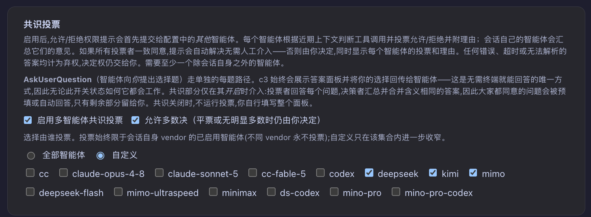
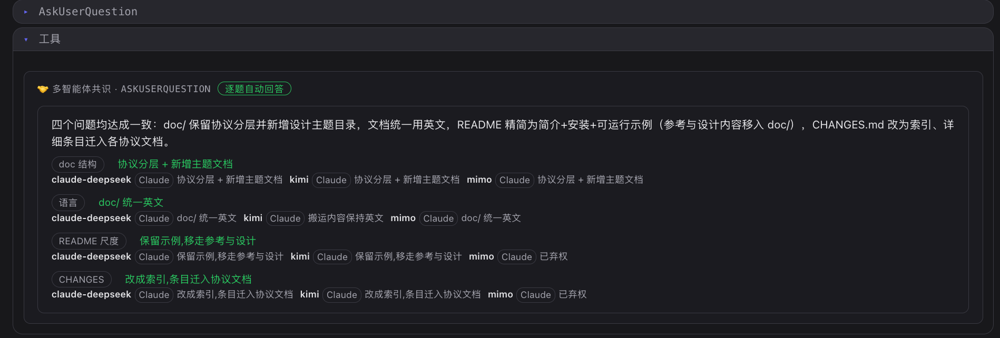

# Multi-agent Consensus

> One notch looser than "you confirm every single step": let several agents vote on your behalf first — whatever can be decided automatically is decided automatically, and only what cannot falls back to you.

## Background

c3 can keep several agents working at once. By default, whenever an agent is about to call a tool with side effects (write a file, run a command, open a PR), the permission gateway pauses and asks you allow/deny; and when an agent raises a multiple-choice question via `AskUserQuestion`, it waits for you to answer in person.

This "human in the loop" guarantees safety, but much of the time it is just a burden: you do not care about the implementation details, you do not know more than the agent about a specialized multiple-choice question, the recommended option is right eight times out of ten — or you have simply walked away from the screen and want the flow to keep moving. What these situations share is that the step does genuinely need a judgement, just not necessarily yours.

## The approach: let several agents vote first, and auto-approve on consensus

The core logic of consensus: before handing a request to you, c3 asks the **other** agents around — should this tool call be allowed? Which option should this question take?

- Each voting agent votes allow/deny (or picks an option) with a rationale, in a one-shot call with all tools disabled, based only on the recent context;
- The session's own agent acts as the decider, aggregating the opinions into a one-sentence summary;
- On consensus, the decision is made automatically without involving you; without consensus, it falls back to you, showing each agent's vote and rationale to help you decide faster.

Three safety lines:

1. **A fallback to the human is always available.** A voting error, a timeout, or an unparsable answer is recorded as an abstention; an abstention does not count as agreement, so the question comes back to you. Consensus only saves the part that is certain; it never gambles a call on your behalf.
2. **There must be at least one "other".** If there is no agent besides the session's own to vote, consensus is skipped and you are asked as usual.
3. **Automatic decisions leave a traceable record.** Every automatic decision made without human involvement leaves an audit-only, non-blocking record under the "auto" filter in the WorkCenter, so afterwards you can check who approved what, when, and on what basis.

Consensus covers not only allow/deny tool permissions but also answering each `AskUserQuestion` item, plus checkpoints in automated orchestration (whether the flow should `continue` or `wait` for a human) — the same voting agents, the same bottom line of falling back to the human.

## How to configure it in c3

In the workspace's Consensus section, consensus is controlled by three switches, narrowing layer by layer from "on or off" to "what counts as passing" to "who votes".

### 1. Enable multi-agent consensus

> **Enable multi-agent consensus**

The master switch, off by default. Only when it is on does a round of voting happen before you are asked.

- Off: business as usual — every sensitive tool call and every multiple-choice question goes straight to you.
- On: vote first; a unanimous result is decided automatically, otherwise it still comes to you (with each agent's opinion attached).

This is both the most conservative and the most recommended starting point: even fully enabled, as long as the voters disagree at all, the final say remains yours.

### 2. Allow majority rule (ties or no clear majority still come to you)

> **Allow majority rule (a tie or no clear majority still leaves the decision to you)**

The second switch, off by default, and only meaningful when consensus is already enabled. It decides "how much agreement counts as passing":

- **Off (default) = unanimous only.** Only if every voter voted the same way is the decision made automatically. Any disagreement or abstention falls back to you.
- **On = allow a majority verdict.** Abstentions do not count, and a strict majority decides (more allow than deny means approve, and vice versa). But a tie (e.g. 2:2), no clear majority, or a full set of abstentions still leaves the decision to you — the safety line does not change.

Majority rule clearly raises the automation rate, at the cost of decisions no longer requiring a full vote. c3 distinguishes "all agents agreed…" from "decided by majority…" in the result, so you can see at a glance how a given decision came about.

> Majority rule also incidentally enables checkpoint consensus in automated orchestration: when the development loop judges that it is stuck, or there is an unanswered multiple-choice question, the same set of agents votes on whether the flow should `continue` or `wait` for a human. With majority rule off, checkpoints never trigger consensus and follow the original "stop and wait for a human" path.

### 3. Who votes

> **Choose who votes. Voting is always limited to enabled agents of the session's own vendor (different vendors never vote); custom only narrows further within that set.** (all agents / custom)

An `all agents (default) / custom` radio choice determines the range of voters.

- **All agents (default)**: every enabled agent other than the session's own takes part in the vote.
- **Custom:** pick the subset allowed to vote from the checklist of enabled agents. Useful for:
  - excluding read-only agents irrelevant to the decision;
  - granting the vote only to the few agents you trust more.

  A custom list can only narrow the set, and it is doubly filtered — disabled or no longer existing agents are removed from the list, and at run time the voting set is rebuilt from the "enabled agents" only, so a stale id can never come back to life as a voter. If the custom list ends up empty, consensus is skipped and you are asked as usual.

## A suggested rollout pace

1. **Start with just the master switch (unanimous).** Feel which operations that used to need your click are now auto-approved unanimously — that is a zero-risk automation dividend.
2. **Add majority rule when you need more speed.** When one or two agents always hold back a unanimous vote while the majority opinion is in fact clear, turn on majority rule to buy a higher automation rate; ties and no-clear-majority cases still come back to you, so the bottom line holds.
3. **Fine-tune the voting panel with custom.** If read-only or unqualified agents are diluting the vote pool, switch to custom and keep only the few agents you trust.

However you configure it, the bottom line stays the same: what can be determined, consensus determines for you automatically; the moment there is real disagreement, the wheel is back in your hands.

## Example

