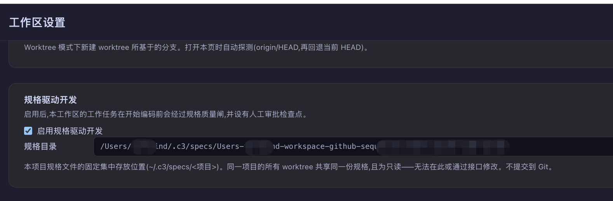
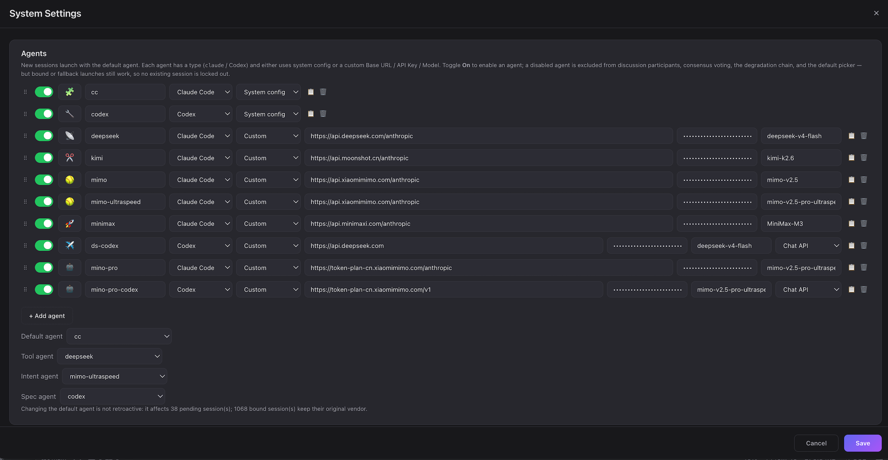

# Spec-Driven Development (SDD)

AI agents write code fast and in volume, but "written fast" is not the same as "written right". The spec-driven development (SDD) approach is: before an agent starts coding, produce a human-reviewable spec document, and only enter development once it is approved by a human — moving the human gate from "reading code" forward to "reading a document".

> We suggest reading [From Requirement to Intent](requirement-to-intent.md) first. SDD builds on intents: an intent answers "what and why", while a spec answers "what exactly it should become and how to verify it".

---

## Part 1: What spec-driven development is

### Background: new problems in the AI coding era

Once AI agents became the executors, an imbalance appeared: the speed of producing code far exceeds the speed at which humans can review it. This shows up in four ways:

1. **There is a "jump" from intent to code.** An intent states Why / What / Acceptance, but a complex change also embeds many design decisions: interface contracts, data migrations, failure handling, compatibility. If an agent improvises all of them while coding, the human can only reverse-engineer them afterwards from a few hundred lines of diff, and correction is expensive.
2. **Reviewing code is expensive; reviewing a document is cheap.** Reading a 500-line PR requires intense focus and often still misses design problems, whereas reading a one-page document that states "which behaviour changes, where the boundary is, how it is verified" takes minutes. The earlier the gate, the lower the cost of correction.
3. **Vibe coding lacks a traceable rationale.** After a one-line prompt generates a pile of code, the design intent is scattered across chat logs, and the next maintainer who sees a "strange" implementation cannot tell whether it was carefully considered or done offhand.
4. **Automated development needs a quality gate.** When an agent is allowed to develop autonomously (nobody watching the screen, automatic commits), the risk is "finishing the whole thing in the wrong direction". The pipeline needs a mechanism guaranteeing that every task entering development has a human-confirmed approach.

### What SDD is

Spec-driven development has only three core conventions:

1. **Spec first, then code.** Every development task first produces a spec document stating the observable behaviour changes, the boundary, the key decisions, and the verification method.
2. **Human approval is the gate into development.** A spec must be reviewed and approved by a human; an unapproved task cannot start coding — the same applies to manual starts and to automated orchestration.
3. **Spec is Truth.** Development follows the spec; when implementation reveals the spec is wrong or needs to deviate, change the spec first (Reverse Sync), keeping document and code consistent at all times.

Around these three conventions, development agents in SDD mode follow a working contract: Spec is Truth, Restate First, Checkpoint Before Execute, Done by Evidence (rather than self-declaration), Reverse Sync (update the spec when implementation and spec diverge), and Ask for Clarification (ask instead of guessing when something is ambiguous).

### Benefits of SDD

1. **The gate moves earlier, so correction is cheapest.** A directional mistake caught at the document stage means rewriting a paragraph; caught at the code stage it means rewriting a PR.
2. **Review does not require reading code.** A good spec lets a reviewer decide to approve or reject without opening the codebase.
3. **Decisions are on the record.** A spec records behaviour agreements, boundaries, and trade-offs, and strings together with the intent, development session, and code branch into a traceable chain.
4. **Code and docs do not drift.** "Single source of truth + reverse sync" ensures documents follow the implementation instead of expiring after merge.
5. **A safety belt for automation.** "The spec is approved" is a checkable gate condition, which is what lets an autonomous development loop really run unattended.

### When to use it

SDD is a quality gate, and a gate has a cost (an extra round of writing and reviewing). More is not always better — weigh it against the risk of the project and the change.

**Good cases for turning SDD on:**

- Changes touching interface contracts, persisted data, migrations, security, or cross-module impact — hard to walk back if wrong;
- Projects with multiple collaborators — the spec carries the team's shared understanding of "what it should become";
- Using automated orchestration to let agents develop autonomously — with nobody present, the gate is the only checkpoint;
- Scenarios with traceability requirements (audit, compliance, long-term maintenance).

**Cases where SDD can stay off:**

- Small fixes (a copy tweak, an extra validation) — the intent's own Acceptance is gate enough;
- Experimental exploration (spikes, prototypes) — the approach itself is what is being explored, so writing a spec first puts the cart before the horse;
- Fast iteration on a personal project — you are in the loop yourself, so the gate adds little.

In c3, SDD is a workspace-level switch: within the same c3 you can turn it on for important projects and off for experimental ones, without interference.

---

## Part 2: SDD configuration and development flow in c3

In c3, SDD is built into the development chain of [intents](requirement-to-intent.md) as a first-class workflow: once enabled, every intent must first produce a spec and get your approval before it can enter development.

```
intent (todo)
   │
   ▼
Write Spec ──► a write-restricted spec session produces spec.md
   │              (can be refined repeatedly / reset and rewritten)
   ▼
Approve Spec ──► human checkpoint: you click approve on the spec document page
   │
   ▼
Start Work ──► the server enforces "spec approved" before starting the development session
   │              the development session treats the spec as the single source of truth
   ▼
development finishes → commit / PR → mark done
```

### Prerequisites

- You have completed the installation and startup in the [c3 Getting Started Guide](c3-get-start.md), and created a workspace pointing at your project directory;
- You have created at least one intent in `todo` status following [From Requirement to Intent](requirement-to-intent.md).

### Configuring SDD

#### 1. Turn on the workspace SDD switch

Open Workspace Setting, find the spec-driven development section, and check enable spec-driven development. The switch is off by default and applies per workspace.

Once on, the primary action button of intents in that workspace becomes the SDD-aware four-state button (see the flow below), and the automation orchestrator only picks up intents whose specs are approved.



#### 2. Understand the spec directory (read-only, nothing to configure)

Once the switch is on, the settings page shows the project's spec directory. It is a fixed central location: `~/.c3/specs/<project path segments>`, resolved deterministically by the server from the workspace path, neither configurable nor modifiable. There are two reasons for this design:

- **All worktrees share the same specs.** Specs are stored per project under the c3 home directory rather than scattered across each git working copy — whichever worktree an intent is developed in, it reads the same spec;
- **Specs are not committed to Git.** They are governance documents of the development process and do not enter the code repository.

#### 3. Optional: designate a spec agent

Under Settings → Agents you can configure the spec agent (the agent responsible for writing specs); it follows the default agent unless set. Note: the spec-writing session is write-restricted (see below), the restriction is enforced at the tool/path layer, and if the configured agent cannot establish this boundary, startup is rejected rather than silently downgraded.



#### 4. Optional: development skill (devSkill)

`devSkill` in the workspace settings is the slash command prefix for development sessions. If devSkill is configured, the development session works according to your skill's conventions; if not, SDD automatically injects the built-in spec-driven working contract into the development session (Spec is Truth, Restate First, Checkpoint Before Execute, Done by Evidence, Reverse Sync, Ask via Tool). The two do not stack — devSkill takes precedence.

### The SDD development flow

With SDD on, the primary action button of a `todo` intent presents three actions depending on state: no spec ⇒ Write Spec; written but not approved ⇒ Approve Spec; approved ⇒ Start Work. Let us walk through it step by step:

#### Step 1: Write Spec

Click Write Spec on the intent detail page. c3 will:

1. Create a dated spec document under the central spec directory: `~/.c3/specs/<project>/yyyy/mm/dd/yyyy-mm-dd-<sequence>-<intent short title>.md`, and immediately back-fill it onto the intent;
2. Start a spec session to write the content. This session only writes the spec and never changes code: writes are hard-restricted to that spec directory (writing anywhere else is rejected outright), the rest of the project is read-only, and shell, subagents, and slash commands are all disabled — just like the intent communication agent, the constraints are enforced at the tool/path layer, not by prompt discipline. It can query the project's existing intents read-only, to align context and avoid conflicting with established agreements.

> In worktree mode, before writing a spec c3 checks whether all of the intent's dependencies have been merged into the mainline — a spec written while the dependency code is not yet on the mainline is castles in the air, so the button is disabled with an explanation.

**What does a spec look like?** A spec's first reader is you (the reviewer), and only its second reader is the development agent. It does not repeat the Why / What / Acceptance already in the intent; it goes straight to the point: the observable behaviour changes, the boundary, the key decisions that need a call, and the verification method. Its length scales with impact — a single-point small change is usually just 8–20 lines; only changes touching contracts, data, migrations, security, or multiple domains expand into recorded trade-offs, compatibility, and failure handling. A spec describes capabilities and contracts in domain language; it does not list file paths or name functions — that belongs to the implementation stage.

#### Step 2: Review and refine

Read the generated spec on the spec tab of the intent detail page. The criterion is simple: without reading the codebase, can you confidently approve or reject it?

If you are not satisfied, there are two ways to keep polishing:

- Continue the conversation in the spec-writing session tab and ask it to revise;
- When the session has gone on so long it has gone "mushy", click reset spec session: enter your new requirements, and c3 starts a fresh, clean spec session from "your input + the current spec path" (write-restricted in the same way). The old session remains visible under Works, but is no longer linked to this intent.

#### Step 3: Approve Spec

Once the spec is good enough, click approve on the spec document tab. This is SDD's core human checkpoint:

- The approval records the approver (the currently logged-in user), and a single confirmation takes effect;
- To prevent misclicks, the approve action is unavailable for the first 10 seconds after a spec is generated;
- Approval only opens the gate; it does not start development automatically — the button then changes to Start Work.

#### Step 4: Start Work

Click Start Work to launch a background development session. SDD does three things at this step:

1. **Server-enforced gate.** An intent whose spec is not approved cannot start development — even calling the API directly, bypassing the UI, is rejected by the server; the gate does not depend on a hidden front-end button;
2. **Injecting the spec path.** Besides the intent title, content, and dependency notes, the development session's startup information carries the path of the approved spec and declares it the single source of truth: when implementation and spec diverge, reverse-sync the spec first;
3. **Installing the working contract.** When devSkill is not configured, SDD's spec-driven working contract is injected into the development session as system context — restate first, checkpoints, done by evidence, ask when ambiguous.

After that it is the standard development loop: the agent develops on a (optionally worktree-isolated) branch, sensitive operations still go through your permission approval, and when finished it commits, pushes a PR, and marks the intent `done`.

#### Working together with automation

When you mark an intent with `automate` and start the automation orchestrator, the SDD switch still applies: intents whose specs are not approved are not picked up by automation, and queue until you approve them before entering autonomous development. That is exactly SDD's value for automation — when nobody is present, the gate keeps watch over the direction for you.

### FAQ

**Q: With SDD on, do I have to write a spec for every small intent? Isn't that too heavy?**

A: A spec's length scales with impact; the spec for a single-point small change is usually just over a dozen lines and takes a minute to review. If most changes in your project are small fixes, you can simply leave SDD off — it is a workspace-level switch, weighed per project.

**Q: Why aren't specs stored in the code repository?**

A: A spec is a governance document of the development process, and metadata such as approval status and approver is managed by c3; central storage also lets all worktrees of the same project share one spec collection. If you want certain design conclusions to settle into the repository, require the development work to update in-repo documents in the intent's Acceptance.

**Q: Could the spec session casually modify my code?**

A: No. Its write scope is restricted to that spec directory, all other paths are read-only, and shell and subagents are disabled — these constraints are enforced at the tool/path layer and cannot be bypassed by prompting.

**Q: Can a spec still be changed after approval?**

A: At the current stage approval is a single-person confirmation with no "unapprove". Polish the spec thoroughly with the spec session or a reset spec session before approving; when development reveals a genuine problem with the spec, follow the reverse-sync principle — have the development session pause and hand the divergence back to you for a decision.

**Q: Do SDD specs duplicate the intent's Acceptance?**

A: No. Acceptance lives in the intent and answers "what conditions count as done"; the spec turns those acceptance items into observable verification conditions and adds the design decisions the intent does not cover (contracts, boundaries, compatibility, failure handling). A spec does not copy the intent's content.

## References

- [c3 Getting Started Guide](c3-get-start.md)
- [From Requirement to Intent](requirement-to-intent.md)
