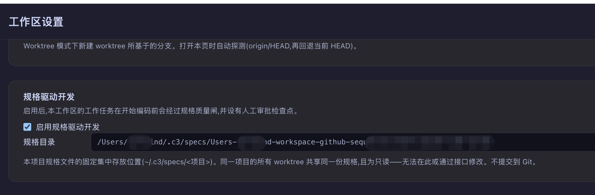
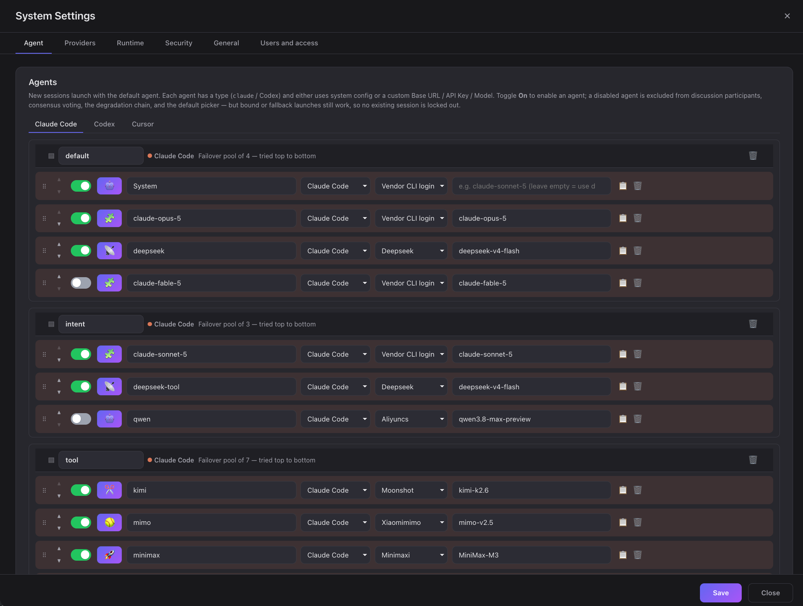

# Spec-Driven Development (SDD)

AI agents write code fast and in volume, but "written fast" is not the same as "written right". The spec-driven development (SDD) approach is: before an agent starts coding, produce a human-reviewable spec document, and only enter development once it is approved by a human — moving the human gate from "reading code" forward to "reading a document".

> We suggest reading [From Requirement to Intent](requirement-to-intent.md) first. SDD builds on intents: an intent answers "what and why", while a spec answers "what exactly it should become and how to verify it".

---

## Part 1: What spec-driven development is

### Background: new problems in the AI coding era

Once AI agents became the executors, an imbalance appeared: the speed of producing code far exceeds the speed at which humans can review it. This shows up in four ways:

1. **There is a "jump" from intent to code.** An intent states Why / What / Acceptance, but a complex change also embeds many design decisions: interface contracts, data migrations, failure handling, compatibility. If an agent improvises all of them while coding, the human can only reverse-engineer them afterwards from a few hundred lines of diff, and correction is expensive.
2. **Reviewing code is expensive; reviewing a document is cheap.** Reading a 500-line PR requires intense focus and often still misses design problems, whereas reading a one-page document that states "which behaviour changes, where the boundary is, how it is verified" takes minutes. The earlier the gate, the lower the cost of correction.
3. **Vibe coding lacks a traceable rationale.** After a one-line prompt generates a pile of code, the design intent is scattered across chat logs, and the next maintainer who sees a "strange" implementation cannot tell whether it was carefully considered or done offhand.
4. **Automated development needs a quality gate.** When an agent is allowed to develop autonomously (nobody watching the screen, automatic commits), the risk is "finishing the whole thing in the wrong direction". The pipeline needs a mechanism guaranteeing that every task entering development has a human-confirmed approach.

### What SDD is

Spec-driven development has only three core conventions:

1. **Spec first, then code.** Every development task first produces a spec document stating the observable behaviour changes, the boundary, the key decisions, and the verification method.
2. **Approval is the gate into development.** An unapproved task cannot start coding — the same applies to manual starts and to the intent queue. High-impact changes still require a human; a workspace may opt in to machine approval after a passing read-only review.
3. **Spec is Truth.** Development follows the spec; when implementation reveals the spec is wrong or needs to deviate, change the spec first (Reverse Sync), keeping document and code consistent at all times.

Around these three conventions, development agents in SDD mode follow a working contract: Spec is Truth, Restate First, Checkpoint Before Execute, Done by Evidence (rather than self-declaration), Reverse Sync (update the spec when implementation and spec diverge), and Ask for Clarification (ask instead of guessing when something is ambiguous).

### Benefits of SDD

1. **The gate moves earlier, so correction is cheapest.** A directional mistake caught at the document stage means rewriting a paragraph; caught at the code stage it means rewriting a PR.
2. **Review does not require reading code.** A good spec lets a reviewer decide to approve or reject without opening the codebase.
3. **Decisions are on the record.** A spec records behaviour agreements, boundaries, and trade-offs, and strings together with the intent, development session, and code branch into a traceable chain.
4. **Code and docs do not drift.** "Single source of truth + reverse sync" ensures documents follow the implementation instead of expiring after merge.
5. **A safety belt for automation.** "The spec is approved" is a checkable gate condition, which is what lets an autonomous development loop really run unattended.

### When to use it

SDD is a quality gate, and a gate has a cost (an extra round of writing and reviewing). More is not always better — weigh it against the risk of the project and the change.

**Good cases for turning SDD on:**

- Changes touching interface contracts, persisted data, migrations, security, or cross-module impact — hard to walk back if wrong;
- Projects with multiple collaborators — the spec carries the team's shared understanding of "what it should become";
- Using the intent queue to let agents develop autonomously — with nobody present, the gate is the only checkpoint;
- Scenarios with traceability requirements (audit, compliance, long-term maintenance).

**Cases where SDD can stay off:**

- Small fixes (a copy tweak, an extra validation) — the intent's own Acceptance is gate enough;
- Experimental exploration (spikes, prototypes) — the approach itself is what is being explored, so writing a spec first puts the cart before the horse;
- Fast iteration on a personal project — you are in the loop yourself, so the gate adds little.

In c3, SDD is a workspace-level switch: within the same c3 you can turn it on for important projects and off for experimental ones, without interference.

---

## Part 2: SDD configuration and development flow in c3

In c3, SDD is a first-class workflow on the [intent](requirement-to-intent.md) development path. The workspace master switch is **on by default**; each intent can override with `specMode`, and impact level still applies.

```
intent (todo)
   │
   ▼
Write Spec ──► a write-restricted spec session produces the spec
   │             (refine / reset; or edit the body directly when development has not started and no spec session is running)
   ▼
Spec Review ──► an independent read-only session; the verdict is bound to the current content fingerprint; rewriting invalidates it
   │
   ▼
Approve Spec ──► human checkpoint; the workspace may explicitly allow machine approval (high impact still requires a human)
   │             approval is revocable; a running development session is not force-stopped, the next resume re-checks the gate
   ▼
Start Work ──► the server enforces the gate before launching the development session
   │             the development session treats the spec as the single source of truth
   ▼
development finishes → commit / PR (optionally onto a delivery) → done when review is settled and the PR is merged
```

When the effective mode is `fast`, the primary button is Start Work and does not invite writing a spec first — it only skips "must approve a spec first". A single-turn diff that reaches the workspace small-change thresholds (default 3 files, 50 lines) pins the intent back to `sdd` and reverse-fills a spec.

### Prerequisites

- You have completed the installation and startup in the [c3 Getting Started Guide](c3-get-start.md), and created a workspace pointing at your project directory;
- You have created at least one intent in `todo` status following [From Requirement to Intent](requirement-to-intent.md).

### Configuring SDD

#### 1. The workspace SDD switch

Open Workspace Setting and find the spec-driven development section. The switch is **on by default** and only turns off when you explicitly disable it; it applies per workspace. Turning it off does not revoke already-approved specs.

Once on, the primary action button of intents follows spec status (see the flow below). Impact levels `L1`/`L2` still force spec-first and forbid machine approval even when the workspace switch is off.



Two optional settings:

- **Allow machine approval of a passing spec review** — off by default. When on, a read-only review concluding "pass" is approved by c3 under a machine identity, and development may start without another human click. The approval stays revocable; the same review conclusion is not machine-approved again. High-impact intents always require a human.
- **Small-change thresholds (fast mode)** — the maximum files and lines a single turn may change; reaching the value is over the threshold.

#### 2. Understand the spec directory (read-only, nothing to configure)

The settings page shows the project's spec directory. It is a fixed central location: `~/.c3/specs/<project path segments>`, resolved deterministically by the server from the workspace path, not configurable. There are two reasons for this design:

- **All worktrees share the same specs.** Specs are stored per project under the c3 home directory rather than scattered across each git working copy;
- **Specs are not committed to Git.** They are governance documents of the development process and do not enter the code repository. Historical spec files inside the workspace are not recognized.

#### 3. Optional: designate spec agents

Under Settings → Agents you can configure the agents for spec writing and spec review; they follow the default agent unless set. The writing session is write-restricted (see below); the review session has no write access to any path. If the configured agent cannot establish this boundary, startup is rejected rather than silently downgraded.



#### 4. Optional: development skill (devSkill)

The development launch skill in workspace settings is the slash-command prefix for development sessions. If it is set, the development session follows your skill's conventions; if not, SDD injects the built-in spec-driven working contract (Spec is Truth, Restate First, Checkpoint Before Execute, Done by Evidence, Reverse Sync, Ask via Tool). The two do not stack — the skill takes precedence.

### The SDD development flow

With SDD on and the effective mode `sdd`, the primary action button of a `todo` intent presents: no spec (or only a seeded placeholder) ⇒ Write Spec; written but not approved ⇒ go to the spec tab to approve; approved ⇒ Start Work. `fast` with no spec yet goes straight to Start Work. Walk through it:

#### Step 1: Write Spec

Click Write Spec on the intent detail page. c3 will:

1. Create a dated spec document under the central spec directory: `~/.c3/specs/<project>/yyyy/mm/dd/yyyy-mm-dd-<sequence>-<intent short title>.md`, and immediately back-fill it onto the intent (seeded as `raw`; real content change moves it to `pending`);
2. Start a spec session to write the content. This session only writes the spec and never changes code: writes are hard-restricted to that spec directory, the rest of the project is read-only, and shell, subagents, and slash commands are all disabled. It can query the workspace's existing intents read-only and cannot save intents.

> Before writing a spec, c3 checks the dependency gate: if predecessor output is not yet on this intent's baseline, the button is disabled with an explanation. That is not the same question as "has the predecessor PR merged to mainline".

**What does a spec look like?** A spec's first reader is you (the reviewer), and only its second reader is the development agent. It does not repeat the Why / What / Acceptance already in the intent; it goes straight to the point: the observable behaviour changes, the boundary, the key decisions that need a call, and the verification method. Its length scales with impact. A spec describes capabilities and contracts in domain language; it does not list file paths or name functions.

#### Step 2: Review, refine, and read-only audit

Read the generated spec on the spec tab of the intent detail page. The criterion is simple: without reading the codebase, can you confidently approve or reject it?

If you are not satisfied:

- Continue the conversation in the spec-writing session tab and ask it to revise;
- When development has not started and no spec session is running, you may edit the body directly; rewriting revokes approval;
- When the session has gone "mushy", reset it: a fresh session starts from "your input + the current spec path"; the old session remains reviewable.

Spec review is an independent read-only session: the verdict is submitted structurally and bound to the current content fingerprint; rewriting invalidates the old verdict. It can be replayed, never resumed; judgements in the chat body do not count.

#### Step 3: Approve Spec

Once the spec is good enough, click approve on the spec document tab. This is SDD's core human checkpoint:

- The approval records the approver (the currently logged-in user), and a single confirmation takes effect;
- To prevent misclicks, the approve action is unavailable for the first 10 seconds after a spec is generated;
- Approval only opens the gate; it does not start development automatically — the button then changes to Start Work;
- An approved spec can be revoked; revocation is auditable and does not force-stop a running development session.

#### Step 4: Start Work

Click Start Work to launch a background development session. SDD does three things at this step:

1. **Server-enforced gate.** When the effective mode requires a spec, an unapproved intent cannot start or resume — even calling the API directly is rejected. High impact also requires a human approver. If a spec was never written and a work session already exists, a manual resume or restart is not blocked for "unapproved"; the queue and high impact still require approval.
2. **Injecting the spec path.** The development session's startup information carries the path of the approved spec and declares it the single source of truth: when implementation and spec diverge, reverse-sync the spec first.
3. **Installing the working contract.** When no development skill is configured, the spec-driven working contract is injected as system context.

After that it is the standard development loop: the agent develops on a (worktree-isolated by default) branch, and sensitive operations still go through your permission approval. A finished run does not by itself mark the intent `done`; that happens when the queue judges completion and commits, or when review is settled and the PR is merged.

#### Working together with the queue

When you mark an intent with `automate` and start the intent queue, the SDD switch still applies. Under SDD the queue autonomously advances write → review → bounded rework; hitting the cap parks the intent for a human. Machine approval is an explicit workspace opt-in, and high impact still requires a human. The spec stage does not consume the development concurrency cap.

### FAQ

**Q: With SDD on, do I have to write a spec for every small intent? Isn't that too heavy?**

A: Spec length scales with impact; a single-point change is usually a dozen lines. Low-impact intents can use `fast`; if most changes in the project are small fixes, you can also turn the workspace switch off. It is a per-workspace trade-off.

**Q: Why aren't specs stored in the code repository?**

A: A spec is a governance document of the development process, and metadata such as approval status and approver is managed by c3; central storage also lets all worktrees of the same project share one spec collection. If you want certain design conclusions to settle into the repository, require the development work to update in-repo documents in the intent's Acceptance.

**Q: Could the spec session casually modify my code?**

A: No. The writing session's write scope is that spec directory; the review session has no write access to any path. Those constraints are enforced at the tool/path layer.

**Q: Can a spec still be changed after approval?**

A: Yes — you can revoke approval. Polish with the spec session, direct edit, or a reset before approving; if development discovers the spec is wrong, reverse-sync — pause the development session and hand the divergence back to you.

**Q: Do SDD specs duplicate the intent's Acceptance?**

A: No. Acceptance lives in the intent and answers "what conditions count as done"; the spec turns those acceptance items into observable verification conditions and adds the design decisions the intent does not cover. A spec does not copy the intent's content.

## References

- [c3 Getting Started Guide](c3-get-start.md)
- [From Requirement to Intent](requirement-to-intent.md)
- [Delivery](delivery.md)
