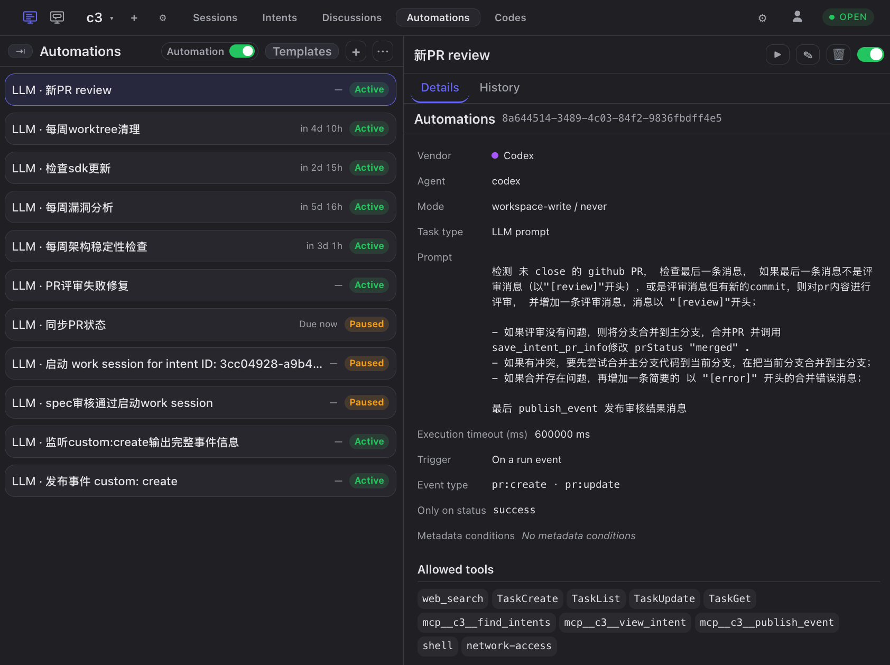
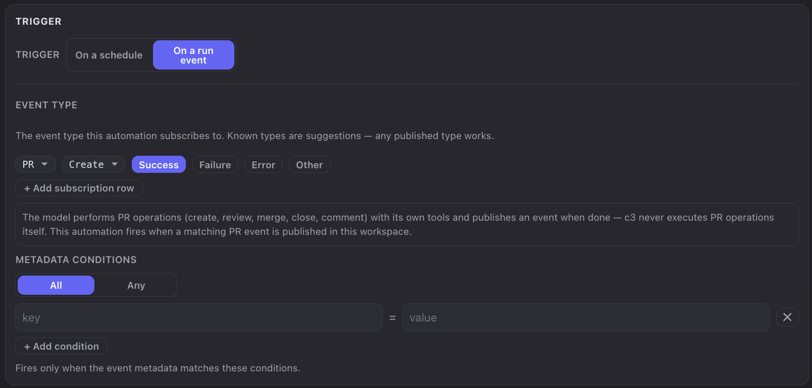

# 自动化工程（Automation Engineering）

智能体已经能独立完成一件事，但从"完成一件事"到"跑通一条流水线"，中间隔着一个人——每一次接力、每一轮返工，都要有人在场点一下。**自动化工程**要解决的正是这件事：用**事件驱动 + 定时任务**做底座，把智能体串成**工作流（workflow）**，再把工作流闭合成**循环（loop engineering）**，让系统自己收敛到"验证通过"，人只在真正需要决策的地方出现。本文分两部分：**第一部分**讲清楚自动化工程是什么、为什么需要它；**第二部分**介绍在 c3 中如何搭建底座、编排工作流与构建循环。

> 建议先阅读 [c3 入门指南](c3-get-start.md)。本文多处以[意图](requirement-to-intent.md)与 [SDD](sdd.md) 为例，但自动化本身不依赖它们。

---

## 一、什么是自动化工程

### 背景：智能体会干活了，人却成了流水线上最慢的一环

当一个项目里同时有开发、测试、评审、发布等多个环节，而每个环节都由智能体承担时，很快会暴露出几个问题：

#### 1. 每一次接力都要人在场

一个智能体干完自己那段就停下了。它不知道下一步该由谁做，也没有办法把活交出去。于是开发会话结束了，你得手动去起一个评审会话；PR 建好了，你得手动去触发验证。**人成了智能体之间唯一的连接件**——而且是一个需要休息、会遗忘、会离开工位的连接件。

#### 2. 一次性对话不构成工程

在聊天框里说一句"跑一下测试并修掉失败用例"，这次能成，下次还得重说一遍。它不可重复、不可复用、不可观测，也没有历史记录可以回看。**工程的特征是可重复执行、可被检查、可被改进**，而一次性对话三样都不占。

#### 3. 质量收敛天然是循环，靠人推最贵

真实的开发不是"开发 → 完成"，而是"开发 → 验证 → 发现问题 → 修复 → 再验证"，直到通过为止。这个循环的每一圈都需要有人判断"过了没有"、"该谁接手"。圈数越多，人的消耗越大——而这恰恰是最机械、最不需要创造力的部分。

#### 4. 例行工作不该占用人的注意力

依赖巡检、PR 状态对账、安全扫描、过期分支清理、周度架构体检——这些工作有明确的执行周期和明确的判断标准，却常年占据着人的日程提醒。

### 自动化工程是什么：三层递进

自动化工程不是"写几个定时脚本"，而是一套自底向上的三层结构：

```
第三层  Loop Engineering  循环    ┌─► 开发 ──► 验证 ──┐
        把工作流闭合成环          └──── 修复 ◄───────┘   直到收敛
                                        ▲
第二层  Workflow  工作流                │
        用事件把智能体串成接力    A 做完 ──事件──► B 接着做 ──事件──► C
                                        ▲
第一层  底座  触发机制                  │
        定时任务 + 事件驱动       ⏰ 到点了        📣 有事发生了
```

1. **第一层·底座**——回答"**什么时候该有事发生**"。两种触发源：**定时任务**（到点就跑，例行工作的入口）和**事件驱动**（有事发生就跑，接力与循环的入口）。
2. **第二层·Workflow**——回答"**一个智能体干完，谁接着干**"。上游智能体完成后发出一个事件，下游智能体订阅这个事件并自动接手。上游**不需要知道下游是谁**——事件是两者之间的解耦点，这让流水线可以随时增删环节而不必改动已有环节。
3. **第三层·Loop Engineering**——回答"**怎么让它自己收敛**"。当下游的产出又能触发上游时，接力就闭合成了环："开发 → 测试验证 → 修复 → 再验证"可以自己转下去，直到验证通过或触发退出条件。人的位置从"每圈都在"变成"只在循环停不下来时出现"。

一句话总结：

> **定时与事件是底座，工作流让智能体接力，循环让系统自己收敛。人从每一步的操作员，变成整条流水线的设计者与最终裁决者。**

### 自动化工程的好处

1. **解耦。** 上游只负责"发生了什么"，下游自己决定"要不要接"。加一个新环节只需新增一条订阅，不用改动已有的任何一环。
2. **可复用。** 一条自动化写一次，之后每次条件满足都按同样标准执行——不会因为你今天赶时间就少跑一步。
3. **可观测。** 每次触发都留下执行记录：什么时候触发、触发它的是哪个事件、智能体做了什么、结果如何，全部可回看。
4. **可收敛。** 循环让"多跑几轮"变成零成本的事，质量可以靠迭代逼近，而不是靠一次做对。
5. **把人放回该在的位置。** 人不再做"接力棒"，而是做"设计流水线"和"在循环卡住时决策"这两件真正需要人的事。

### 适用与不适用场景

**适合自动化的：**

- **有明确触发条件的接力**——开发结束跑评审、PR 建好跑检查、意图完成同步文档；
- **有明确通过标准的循环**——测试能给出通过/失败，lint 能给出干净/有问题；
- **周期性例行工作**——巡检、对账、扫描、清理、周报；
- **需要留痕的动作**——每次执行都要能回溯是什么触发的、做了什么。

**不适合自动化的：**

- **判断标准说不清楚的事**——"这个设计好不好"没有机器可判定的通过条件，自动化只会把含混的判断放大；
- **不可逆且高风险的操作**——直接改生产数据、直接发布、直接合并主干，除非你已经用权限模式与工具清单把边界收得足够窄；
- **只做一次的事**——写一条自动化的成本高于手动做一次。

**一个重要的定位说明：自动化是受监督的，不是无人值守的。** 自动化执行时智能体触发的敏感操作仍然走正常的权限审批；如果没有人在旁边回答，这次执行会一直等下去。想让某条自动化真正无人值守地跑完，必须提前通过**权限模式**与**允许的工具**清单把它需要的能力授权好——这是一次显式的、有边界的授权，而不是"全部放行"。

---

## 二、c3 中的自动化工程

在 c3 中，自动化按**工作区**组织：一条自动化恰好属于一个工作区，执行时使用该工作区的目录、项目设置与智能体配置——就像这个工作区里一次由你发起的运行一样。

### 前置条件

- 已完成 [c3 入门指南](c3-get-start.md)中的安装与启动，并创建了指向你项目目录的工作区；
- 至少配置了一个可用的智能体（LLM 类型的自动化需要它来执行）。

### 1. 底座：一条自动化由什么构成

在左侧导航进入**自动化**页。页面分两栏：左栏是自动化列表，右栏是选中项的**详情**与**历史**两个标签页。点击左栏的 **+** 新建，表单分为五个区块：



| 区块               | 配置什么                                                                        |
| ------------------ | ------------------------------------------------------------------------------- |
| **基本信息**       | 标题（留空自动生成）、任务类型（命令 / LLM 提示词）、命令或提示词正文、执行超时 |
| **触发条件**       | 触发方式（按时间表 / 按运行事件），以及对应的排期或事件订阅条件                 |
| **标注**           | 自由的键值元数据，用于给这条自动化打标签（下文"定向接力"会用到）                |
| **执行身份与权限** | 品牌（vendor）、Agent、权限模式                                                 |
| **工具权限**       | 允许该次执行使用的工具清单，按"只读 / 写入"分区展示，可全选或全清               |

其中几个字段值得单独说明：

- **任务类型**分两种：**命令**（在工作区目录里跑一条 shell 命令，捕获 stdout/stderr，退出码非零即失败）与 **LLM 提示词**（在工作区里起一个智能体会话，把提示词作为第一轮输入，这一轮结束会话即结束）。**类型创建后不可更改。**
- **执行超时**是单次执行的最大墙钟时长。留空使用默认值（命令 30 秒、LLM 60 秒），显式设置的取值范围是 1 秒到 24 小时。**跑测试、跑构建这类任务务必显式调大**，否则会因超时被判失败。
- **权限模式 + 允许的工具**共同决定这次执行的能力边界。只读巡检类任务建议只勾选只读工具；需要改代码的任务才开放写入工具。这是自动化最重要的一道安全阀——**执行时没有人守在旁边，工具清单就是它的能力上限**。

列表右上角还有一个工作区级的**启用自动化**总开关：关闭后，该工作区的**所有定时与事件触发都被静音**（不排队、不补跑），但每条自动化自身的启用/暂停状态不变，**「立即运行」也仍然可用**。它是"临时全部停下来"的总闸，排查问题时非常有用。

> 左栏的**模板**菜单里有几条开箱即用的自动化（PR 状态轮询对账、每周架构稳定性体检、每周漏洞分析、清除过期 worktree），选中即创建，可以拿来当作参照样本。列表的 **⋯** 菜单支持**导入 / 导出** JSON，方便把一套流水线复制到别的工作区——导入的自动化一律以**暂停**状态创建，需要你逐条确认后再启用。

### 2. 定时触发：例行工作的入口

触发方式选**按时间表**，即可用可视化构造器配置排期：**频率**（每 N 分钟 / 每 N 小时 / 每天 / 每周并选择星期几）加**时间**，表单会实时预览生成的 cron 表达式与**下次运行**时刻，列表行上还有下次执行的倒计时。

几条需要知道的规则：

- **按系统时区解释。** cron 不是按 UTC，而是按系统设置里的时区（如 `Asia/Shanghai`）解释，并且感知夏令时。
- **同一条自动化串行执行。** 上一次还在跑时，新一次触发会被**跳过**而不是排队——不会堆积。
- **逾期太久不补跑。** 如果服务停机导致某次触发逾期超过五分钟，c3 不会补跑，而是记一条失败并按当前时间重算下次运行。
- **随时可以手动跑一次。** 详情面板标题栏的「立即运行」会执行一次，**不影响**排期，也不改变启用状态；暂停中的自动化同样可以手动执行——这是调试的主要手段。

### 3. 事件触发：接力与循环的入口

触发方式选**按运行事件**，进入事件订阅配置。这是整个自动化工程的核心机制。

#### 事件长什么样

c3 的事件统一采用 `<大类>:<动作>` 的命名，另外携带 `status`（这件事的结果）和 `metadata`（其余上下文）。目前已知的事件类型：

**`run` —— 运行生命周期**

- 事件类型：`run:started`（运行开始）、`run:settled`（运行结束）
- status：仅 `run:settled` 有，取值为结束原因——已完成 / 出错 / 已中止
- 由 c3 自身发布，覆盖每一次运行的开始与结束

**`pr` —— PR 操作**

- 事件类型：`pr:create`（创建）、`pr:review`（评审）、`pr:merge`（合并）、`pr:close`（关闭）、`pr:comment`（评论）、`pr:update`（修改重提）
- status：操作结果——成功 / 失败 / 异常（"异常"指执行本身出错，如 CI 超时、工具报错，区别于"评审没通过"）
- 由智能体完成 PR 操作后主动发布；c3 服务端自己建 PR 成功时也会发一条 `pr:create`

**`intent` —— 意图生命周期**

- 事件类型：`intent:created`（已创建）、`intent:dev_started`（工作开始）、`intent:done`（已完成）、`intent:failed`（异常结束）、`intent:cancelled`（已取消）、`intent:spec_approve`（规范审批通过）
- status：无
- 由 c3 自身在意图生命周期节点发布

两点很关键：

- **事件类型是开放的，不是封闭枚举。** 表单用级联选择器（大类 → 动作）给出已知建议，但每一层都有「其他」入口可以自由输入。智能体可以发布 `custom:verify` 这样的**自定义事件**，自动化也可以订阅它——这是构建自己的流水线语义最重要的扩展点。
- **`pr:*`、`intent:*` 这样的大类通配可以匹配该大类下的所有动作**（只支持大类级通配）。

关于 PR 事件有一个必须理解的前提：**c3 自己从不执行任何 PR 操作。** 创建、评审、合并、关闭、评论都是智能体用它自己的工具（`gh` CLI、GitHub MCP 等）完成的，完成之后它再调用 c3 提供的 MCP 工具发布一条 PR 事件。因此——**没有发布事件就没有触发**。如果你希望 PR 相关的接力生效，需要在上游智能体的提示词里明确要求它在完成操作后发布事件。

#### 订阅条件怎么写

一条自动化可以配置**多行订阅条件，行与行之间是"或"的关系**（任一行命中即触发），点「添加订阅条件」增加行。每一行包含三个维度：

1. **事件类型**——大类 + 动作（动作可选"全部"即通配）；
2. **仅当状态匹配**——可添加多个状态值，**留空表示任意状态**；非空时要求与事件的 status **完全一致（区分大小写）**；
3. **元数据条件**——若干个"键 = 值"条件，并可选择**全部满足（AND）**或**任一满足（OR）**；留空表示不过滤。值同样是精确匹配，不做大小写折叠、不支持正则或子串。

此外，当订阅的是**运行事件**（`run:started` / `run:settled`）时，会多出一个**在以下会话类型时触发**的多选：工作 / 意图 / 讨论 / 自动化 / 共识 / 工具 / 规范。**留空表示所有会话类型都触发**；选中之后就只有来自这些来源的运行才会命中。

> 这个维度非常重要：它既是"只响应真正的开发会话，不被讨论会话误触发"的过滤器，**也是构建循环的开关**——因为**「自动化」本身就是一种会话类型**，勾选它就意味着"一条自动化跑完，可以触发另一条自动化"。

匹配的判断顺序是固定的：**工作区 → 会话类型（仅运行事件且非空时） → 事件类型 → 状态 → 元数据**，任一维度不满足就不触发。



### 4. Workflow：让一个智能体做完，另一个接着干

有了事件底座，工作流就是"上游发事件、下游订阅事件"这么简单。上游完全不需要知道下游存在。

#### 例一：开发会话正常结束 → 自动跑一轮代码走查

| 配置项       | 取值                                            |
| ------------ | ----------------------------------------------- |
| 触发方式     | 按运行事件                                      |
| 事件类型     | 运行 → 结束（`run:settled`）                    |
| 仅当状态匹配 | 已完成（避免对出错和中止的运行做无意义的走查）  |
| 会话类型     | 工作                                            |
| 任务类型     | LLM 提示词                                      |
| 提示词       | 走查本次工作会话产生的改动，逐条列出问题与建议… |
| 工具权限     | 只勾只读工具                                    |

#### 例二：PR 创建成功 → 自动触发评审

| 配置项       | 取值                                                      |
| ------------ | --------------------------------------------------------- |
| 事件类型     | PR → 创建（`pr:create`）                                  |
| 仅当状态匹配 | 成功                                                      |
| 任务类型     | LLM 提示词                                                |
| 提示词       | 评审这个 PR 的变更，给出结论；评审完成后发布 PR 评审事件… |

#### 例三：意图完成 → 同步文档

| 配置项   | 取值                                                        |
| -------- | ----------------------------------------------------------- |
| 事件类型 | 意图 → 已完成（`intent:done`）                              |
| 提示词   | 根据这个意图的改动，检查并更新相关文档，保持文档与代码一致… |

#### 让下游看见触发它的事件

例三里的"这个意图"，下游智能体怎么知道是哪一个？在**事件触发 + LLM 提示词**这个组合下，表单会出现一个复选框——**在提示词中嵌入触发事件**。勾选后，执行时会把这次命中的完整事件（类型、状态、描述、元数据、数据）序列化后追加到提示词末尾，并明确标注它是数据而非新的任务要求。下游因此能拿到 intentId、PR 编号、失败摘要等上下文，而不需要你在提示词里硬编码。

> 它只作用于当次执行，不会写回保存的配置；代价是会增加一些 token 消耗。**只在下游确实需要事件内容时才勾选。**

#### 定向接力：用标注避免"全场广播"

当工作区里的自动化多起来，"所有工作会话结束都触发所有下游"就成了噪音。解决办法是**标注（metadata）**：

- 在上游自动化的**标注**区块里写下键值对，例如 `stage = build`；
- c3 会把这些标注**印到该自动化自身产生的运行事件上**；
- 下游在订阅条件的**元数据条件**里写 `stage = build`，就只会被这一条上游触发。

这样同一个 `run:settled` 事件流里可以并存多条互不干扰的流水线。**注意：标注只会印在该自动化自己的运行事件上**——手动发起的工作会话、讨论等来源的事件不带标注，因此不会被打上标签，也就不会命中非空的元数据条件。

### 5. Loop Engineering：把工作流闭合成循环

当下游的完成又能触发上游时，接力就闭合成了环。c3 里让循环成立的关键机制只有一条：**自动化自身的运行也会产生 `run:started` / `run:settled` 事件，且会话类型为「自动化」**——所以只要在订阅条件里勾上「自动化」这个会话类型，A 跑完就能触发 B，B 跑完就能回触 A。

#### 一个"开发 → 验证 → 修复"循环

用三条自动化搭出来（假设起点是开发会话结束）：

**A · 验证**

- 触发条件：运行 → 结束；状态=已完成；会话类型=**工作 + 自动化**；元数据条件 `stage = fix`（或不限）
- 任务（LLM）：跑测试与 lint。**全部通过**则发布事件 `custom:verify`（状态 `success`）；**有失败**则发布 `custom:verify`（状态 `failure`），并在描述里带上失败摘要
- 标注：`stage = verify`

**B · 修复**

- 触发条件：事件类型 `custom:verify`（用「其他」自由输入）；状态=`failure`；勾选**在提示词中嵌入触发事件**
- 任务（LLM）：根据附带的失败信息定位并修复，修复后提交
- 标注：`stage = fix`

**C · 收尾**

- 触发条件：事件类型 `custom:verify`；状态=`success`
- 任务（LLM）：整理本轮结果，创建或更新 PR，并发布 PR 事件
- 标注：`stage = done`

转起来是这样的：

```
开发会话结束 ──► A 验证 ──失败──► B 修复 ──跑完──► A 验证 ──► …
                    │
                    └──成功──► C 收尾（出环）
```

这里有一个设计要点值得强调：**A 的成败结论没有用运行事件的 status 表达，而是自己发了一个 `custom:verify` 事件。** 因为 `run:settled` 的状态说的是"这次运行有没有正常结束"，不是"测试有没有通过"——一次成功执行完的验证任务，即使测试全红，运行状态依然是"已完成"。**要表达业务结论，就让智能体自己发布一个业务事件**，这是自定义事件类型最有价值的用法。

#### 循环必须自己装刹车

**c3 不做环检测，也不限制链的深度。** 循环能不能停下来，完全取决于你怎么设计。以下每一条都建议配齐：

1. **退出条件写进提示词。** 这是最主要的刹车。例如："如果同一个失败在本轮之前已经出现过，或修复尝试已达 3 次，不要继续修复，改为发布 `custom:verify` 状态 `stuck` 并停止。"由于 c3 不提供轮次计数器，**轮次需要智能体自己维护**——把尝试记录写进一个约定的临时文件或 PR 评论里，每轮先读再写。
2. **给"卡住"留一个出口。** 再配一条订阅 `custom:verify` 状态 `stuck` 的自动化，让它把结论汇总出来（或直接不配，让循环停在那里等你看历史）——**关键是别让"卡住"这个状态无人接管，也别让它继续触发修复。**
3. **用状态分叉，别让一条自动化触发自己。** 上例中 A 只在 `stage=fix` 或工作会话时触发，B 只在 `failure` 时触发——**任何一条订阅条件宽到能匹配自己产生的事件，就是一个无限循环。** 配完之后照着"这条自动化自己跑完会产生什么事件、这些事件会不会命中它自己的订阅条件"检查一遍。
4. **设执行超时。** 每条自动化都显式设置**执行超时**，给单次执行封顶。
5. **依赖串行门兜底。** 同一条自动化在途时新事件会被**跳过**而不是排队，这天然抑制了事件风暴的堆叠——但它**只防堆叠，不防循环**：一轮一轮慢慢转的死循环照样能一直转下去。
6. **留好总闸。** 出问题时，直接关掉工作区的**启用自动化**开关，所有定时与事件触发立即静音，且不会补跑。

#### 观察循环在干什么

- **执行历史**——在右栏切到**历史**标签页，点「浏览执行记录」选择某次执行，可以看到三块内容：**执行信息**（状态、起止时间、耗时、退出码、输出、错误）、**会话记录**（LLM 类型才有，是这次执行智能体会话的只读回放）、**Command 日志**（命令类型才有）。选中的执行如果**正在运行**，页面会自动刷新状态与会话内容，不用手动刷新。
- **Works 页的「自动化」标签**——自动化产生的会话会出现在这里，可以像看普通会话一样实时看它的运行状态与消息流（只读，不能输入）。

### 6. 端到端：从零搭一条流水线

以"开发结束自动跑验证，失败则自动修复"为例：

**第 1 步：先手动跑通一次。** 在普通工作会话里让智能体跑一次测试，确认命令、目录、依赖都没问题。**能手动跑通，才谈得上自动化。**

**第 2 步：建"验证"自动化。** 自动化页 **+** → 任务类型选 LLM 提示词 → 提示词写清楚"跑什么、通过的标准是什么、结论怎么发布" → 触发方式先选**按时间表**且设一个很远的排期（这一步先不接事件）→ 显式设置**执行超时** → 工具权限只勾必要的项。

**第 3 步：用「立即运行」调试。** 在详情面板标题栏点「立即运行」，到历史里看**会话记录**，确认它真的跑了测试、并且在结束时按约定发布了事件。**反复调提示词，直到这一步稳定。**

**第 4 步：接上事件触发。** 编辑这条自动化，触发方式改为**按运行事件**：事件类型选运行 → 结束，状态选已完成，会话类型勾"工作"。保存后跑一次真实的开发会话，验证它被自动触发。

**第 5 步：建"修复"自动化。** 订阅 `custom:verify` + 状态 `failure`，勾上**在提示词中嵌入触发事件**，提示词里写清修复范围与**退出条件**。

**第 6 步：闭环。** 回到"验证"自动化，在会话类型里加上"自动化"，并配好元数据条件（只接 `stage=fix`）——环成了。

**第 7 步：装刹车再放手。** 检查一遍上一节的六条刹车，先在一个低风险的工作区观察几轮，再推广。

---

## 常见问题

**Q：循环会不会失控？会不会把我的代码改乱？**

A：c3 不做环检测，所以"会不会停"取决于你的设计——必须自己装刹车（退出条件、状态分叉、执行超时、总闸）。至于"改乱"，边界由**权限模式 + 允许的工具**决定：不给写入工具，它就改不了代码；工具清单是自动化最重要的一道安全阀，配置时按"最小够用"来勾。

**Q：我配了事件触发，但它从来没被触发过。**

A：按匹配顺序逐条排查：① 工作区的**启用自动化**总闸是不是关着；② 这条自动化本身是不是暂停状态；③ **事件类型**是否写对（`<大类>:<动作>`，大小写敏感）；④ **状态**填了值就必须完全一致，先清空试试；⑤ 运行事件的**会话类型**是否把真实来源勾上了；⑥ **元数据条件**是精确匹配，且**只有该自动化自己产生的运行事件才带标注**；⑦ 如果订阅的是 PR 事件，确认上游智能体确实发布了事件——**c3 不会去探测 PR 状态**。

**Q：一条自动化能触发它自己吗？**

A：机制上可以——它自己的运行也会产生事件。**但这几乎总是配置失误**：如果它的订阅条件宽到能匹配自己产生的事件，就是一个无限循环。用状态或元数据条件把自己排除掉。

**Q：定时任务错过了会补跑吗？**

A：逾期超过五分钟不补跑，只记一条失败并按当前时间重算下次运行。另外，因为**总闸关闭而被静音**的触发不算"错过"——重新打开后只处理新到达的事件，不会补历史。

**Q：自动化执行时弹出权限请求，谁来回答？**

A：需要有人在浏览器里回答，否则这次执行会一直等到超时。想真正无人值守，就提前用**权限模式**和**允许的工具**把它需要的能力授权好。

**Q：命令类型和 LLM 类型怎么选？**

A：判断标准是"结论是否需要理解力"。跑构建、清理文件、导出数据这类**有确定的成功/失败判据**的，用**命令**——更快、更省、更可预测。需要读代码、下判断、写内容的，才用 **LLM 提示词**。也可以组合：命令负责跑，LLM 负责解读。

**Q：为什么我的验证任务总是超时失败？**

A：LLM 类型默认超时只有 60 秒，跑测试远远不够。在**执行超时**里显式设置（上限 24 小时）。

**Q：怎么临时把所有自动化全停掉？**

A：自动化页列表标题栏右侧的**启用自动化**开关，关掉即静音该工作区的全部定时与事件触发；单条自动化的启用状态不受影响，「立即运行」也仍然可用。重新打开后一切照旧。

## 参考

- [c3 入门指南](c3-get-start.md)
- [从需求到意图](requirement-to-intent.md)
- [规范驱动开发（SDD）](sdd.md)
- [多智能体共识投票](multi-agent-consensus.md)
