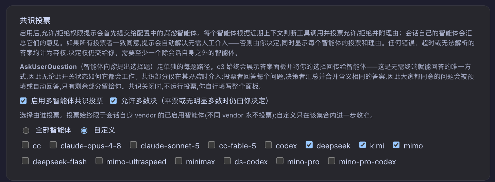
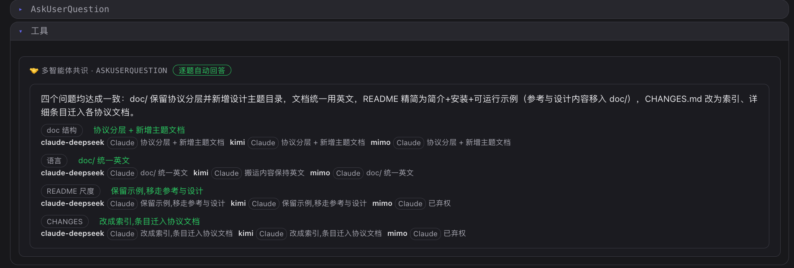

# 多智能体共识投票（Multi-agent Consensus）

> 在"每一步都要你确认"的基础上再松一档：让多个 agent 先替你投票，能自动定的就自动定，定不了才交回给你。

## 背景

c3 可以同时挂着多个 agent 一起干活。默认情况下，只要某个 agent 要调用一次有副作用的工具（写文件、跑命令、发 PR），权限网关就会暂停下来问你 allow/deny；agent 通过 `AskUserQuestion` 抛出选择题时，也要等你亲自作答。

这种"人在环中"保证了安全，但很多时候只是负担：你不关心实现细节、对专业选择题并不比 agent 懂更多、推荐选项八成就是对的，或者你干脆离开了屏幕、希望流程自动推进。这些场景的共同点是——这一步确实需要一个判断，但不一定非得你本人来做。

## 方案：让多个 agent 先投票，达成共识就自动放行

共识的核心逻辑：在把请求交给你之前，c3 先问一圈**其他** agent——这次工具调用该不该放行？这道选择题该选哪个？

- 每个投票 agent 以一次性、禁用所有工具的方式，仅凭最近上下文投出 allow/deny（或选出选项）并附理由；
- 会话自己的 agent 担任 decider（裁决者），把意见汇总成一句话摘要；
- 达成共识则自动决议，无需你出面；达不成则回落到你这里，并展示每个 agent 的票和理由，帮你更快决策。

三条安全底线：

1. **永远可回落到人。** 投票出错、超时、答案无法解析，都记为弃权；弃权不算一致，这道题重新交回你手上。共识只省掉能确定的部分，不替你冒险拍板。
2. **至少要有一个"别人"。** 若除了会话自己没有其他 agent 可投票，共识被跳过，照常问你。
3. **自动决策留痕可追溯。** 每次无人参与的自动决议都会在工作台（WorkCenter）的"自动"筛选下留下一条仅审计、不阻塞的记录，事后可查是谁、何时、依据什么放行。

共识不仅覆盖 allow/deny 的工具权限，还覆盖 `AskUserQuestion` 的逐题作答，以及意图队列里的检查点（让流程 `继续` 还是 `等待`人工）——同一套投票智能体，同一条回落到人的底线。

## c3 里怎么配

在工作区（Workspace）的 Consensus 区块里，共识由三个开关控制，从"开不开"到"怎么算通过"再到"谁来投"，逐层收窄。

### 1. 启用多智能体共识投票

> **启用多智能体共识投票**

总开关，默认关闭。打开后才会在问你之前先发起一轮投票。

- 关闭时：一切照旧，每个敏感工具调用、每道选择题都直接问你。
- 打开时：先投票；全体一致才自动决议，否则仍交给你（附各 agent 的意见）。

这是最保守也最推荐的起点：即使全开，只要投票者有任何分歧，最终决定权仍在你手里。

### 2. 允许多数决（平票或无明显多数仍交由你决定）

> **允许多数决（平票或无明显多数时仍由你决定）**

第二个开关，默认关闭，只在共识已启用时才有意义。它决定"多一致才算通过"：

- **关闭（默认）= 仅全体一致。** 只有每一个投票者都投了相同结果才自动决议。任何分歧、弃权都回落到你。
- **打开 = 允许多数派裁决。** 弃权不计票，严格多数即可决议（allow 多于 deny 则放行，反之则拒绝）。但平票（如 2:2）、没有明显多数、或全体弃权时，仍交由你决定——安全底线不变。

多数决会明显提升自动化率，代价是决策不再要求全票。c3 会在结果里区分"所有 agent 一致…"与"多数派裁决…"，让你一眼看出这一票是怎么来的。

> 多数决还会顺带启用意图队列的检查点共识：当开发循环判定卡住、或有一道未答的选择题时，同一批智能体会投票决定流程该 `继续` 还是 `等待`人工。关闭多数决时，检查点永远不会触发共识，照走原有的"停下等人"路径。

### 3. 谁来投票

> **选择由谁投票。**（全部智能体 / 自定义）

用一个 `全部智能体 / 自定义` 单选决定投票者范围。

- **全部智能体**：除会话自己以外的每一个已启用智能体都参与投票，**不分厂商**。Claude 会话可以由 Codex 或 Cursor 智能体来投票。
- **自定义：** 从已启用智能体勾选清单里挑出允许投票的子集。适合用来排除只读或不相关的智能体，或只把票权交给你更信任的少数几个。自定义只做缩小，按 id 收窄，不按厂商收窄。已禁用或名单为空则零投票者，共识被跳过，照常问你。

只读、无人值守或写入受限的运行不跑共识。挂载外部技能时，写类工具跳过共识、直达人工。自动化检查点的继续/等待投票共用同一份工作区配置与投票者集，但不经权限网关。

## 建议的开启节奏

1. **先只开总开关（全体一致）。** 感受哪些原本要你点确认的操作现在被全票自动放行了——这是零风险的自动化红利。
2. **需要更快时再叠加多数决。** 当总有一两个 agent 拖住全票、而多数意见其实很清晰时，打开多数决换取更高的自动化率；平票和没有明显多数仍会回到你，底线不丢。
3. **用自定义精修投票团。** 若有只读或不专业的 agent 在稀释票池，切到自定义，只保留你信得过的几个 agent。

无论怎么配，底线不变：能确定的，共识替你自动定；一旦有真正的分歧，方向盘还在你手上。

## 示例

