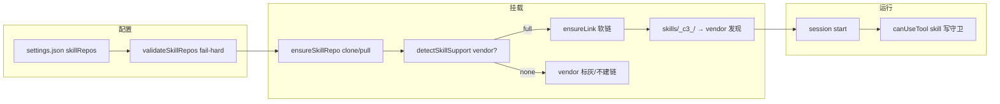

# Claude Agent SDK 架构指南

> 面向开发者与 AI：解释 c3 所依赖的 `@anthropic-ai/claude-agent-sdk`（TypeScript）
> 是什么、如何与 Claude Code 协作、数据存在哪里、如何读取 Skill，以及最佳实践。
>
> - **适用版本**：`@anthropic-ai/claude-agent-sdk@^0.3.158`（见 `server/package.json`）。
> - **历史名称**：该 SDK 前身为 “Claude Code SDK”，2025 年下半年更名为 “Claude Agent SDK”。
> - **官方文档**：<https://code.claude.com/docs/en/agent-sdk/>
> - **源码仓库**：<https://github.com/anthropics/claude-agent-sdk-typescript>
> - 与 c3 的关系见 [`architecture.md`](architecture.md)（`agent-session` 模块封装 `query()`）。

> **关于其他 vendor SDK**：c3 还使用 `@openai/codex-sdk`（OpenAI Codex）和 `@opencode-ai/sdk`（OpenCode），
> 它们的架构与本指南描述的 Claude Agent SDK 不同，分别封装在各自 adapter 中（`server/src/kernel/agent/adapters/codex/`、
> `server/src/kernel/agent/adapters/opencode/`）。三者的能力差异由 `AdapterCapabilities` 管理（ADR-0011）。
> 本指南的内容（子进程包装、`canUseTool` 回调、Skill 发现）**仅适用于 Claude**，不适用于其它 vendor。

## 1. 它是什么架构

**子进程包装架构（subprocess wrapper），不是直连 Anthropic API。** SDK 把 Claude Code
CLI 二进制作为子进程拉起，二者通过 stdin/stdout 上的 **JSON-lines 控制协议**双向通信。
SDK 进程负责编排、回调、MCP 与 hook；真正的 agent loop（调用模型、执行工具）跑在
被拉起的 `claude` 子进程里。

```
┌─────────────────────────────┐
│  你的 Node 进程              │
│                             │
│   query({ prompt, options })│  ── 返回 Query（AsyncGenerator<SDKMessage>）
│        │                    │
│        │  spawn + JSON over stdio
│        ▼                    │
│  ┌───────────────────────┐  │
│  │ claude CLI 子进程      │──┼──► Anthropic API（模型推理）
│  │ - agent loop          │  │
│  │ - 工具执行            │  │
│  │ - MCP / 子代理        │  │
│  └───────────────────────┘  │
└─────────────────────────────┘
```

### `query()` 入口

```ts
function query({
  prompt,
  options,
}: {
  prompt: string | AsyncIterable<SDKUserMessage>
  options?: Options
}): Query
```

- 返回的 `Query` 既是 `AsyncGenerator<SDKMessage>`（用 `for await` 流式消费），又带控制方法：
  `interrupt()`、`setPermissionMode(mode)`、`setModel(model?)`、`close()` 等。
- **输入两种形态**：单字符串（一次性 one-shot）或 `AsyncIterable<SDKUserMessage>`
  （流式输入，支持多轮、图片、运行中追加消息）。

### 消息类型（SDKMessage 判别联合）

| `type`      | 含义                                                                     |
| ----------- | ------------------------------------------------------------------------ |
| `system`    | 子类型 `init`（会话初始化元数据）、`compact_boundary`（上下文压缩）等    |
| `assistant` | Claude 的回复；`message.content` 内含 `text` 与 `tool_use` 块            |
| `user`      | 工具结果（`tool_result` 块）回灌；也是流式用户输入                       |
| `result`    | 终态；含 `subtype`、`total_cost_usd`、`usage`、`session_id`、`num_turns` |

> c3 的消费方式见 `server/src/claude.ts`：对 `assistant` 拆出 `text`/`tool_use`，
> 对 `user` 拆出 `tool_result`，对 `result` 发出 `turn_end`，再映射到
> [WebSocket 线协议](../shared/api-conventions/websocket-protocol.md)。所有事件经
> `server/src/runs.ts` 的 `emit` 写入会话运行时缓冲并投递给当前订阅的连接（ADR 0006）。

## 2. 是否需要本机安装 Claude Code

**常规 npm 安装下不需要单独安装 Claude Code。** SDK 的 npm 包内自带（vendored）Claude
Code CLI，安装 `@anthropic-ai/claude-agent-sdk` 后即可运行，无需 `npm i -g
@anthropic-ai/claude-code`。SDK 在 `node_modules` 中定位自带的 `cli`/`cli-<platform>`
并拉起。

### `pathToClaudeCodeExecutable` 选项

用于指定自定义的 `claude` 可执行文件（换版本、或自带二进制无法定位时）：

- SDK 用 `fs.existsSync()` 校验该路径，**裸命令名（如 `"claude"`）会被当作相对路径**，
  因此不会走 PATH 查找——必须传**绝对路径**。

### c3 的实际处理（重要边界情况）

c3 在 `server/src/claude.ts` 中显式探测并传入 `pathToClaudeCodeExecutable`：

- **原因**：c3 用 `bun build --compile` 打成单二进制（见 [ADR 0003](adr/0003-single-binary-via-bun-compile.md)）后，
  运行时没有 `node_modules` 可供 SDK 走查找逻辑，自带的 `cli-<platform>` 定位会落空。
- **做法**：用 `command -v claude` 从宿主 PATH 解析出绝对路径交给 SDK；可用
  `CLAUDE_PATH` 环境变量覆盖。
- **推论**：**c3 的打包发行版确实依赖宿主机上存在 `claude` 命令**——这是 c3 自身的部署
  约束，并非 SDK 的通用要求。

## 3. 它如何与 Claude Code 交互

SDK 进程对子进程的控制分层进行：

| 层级     | 机制                                                                                                     |
| -------- | -------------------------------------------------------------------------------------------------------- |
| 进程管理 | Node `child_process.spawn()` 拉起 `claude`；会话期间常驻，可 `interrupt`/`close`                         |
| 报文协议 | stdio 上的 JSON-lines，每行一个 JSON 对象，带请求 ID 做双向多路复用                                      |
| 权限回调 | `canUseTool(toolName, input, ctx)`：子进程请求工具 → SDK 回调 → 返回 `allow`/`deny` → 子进程据此执行     |
| MCP      | `mcpServers` 配置下发给子进程；stdio 服务由子进程拉起，HTTP/SSE 走网络，进程内 SDK MCP 工具在 SDK 侧定义 |
| Hooks    | 在 **SDK 进程内**执行（`PreToolUse`/`PostToolUse`/`SessionStart`/`Stop` 等），可拦截/改写/注入上下文     |

### 权限回调（c3 的核心）

c3 不使用 hook，而是只通过 `canUseTool` 把每次敏感工具调用转成一次浏览器审批：

```ts
canUseTool: async (toolName, input) => {
  // → 经 WebSocket 发 permission_request 给浏览器，阻塞等待
  const decision = await waitForDecision(requestId)
  return decision === 'allow'
    ? { behavior: 'allow', updatedInput: input }
    : { behavior: 'deny', message: 'User denied in c3 UI' }
}
```

详见 [permission-gateway 域](../domains/core/permission-gateway/spec.md) 与
[ADR 0005](adr/0005-inherit-user-project-settings.md)（取代 [ADR 0001](adr/deprecated/0001-c3-sole-permission-authority.md)）。

## 4. 上下文与 Session 数据存储

### 默认与 CLI 一致

SDK 会话默认存储在本地文件系统，与命令行 Claude Code **一致**：

```
~/.claude/projects/<编码后的-cwd>/<session-id>.jsonl
```

- `<编码后的-cwd>`：把工作目录绝对路径中的非字母数字字符替换为 `-`
  （例：`/Users/me/proj` → `-Users-me-proj`）。
- 每个 `.jsonl` 是该会话的 **newline-delimited JSON** transcript。

### 会话续接

| 选项                  | 行为                                                             |
| --------------------- | ---------------------------------------------------------------- |
| `resume: <sessionId>` | 按 ID 加载指定历史会话并继续，上下文完整保留                     |
| `continue: true`      | 自动续接当前目录下最近一次会话                                   |
| `forkSession: true`   | 配合 `resume`，从历史分叉出新会话（原会话 ID 不变，分叉得新 ID） |

> TS SDK 另提供 `listSessions` / `getSessionMessages` / `getSessionInfo` /
> `renameSession` / `tagSession` 等会话自省 API。

### `settingSources` 与 `~/.claude` 的读取

`settingSources` 控制是否加载 `~/.claude`（`"user"`）与项目 `.claude`（`"project"`）配置：

- 默认加载 `["user", "project"]`。
- **c3 设为 `settingSources: ['user', 'project']`**（[ADR 0005](adr/0005-inherit-user-project-settings.md)）：
  继承用户 `~/.claude` 与项目 `.claude` 的 hooks、allow/deny 规则、Skill、`CLAUDE.md`。
  SDK 先按继承的 deny → ask → allow 规则与权限模式裁决；**未被预先裁决的工具**才流经
  `canUseTool` 到浏览器。c3 是权限**网关**而非唯一权威——某条继承的 allow 规则可能在不经
  浏览器的情况下自动放行工具（与 `claude` CLI 行为一致）。
- 注意：`settingSources` 影响“是否读取配置/Skill”，但**不改变会话 transcript 仍写入
  `~/.claude/projects/...`** 这一存储行为。c3 自身在权限层是无持久化、纯内存、按连接的
  （见 [`architecture.md`](architecture.md) 的 cross-cutting conventions）。

## 5. 它如何读取 Skill

Skill 是文件系统上的 `SKILL.md`（YAML frontmatter + Markdown），按 `settingSources`
发现：

| 位置                          | 何时加载                        | 共享范围       |
| ----------------------------- | ------------------------------- | -------------- |
| `~/.claude/skills/*/SKILL.md` | `settingSources` 含 `"user"`    | 用户级，跨项目 |
| `.claude/skills/*/SKILL.md`   | `settingSources` 含 `"project"` | 项目级，随 git |
| 插件提供的 Skill              | 通过 `plugins` 选项 / 插件系统  | 按插件         |

发现与加载流程：

1. 启动时按 `settingSources` 从文件系统读取 Skill 的元数据（name、description）。
2. 运行时这些描述进入 Claude 的上下文，由模型按描述自主决定何时调用。
3. 被调用时才把完整 `SKILL.md` 内容载入上下文。

控制开关：

```ts
options: {
  settingSources: ['user', 'project'], // 必须含 user/project 才会发现 Skill
  skills: 'all',                        // 或 ['pdf','docx'] 仅启用部分；[] 全禁
}
```

要点与边界：

- **若 `settingSources: []`，则不发现任何 Skill**——磁盘上的 Skill 文件仍在，但只能被
  `Read`/`Bash` 当普通文件读取，不会作为 Skill 注入。c3 现设为 `['user', 'project']`
  （[ADR 0005](adr/0005-inherit-user-project-settings.md)），故会发现用户级与项目级 Skill。
- SDK 中 Skill **不遵循** `SKILL.md` 里的 `allowed-tools` frontmatter（那是 CLI 行为）；
  在 SDK 侧应通过主 `allowedTools` 或 `PreToolUse` hook 限制 Skill 内的工具。

> ⚠️ 待核实：以上 Skill 行为以官方文档（`agent-sdk/skills`）为依据。`plugins` 中
> 以编程方式注入 Skill 的精确字段形态各版本可能不同，落地前请对照所用版本的类型定义。

### 实证：`skills/*/SKILL.md` 是**单层** glob，嵌套目录不被发现

> spike（2026-06-07，外部 skill git 化 1/3，见 [ADR 0016](adr/0016-external-skill-git-mount.md)）。

在临时项目 `<cwd>/.claude/skills/` 下同时放置：

- 扁平 `_c3_flat/SKILL.md`（单层）；
- 嵌套 `_c3_session/abc123def/SKILL.md`（两层）。

用与 `server/src/commands.ts` 相同的机制（streaming-input `query()` + `supportedCommands()`，
`settingSources: ['project']`）实列，结果 **`flat=true, nested=false`**：

- Claude 只把**单层** `skills/<name>/SKILL.md` 注册为 skill；
- 两层 `skills/<name>/<id>/SKILL.md` **不会**被发现。

→ c3 软链挂载外部 skill 时，目录布局必须是扁平的 `<vendorSkillsDir>/_c3_<id>/SKILL.md`
（一个配置 id 一个目录、直挂 `SKILL.md`），不能用嵌套的 `_c3_session/<id>/`。codex（`~/.codex/skills/<name>/SKILL.md`，
frontmatter 与 Claude 兼容）同为单层布局；opencode 本机未装，发现机制待补证。

## 6. 外部 skill 加载路径(挂载层)

> 本节对应 [ADR-0016](adr/0016-external-skill-git-mount.md)(前提:扁平布局 + vendor 范围)
> 与 [ADR-0017](adr/0017-external-skill-mount-mechanism.md)(加载机制)。

c3 支持从外部 git 仓库加载 skill,在 session 启动前按以下流程自动挂载:



### 6.1. clone 与缓存

- 所有 vendor 共用 `~/.c3/repo/<hash>` — hash = SHA256(repo + ref),不按 vendor 区分。
- `ensureSkillRepo(config)` 在 1/3 实现:clone(首次)或 pull(后续),然后 `resolveSubpath`。
- `trust='pinned'` 时 clone 后 `git cat-file -t <sha>` 校验,防 force-push 伪造。

### 6.2. 发现目录(项目级)

| vendor   | 发现目录(SKILL.md 直接子级)    |
| -------- | ------------------------------ |
| claude   | `<projectDir>/.claude/skills/` |
| codex    | `<projectDir>/.codex/skills/`  |
| opencode | `<projectDir>/.agents/skills/` |

「vendor=all」展开为所有 `detectSkillSupport=full` 的 vendor,各建一份软链。

### 6.3. 准入管制

- **detectSkillSupport**:结果缓存在 `state.json`,SDK 版本升级时主动失效重探。
- **trust 三档**:`pinned`(仅 cat-file 校验)、`review-on-update`(首次+ref 变化审批)、
  `unreviewed`(每次审批;取消则 session 不启动)。
- **.gitignore**:首次挂载前请求 Human 确认追加 `_c3_*/` 条目;确认后永久静默。
- **写操作审批**:挂载了外部 skill 的 session 中,写类工具走 `permission_request` 而非任何自动放行。

### 6.4. 生命周期

- 挂载在 `launchRun` 中、`adapter.driver.start()` **之前**完成。
- 幂等:已存在且 ref 未变的软链完全 skip(clone + relink 都不做)。
- 不清理:session 结束不删软链;下次命中缓存复用。
- 孤儿扫描:c3 启动时对 `trust=unreviewed` 且从未消费的条目做一次性 ack 提醒。

## 7. 最佳实践

### 权限与工具控制

| `permissionMode`    | 适用场景                                                    |
| ------------------- | ----------------------------------------------------------- |
| `default`           | 交互式应用，配合 `canUseTool` 做人工审批（**c3 起始模式**） |
| `acceptEdits`       | 受信开发流，自动批准文件编辑等常见操作                      |
| `plan`              | 只读分析，不改文件                                          |
| `bypassPermissions` | CI/容器等隔离环境，全部放行                                 |

- `allowedTools`：预批准列出的工具；未列出的回落到 `permissionMode`。
- `disallowedTools`：裸名（`"Bash"`）从上下文移除该工具；带作用域（`"Bash(rm *)"`）仅拦截匹配调用。
- **切到 `bypassPermissions` 需要 `allowDangerouslySkipPermissions: true`**——c3 即便要在运行
  中切换权限模式也保留此开关，但仍由 c3 UI 把关（见 `server/src/claude.ts`）。

### 流式 vs 一次性

- **优先流式输入**（`AsyncIterable` prompt）：支持图片、运行中追加消息、hook、实时
  `interrupt()`、自然多轮。
- 单字符串 one-shot 更简单，但无图片、无中断、无 hook。

### 错误、中断与成本

- 消费 `result` 的 `subtype`：`success` / `error_max_turns` / `error_max_budget_usd` /
  `error_during_execution`，并读取 `total_cost_usd`、`usage`（含 `cache_read_tokens`）。
- `interrupt()` 返回的 Promise 可能**异步 reject**（如 “ProcessTransport is not ready for
  writing”，发生在查询已结束或尚未开始流式时）。同步 `try/catch` 抓不到——**必须挂
  `.catch()`** 兜住，否则会让进程崩溃。c3 在 abort 处理里正是这么做的。

### 子代理与上下文

- `agents` 定义专用子代理（独立 system prompt、受限 `tools`、可指定更强 `model`），用于隔离
  上下文与并行化。
- 子代理**继承**自身 prompt 与（经 `settingSources`）项目 CLAUDE.md；**不继承**父会话历史、
  父工具结果与已预载的 Skill 内容（除非在其 `skills` 字段列出）。
- 接近上下文上限时 SDK 会**自动压缩**历史，并发出 `system` / `compact_boundary` 消息。

### 提示缓存与模型

- 系统提示、工具定义、CLAUDE.md 等重复内容自动走 prompt caching。
- `model` 可填具体 ID 或别名（`opus`/`sonnet`/`haiku`）；不填用 Claude Code 默认（取决于鉴权方式）。

## 附录：来源与可信度

| 主题                                                                    | 来源                                           | 可信度                         |
| ----------------------------------------------------------------------- | ---------------------------------------------- | ------------------------------ |
| `query()`/消息/会话/Skill/权限                                          | 官方文档 `code.claude.com/docs/en/agent-sdk/*` | 高                             |
| c3 的 PATH 解析、`interrupt` 兜底、`settingSources: ['user','project']` | 本仓库 `server/src/claude.ts`                  | 高（已落地代码）               |
| 二进制如何被打包/提取的内部细节                                         | 第三方博客 + 推断                              | 中（实现细节，跨版本可能变化） |
| `plugins` 注入 Skill 的字段形态                                         | 官方文档 + 推断                                | 中（以所用版本类型为准）       |

> 维护提示：本文件描述外部依赖，**会随 SDK 版本漂移**。升级
> `@anthropic-ai/claude-agent-sdk` 时复核「需不需要本机 claude」「`settingSources` 语义」
> 「会话存储路径」「Skill 开关」四处，并更新顶部「适用版本」。
