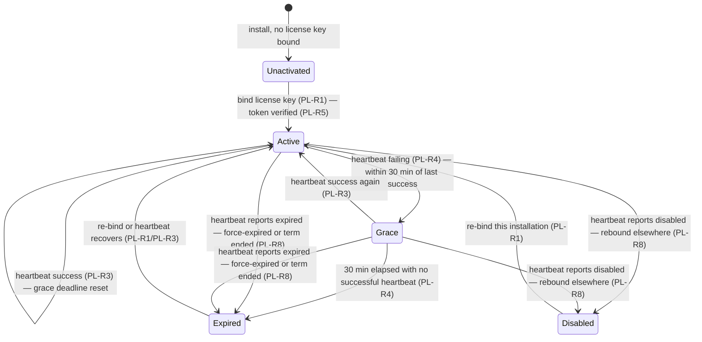

# product-license — Domain Spec

## Overview

The product-license domain decides whether a c3 installation is **commercially entitled** to create
new work and surfaces that state to the user. The authoritative entitlement record lives in the
separate **license-server (LS)**; c3 is the **enforcer**. A user obtains a **license key** (a
shareable handle for a license), pastes it into an installation to **bind** that installation to the
license, then **heartbeats** periodically. Between heartbeats and through transient outages, c3
trusts an **LS-signed entitlement token** it verifies **offline** (Ed25519), bounded by a
**30-minute offline grace** from the last successful heartbeat.

This domain is distinct from [auth](../../core/auth/auth-overview.md): auth decides _who_ may drive
agents (local access control), product-license decides _whether the product is paid for_
(server-authoritative entitlement). See [ADR-0026](../../../architecture/adr/0026-product-licensing-separate-license-server.md).

**Scope:** account sign-in + trial issuance (LS), license-key binding, heartbeat + offline grace,
offline token verification, new-session gating, badge/menu surfacing, the renewal payment +
no-refund flow (LS), and admin license operations (LS).
**Boundary:** it does not authenticate connections, does not gate individual tool calls, and never
interrupts an in-flight run or an existing session.

## Core entities

| Entity              | Description                                                                                        | Key attributes                                                                            |
| ------------------- | -------------------------------------------------------------------------------------------------- | ----------------------------------------------------------------------------------------- |
| License             | The authoritative, LS-owned record that an installation is entitled, with a term and a status      | license identity, owner, plan, term (validity window), status (active/expired)            |
| License key         | A **random, unique, shareable handle** that identifies a license on the c3 ↔ LS API; not a bearer  | opaque value, unique per license, presented on bind and heartbeat                         |
| Live binding        | The **exclusive** link between a license and the single installation currently using it            | installation identifier, validity token (alive token), last-successful-heartbeat time     |
| Alive token         | The **per-binding bearer credential** generated at bind, presented on every heartbeat; rotated     | opaque bearer value (LS stores only its hash; plaintext returned to c3 once at bind)      |
| Entitlement         | The c3-side derived answer "may this installation create new work right now?"                      | state (see § States), last-successful-heartbeat time, grace deadline                      |
| Entitlement token   | The LS-signed, offline-verifiable assertion of entitlement that c3 caches and checks between beats | subject/installation binding, validity window, signature (Ed25519)                        |
| Plan                | A purchasable license term in the LS-owned public catalog (the same for every buyer)               | stable id, name, duration, price (minor unit) + currency                                  |
| Order               | The LS-owned purchase record that extends a license's term and status                              | buyer, plan, the license it extends, payment reference (WeChat Pay), no-refund acceptance |
| No-refund agreement | The service-agreement acceptance recorded before sign-in (trial) or on the order (renewal)         | accepted flag, accepted-at, agreement version                                             |

LS owns Plan, License, License key, the live binding (alive token / installation / alive time), and
Order. c3 holds only the derived Entitlement and the cached Entitlement token (plus the license key
and alive token, used as a handle and a heartbeat credential respectively — never as long-term proof
of entitlement).

> **Note — trial issuance.** GitHub sign-in is used **only to log in / register an account**. Before
> sign-in the user must accept the no-refund service agreement; on first sign-in LS creates the
> account and issues a **default trial license** with a fresh license key, then shows the key for the
> user to copy. PL-R9's "accept before proceeding" rule applies at this sign-in gate; the renewal
> path records acceptance on the order instead.

## Business rules

| ID     | Rule                                                                                                                                                                                                                                                                                                                                                                                                                                                                                                                                                                                                 |
| ------ | ---------------------------------------------------------------------------------------------------------------------------------------------------------------------------------------------------------------------------------------------------------------------------------------------------------------------------------------------------------------------------------------------------------------------------------------------------------------------------------------------------------------------------------------------------------------------------------------------------- |
| PL-R1  | **Activation binds a license key to an installation.** A user activates an installation by submitting a **license key** plus an installation identifier. On success LS records the binding **exclusively** (one installation per license), and returns a signed **entitlement token**, an **alive token** (plaintext, once), the term end, and the heartbeat interval. The entitlement is the validity window only — plan is not carried on the token or the bind/heartbeat response. A license that is not `active` (status `expired` or a lapsed term) is rejected.                                |
| PL-R2  | **The license key is a handle, not a heartbeat credential.** Heartbeats authenticate with the **alive token** (the per-binding bearer credential), never with the license key alone. The license key may be shared/displayed; it never proves entitlement and cannot, by itself, complete a heartbeat.                                                                                                                                                                                                                                                                                               |
| PL-R3  | **Heartbeat confirms and refreshes.** c3 heartbeats periodically with the license key, the installation identifier, and the alive token. When the binding still matches and the license is active and within term, LS refreshes the last-success time, returns a refreshed signed entitlement token, and dictates the next interval.                                                                                                                                                                                                                                                                 |
| PL-R4  | **30-minute offline grace.** If heartbeats fail (network down, LS unreachable, or a transient error), c3 keeps treating entitlement as `active` for **30 minutes** from the **last successful heartbeat**. After 30 minutes without a successful heartbeat, entitlement lapses and gating applies.                                                                                                                                                                                                                                                                                                   |
| PL-R5  | **Offline verification is authoritative for trust.** c3 honors `active` only after verifying the entitlement token's **Ed25519 signature** against the **embedded LS public key** and confirming the token is within its validity window. A missing, malformed, expired, or unverifiable token is treated as **not entitled** (deny-by-default). The network is never trusted for the "active" answer — only a valid signature is.                                                                                                                                                                   |
| PL-R6  | **Gating blocks only new-session creation.** When entitlement is not `active`, c3 **refuses to create new sessions**. Existing sessions (including idle ones) remain fully usable and **in-flight runs are never interrupted** (consistent with ADR-0006: runs are decoupled from connections and survive). Gating stops _new_ work, never _current_ work.                                                                                                                                                                                                                                           |
| PL-R7  | **State is always surfaced.** The current entitlement state is shown to the user as a **license badge** and a **license menu** offering activation, status detail, a purchase/renew link, and (when unactivated/expired/disabled) guidance. When entitled (`Active`/`Grace`) and a term end is known, the badge also shows the **validity/expiry date** (the term end), so the user can see how long the purchased service runs; an unknown term end (0) renders no date. The badge never blocks the UI by itself — gating is enforced at new-session creation (PL-R6), not by hiding the interface. |
| PL-R8  | **Displacement and expiry propagate via heartbeat.** A heartbeat whose installation id or alive token no longer matches the license's live binding returns `disabled` — the license was rebound to another installation, so this one is gated and **cannot be recovered by going offline**. When the license is no longer `active` (an admin force-expired it, status `expired`) or the term has ended, the heartbeat returns `expired`. Neither can be out-waited because the heartbeats that _succeed_ report the verdict.                                                                         |
| PL-R9  | **No-refund acceptance is required.** Acceptance of the **no-refund service agreement** is recorded **before GitHub sign-in** on the trial path, and **on the order** before payment on the renewal path. Renewal payment is taken via **WeChat Pay**; a paid order extends the linked license's term and status.                                                                                                                                                                                                                                                                                    |
| PL-R10 | **No refunds (MVP).** The product is a **virtual/digital good**; the service agreement states it does **not support refunds**. The MVP has **no refund workflow** — there is no automated or self-service refund path. (Chargebacks/abuse are handled out-of-band by an admin **force-expiring** the license, PL-R8/PL-R11.)                                                                                                                                                                                                                                                                         |
| PL-R11 | **Admin operations are authority-side.** A license admin (authenticated via **GitHub OAuth** on the LS back-office) may **issue**, **force-expire** (set status `expired`), and **inspect** licenses, bindings, and orders. Admin operations change the authoritative record; their effect reaches c3 only through subsequent heartbeats (PL-R8). c3 has no admin surface for licenses.                                                                                                                                                                                                              |
| PL-R12 | **Secret-by-reference; only the public key ships in c3.** The c3 binary embeds only the LS **public** verification key. Signing keys, OAuth client secrets, and payment credentials live exclusively in LS (never in the c3 binary, the entitlement cache, or any c3 config). Mirrors the auth domain's secret-by-reference discipline (AUTH-R4).                                                                                                                                                                                                                                                    |
| PL-R13 | **Bind/heartbeat are idempotent and fail-soft for current work.** A failed bind or heartbeat never crashes c3 and never interrupts running work; it only affects whether _new_ sessions may be created once the grace window is exhausted. Binding may be retried; a transient heartbeat error is retried before the grace deadline.                                                                                                                                                                                                                                                                 |

## States & transitions

The c3-side **Entitlement** is in exactly one state:

- **Unactivated** — no license key has been bound, or the entitlement cache is absent/unverifiable.
  New-session creation is **gated** (PL-R6).
- **Active** — a valid, signature-verified entitlement token within its window and the last
  successful heartbeat within the grace window. New sessions allowed.
- **Grace** — heartbeats are currently failing but the last success is under 30 minutes old. Still
  treated as `active` for gating (new sessions allowed) — this state exists to bound the trust.
- **Expired** — the grace window elapsed with no successful heartbeat, or the heartbeat reported
  `expired` because the license is no longer `active` (an admin force-expired it) or the term ended.
  New-session creation gated; recovery is a re-bind or a heartbeat that recovers (PL-R1/PL-R3).
- **Disabled** — a successful heartbeat reported `disabled` because the license was rebound to
  another installation (PL-R8). New-session creation gated; recovery requires re-binding the license
  to this installation.

For gating purposes, `Active` and `Grace` permit new sessions; `Unactivated`, `Expired`, and
`Disabled` gate them. In **every** state, existing sessions and in-flight runs are untouched (PL-R6).

### State derivation priority — cached verdict over token re-verification

The derived state is computed from the entitlement cache with a strict priority order, so a still-valid
cached token can never resurrect a heartbeat verdict:

1. **Terminal heartbeat verdicts are authoritative.** A cached `Disabled` or `Expired` — written by a
   heartbeat from an authoritative LS verdict (PL-R8) or grace-window exhaustion (PL-R4) — is returned
   as-is and is **never** re-verified back to `Active`. The cached token's validity window is irrelevant
   here: an admin force-expire or a displacement must not be out-waited by going offline while the
   token's term has not yet lapsed. Recovery from these states is a re-bind (PL-R1) or a recovering
   heartbeat (PL-R3), each of which rewrites the cached state.
2. **`Grace` is entitled only while its window holds.** A cached `Grace` stays entitled while the
   30-minute offline window from the last successful heartbeat is unexpired; past it, derivation reports
   `Expired` even before the next heartbeat writes the transition (e.g. across a restart before the
   first beat lands).
3. **Offline baseline (no heartbeat verdict).** Only when the cached state is `Active`/`Unactivated`
   does derivation fall back to offline token verification (PL-R5): an absent/unverifiable token ⇒
   `Unactivated`, a verified token past its window ⇒ `Expired`, a verified in-window token ⇒ `Active`.
   This is what downgrades a stale `Active` cache after a term lapse over a restart, without ever
   upgrading a terminal verdict.

## Gating enforcement boundary

PL-R6 names new-session creation as the gate, but the runtime has several session-creation entry
points. This intent enforces the gate at the **single user-driven console entry** and explicitly scopes
out the automated/intent-internal ones (their gating is a separate decision, not made here).

| Entry point                                                             | Kind      | Gated?          | Rationale                                                                                                                               |
| ----------------------------------------------------------------------- | --------- | --------------- | --------------------------------------------------------------------------------------------------------------------------------------- |
| `create_session` (works) — the user opens a new console chat            | `session` | **Yes**         | The user-driven creation of new work; this is the enforcement point. Refusal writes no pending row, mints no runtime, switches no view. |
| `open_intent_chat` / `refine_intent` / `discussion_to_intent` (intents) | `intent`  | No (scoped out) | Intent-tool **communication** sessions; the intent workflow's own gating policy is deliberately undecided here.                         |
| `start_intent_dev` dev session (intents)                                | `session` | No (scoped out) | Auto dev session launched from an intent; an automated, non-user-initiated entry.                                                       |
| automation / discussion run sessions (intent automation)                | `session` | No (scoped out) | Scheduled / automated runs; non-user-initiated.                                                                                         |
| `dev-turn` programmatic turn (wiring)                                   | `session` | No (scoped out) | Internal programmatic launch.                                                                                                           |

**Refusal contract (`create_session`).** When `currentLicenseStatus().entitled` is false
(`Unactivated`/`Expired`/`Disabled`), the handler sends a structured `license.notEntitled` error whose
`reason` carries the entitlement **state** (so the web localizes the cause and points to the renewal
entry — the license badge), and returns **before any side effect**: no `work_session_metadata` pending
row, no `ensureRuntime`, no `removeViewer`/view switch. While entitled (`Active`/`Grace`) creation
proceeds unchanged. Correctness depends on the state-derivation priority above: a terminal heartbeat
verdict is never re-verified back to entitled, so a force-expired/displaced license cannot out-wait the
gate by going offline.

## No-refund policy

The product is sold as a **virtual/digital good**. Acceptance of a **no-refund service agreement**
is recorded before the user proceeds — at GitHub sign-in on the trial path, and on the order before
payment on the renewal path (PL-R9); the agreement states the product does not support refunds. The
MVP deliberately ships **no refund workflow** (PL-R10) — a non-goal, not an omission. Disputes,
chargebacks, and abuse are handled out-of-band by an admin **force-expiring** the license (PL-R11),
which propagates to c3 via heartbeat as `expired` (PL-R8).

## Admin operations (license-server)

Admins authenticate on the LS back-office via GitHub OAuth (PL-R11) and may:

- **Issue** a license (e.g. for a manual or comped sale).
- **Force-expire** a license — set its status to `expired` (chargeback, abuse, or refund-equivalent handling).
- **Inspect** licenses, bindings, and orders.

Admin changes mutate the authoritative LS record only; c3 observes the effect on its next heartbeat.
c3 exposes **no** license-admin surface.

## Security invariants

- **Trust comes from the signature, not the network (PL-R5).** A forged "active" cannot be injected
  by tampering with traffic — c3 verifies Ed25519 against an embedded public key, offline.
- **Deny-by-default on verification failure (PL-R5).** An unverifiable/expired/absent token ⇒ not
  entitled. Balanced against "never kill in-flight work": the consequence is gating **new** sessions
  only (PL-R6), never interrupting running ones.
- **License key is a handle, not a credential (PL-R2).** The license key identifies a license and may
  be shared/displayed; only the per-binding alive token authenticates a heartbeat.
- **Exclusive binding, rotated credential (PL-R8).** A license binds to one installation at a time;
  the alive token rotates on each (re)bind and LS stores only its hash. A displaced installation is
  reported `disabled` on its next heartbeat and cannot out-wait the grace window.
- **Only the public key in c3 (PL-R12).** No signing key, OAuth secret, or payment credential ever
  ships in the c3 binary or rests in its config/cache.

## User scenarios

- **Trial sign-in + activation:** Given an unactivated installation, When the user accepts the
  no-refund agreement and signs in to LS with GitHub, LS creates the account, issues a default trial
  license, and shows its **license key**; the user pastes the key into c3, which binds the
  installation (PL-R1), verifies the returned signed token (PL-R5), enters `Active`, and the badge
  shows entitled.
- **Routine heartbeat:** Given an active installation, When a heartbeat succeeds, Then the grace
  deadline resets and the refreshed token is cached (PL-R3).
- **Transient outage:** Given LS is briefly unreachable, When heartbeats fail for under 30 minutes,
  Then c3 stays in `Grace` and new sessions remain allowed (PL-R4); recovery returns it to `Active`.
- **Sustained lapse:** Given heartbeats fail for over 30 minutes, When the grace window elapses,
  Then entitlement is `Expired` and **new-session creation is gated** while existing sessions keep
  working (PL-R4/PL-R6).
- **Displacement:** Given the same license key is bound on a second installation, When this
  installation's next heartbeat reports `disabled`, Then it lapses to gated and cannot be recovered
  offline (PL-R8); existing in-flight runs still finish (PL-R6).
- **Force-expire:** Given an admin force-expires the license (status `expired`), When the next
  heartbeat reports `expired`, Then c3 lapses to gated; existing in-flight runs still finish
  (PL-R8/PL-R6).

### Anti-scenarios (must never happen)

- A new session must **never** be created while entitlement is `Unactivated`, `Expired`, or
  `Disabled` (PL-R6).
- Gating must **never** interrupt an in-flight run or make an existing session unusable (PL-R6).
- c3 must **never** honor `active` from an entitlement token whose Ed25519 signature does not verify
  against the embedded public key (PL-R5).
- The license key alone must **never** be accepted as a heartbeat credential; only the per-binding
  alive token authenticates a heartbeat (PL-R2).
- A signing key, OAuth client secret, or payment credential must **never** ship in the c3 binary or
  rest in its config/cache (PL-R12).
- A user must **never** proceed to sign-in (trial) or payment (renewal) without recording acceptance
  of the no-refund agreement (PL-R9).

## Non-goals

- **No refund workflow (MVP)** — virtual product; no-refund agreement governs (PL-R10).
- **No multi-tenant / organization accounts** — entitlement binds to an installation, not an org.
- **No license admin surface in c3** — admin operations live only on LS (PL-R11).
- **Not an auth provider** — product-license is never expressed as an `AuthProvider` arm or merged
  into the auth runtime (ADR-0026).
- **No per-tool licensing** — entitlement gates new-session creation, not individual capabilities.

## Domain events / interactions

- **web-console** — renders the license **badge** and **menu**, the activation entry (paste license
  key), status detail, and the purchase/renew link; receives entitlement-state surfacing over the c3
  WebSocket ([shared protocol](../../../shared/api-conventions/websocket-protocol.md)).
- **session-registry** — consulted at **new-session creation** via the `create_session` handler
  (works feature): a gated entitlement refuses creation before any pending row / runtime is written
  (PL-R6, see § Gating enforcement boundary). The registry's existing sessions and the run lifecycle
  are otherwise untouched; intent-internal and automated session-creation paths are out of this gate's
  scope.
- **license-server (external)** — the authoritative entitlement record; c3 calls it over the
  [license-server API contract](../../../shared/api-conventions/license-server-api.md) for
  binding and heartbeat, and the LS web hosts account sign-in, trial issuance, the renewal payment +
  no-refund flow, and the admin back-office.
- **auth domain** — **independent**. Product-license neither reads nor writes auth state; gating
  applies regardless of the active auth provider (ADR-0026).

## Data dictionary

- **Entitled / Gated** — "entitled" = entitlement permits new-session creation (`Active`/`Grace`);
  "gated" = new-session creation is refused (`Unactivated`/`Expired`/`Disabled`).
- **Offline grace** — the 30-minute window after the last successful heartbeat during which c3
  treats entitlement as active despite failing heartbeats (PL-R4).
- **Activation / binding** — pasting a license key into c3 to bind an installation, yielding the
  first signed entitlement token + alive token (PL-R1).
- **License key** — the random, unique, shareable handle that identifies a license on the c3 ↔ LS
  API; not a bearer credential (PL-R2).
- **Alive token** — the per-binding bearer credential, rotated on each (re)bind, presented on every
  heartbeat; LS stores only its hash (PL-R3/PL-R8).
- **Entitlement cache** — the small on-disk store holding the cached entitlement token, the license
  key, and the alive token; written with **0600** permissions to protect the bearer token from other
  users on the same machine.
- **trial plan** — a catalog plan flagged `is_trial`; the first such plan (if any) is issued as the
  default trial term at first sign-in. With no trial plan configured, no trial is issued and the buyer
  must purchase.
- See [glossary](../../../glossary.md) for license-server, Entitlement, Entitlement token, License
  key, Alive token, License badge, Session gating, and No-refund agreement.
