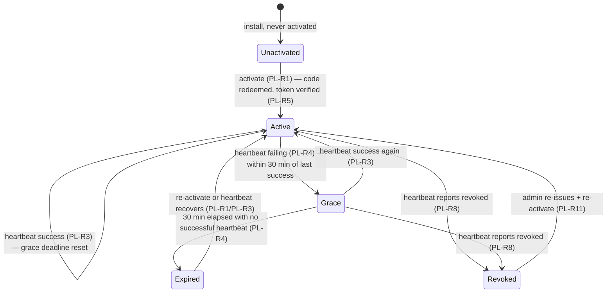

# product-license — Domain Spec

## Overview

The product-license domain decides whether a c3 installation is **commercially entitled** to create
new work and surfaces that state to the user. The authoritative entitlement record lives in the
separate **license-server (LS)**; c3 is the **enforcer**. An installation **activates** once
(consuming a one-time, short-lived activation code), then **heartbeats** periodically. Between
heartbeats and through transient outages, c3 trusts an **LS-signed entitlement token** it verifies
**offline** (Ed25519), bounded by a **30-minute offline grace** from the last successful heartbeat.

This domain is distinct from [auth](../../core/auth/auth-overview.md): auth decides _who_ may drive
agents (local access control), product-license decides _whether the product is paid for_
(server-authoritative entitlement). See [ADR-0026](../../../architecture/adr/0026-product-licensing-separate-license-server.md).

**Scope:** activation, heartbeat + offline grace, offline token verification, new-session gating,
badge/menu surfacing, the buyer payment + no-refund flow (LS), and admin license operations (LS).
**Boundary:** it does not authenticate connections, does not gate individual tool calls, and never
interrupts an in-flight run or an existing session.

## Core entities

| Entity              | Description                                                                                        | Key attributes                                                                          |
| ------------------- | -------------------------------------------------------------------------------------------------- | --------------------------------------------------------------------------------------- |
| License             | The authoritative, LS-owned record that an installation is entitled, with a term and a status      | license identity, owner (buyer), term (validity window), status (active/revoked)        |
| Entitlement         | The c3-side derived answer "may this installation create new work right now?"                      | state (see § States), last-successful-heartbeat time, grace deadline                    |
| Entitlement token   | The LS-signed, offline-verifiable assertion of entitlement that c3 caches and checks between beats | subject/installation binding, validity window, signature (Ed25519)                      |
| Activation code     | A **one-time, short-lived** credential a buyer redeems to activate an installation                 | opaque value, single-use flag, short expiry                                             |
| Heartbeat token     | The **long-lived bearer credential** issued at activation, presented on every heartbeat; revocable | opaque bearer value, bound to the installation, revocable at LS                         |
| Order               | The LS-owned purchase record produced by the buyer payment flow                                    | buyer (GitHub identity), payment reference (WeChat Pay), no-refund-agreement acceptance |
| No-refund agreement | The service-agreement acceptance the buyer must record before payment                              | accepted flag, accepted-at, agreement version                                           |

LS owns License, Activation code, Heartbeat token, Order, and No-refund agreement. c3 holds only the
derived Entitlement and the cached Entitlement token (plus the heartbeat token, used as a credential
— never as long-term proof of entitlement).

## Business rules

| ID     | Rule                                                                                                                                                                                                                                                                                                                                                                                                                                                       |
| ------ | ---------------------------------------------------------------------------------------------------------------------------------------------------------------------------------------------------------------------------------------------------------------------------------------------------------------------------------------------------------------------------------------------------------------------------------------------------------- |
| PL-R1  | **Activation is one-time, with a one-time code.** A buyer activates an installation by redeeming an **activation code** that is **single-use** and **short-lived**. On success LS returns a signed **entitlement token** and a long-lived **heartbeat token**. An expired or already-consumed code is rejected.                                                                                                                                            |
| PL-R2  | **The activation code is never a heartbeat credential.** Heartbeats authenticate with the **heartbeat bearer token**, never with the activation code. c3 must not retain or replay the activation code after activation; LS must reject any attempt to use it as a heartbeat credential.                                                                                                                                                                   |
| PL-R3  | **Heartbeat confirms and refreshes.** c3 heartbeats periodically with the heartbeat bearer token. A successful heartbeat returns the current entitlement status, may return a refreshed signed entitlement token, and resets the offline-grace deadline. The next heartbeat interval is dictated by LS.                                                                                                                                                    |
| PL-R4  | **30-minute offline grace.** If heartbeats fail (network down, LS unreachable, or a transient error), c3 keeps treating entitlement as `active` for **30 minutes** from the **last successful heartbeat**. After 30 minutes without a successful heartbeat, entitlement lapses to `grace`-expired and gating applies.                                                                                                                                      |
| PL-R5  | **Offline verification is authoritative for trust.** c3 honors `active` only after verifying the entitlement token's **Ed25519 signature** against the **embedded LS public key** and confirming the token is within its validity window. A missing, malformed, expired, or unverifiable token is treated as **not entitled** (deny-by-default). The network is never trusted for the "active" answer — only a valid signature is.                         |
| PL-R6  | **Gating blocks only new-session creation.** When entitlement is not `active`, c3 **refuses to create new sessions**. Existing sessions (including idle ones) remain fully usable and **in-flight runs are never interrupted** (consistent with ADR-0006: runs are decoupled from connections and survive). Gating stops _new_ work, never _current_ work.                                                                                                 |
| PL-R7  | **State is always surfaced.** The current entitlement state is shown to the user as a **license badge** and a **license menu** offering activation, status detail, a purchase link, and (when unactivated/expired) guidance. The badge never blocks the UI by itself — gating is enforced at new-session creation (PL-R6), not by hiding the interface.                                                                                                    |
| PL-R8  | **Revocation propagates via heartbeat.** When LS revokes a license, the next heartbeat returns a non-active status (or LS withholds a refreshed token). Once the cached token's window ends or a heartbeat reports revoked — at the latest after the grace window — c3 lapses to gated. Revocation cannot be undone by going offline (a revoked installation cannot out-wait the 30-minute grace because heartbeats that _succeed_ report the revocation). |
| PL-R9  | **Purchase requires no-refund acceptance.** On the LS buyer flow, the buyer logs in via **GitHub OAuth**, and must **explicitly accept the no-refund service agreement** before payment. Payment is taken via **WeChat Pay**. A paid order issues an activation code to the buyer.                                                                                                                                                                         |
| PL-R10 | **No refunds (MVP).** The product is a **virtual/digital good**; the service agreement states it does **not support refunds**. The MVP has **no refund workflow** — there is no automated or self-service refund path. (Chargebacks/abuse are handled out-of-band by admin revocation, PL-R8/PL-R11.)                                                                                                                                                      |
| PL-R11 | **Admin operations are authority-side.** A license admin (authenticated via **GitHub OAuth** on the LS back-office) may **issue**, **revoke**, and **inspect** licenses, activations, orders, and heartbeats. Admin operations change the authoritative record; their effect reaches c3 only through subsequent heartbeats (PL-R8). c3 has no admin surface for licenses.                                                                                  |
| PL-R12 | **Secret-by-reference; only the public key ships in c3.** The c3 binary embeds only the LS **public** verification key. Signing keys, OAuth client secrets, and payment credentials live exclusively in LS (never in the c3 binary, the entitlement cache, or any c3 config). Mirrors the auth domain's secret-by-reference discipline (AUTH-R4).                                                                                                          |
| PL-R13 | **Activation/heartbeat are idempotent and fail-soft for current work.** A failed activation or heartbeat never crashes c3 and never interrupts running work; it only affects whether _new_ sessions may be created once the grace window is exhausted. Activation may be retried; a transient heartbeat error is retried before the grace deadline.                                                                                                        |

## States & transitions

The c3-side **Entitlement** is in exactly one state:

- **Unactivated** — never activated, or the entitlement cache is absent/unverifiable. New-session
  creation is **gated** (PL-R6).
- **Active** — a valid, signature-verified entitlement token within its window and the last
  successful heartbeat within the grace window. New sessions allowed.
- **Grace** — heartbeats are currently failing but the last success is under 30 minutes old. Still
  treated as `active` for gating (new sessions allowed) — this state exists to bound the trust.
- **Expired** — the grace window elapsed with no successful heartbeat. New-session creation gated.
- **Revoked** — a successful heartbeat reported the license revoked (PL-R8). New-session creation
  gated; recovery requires admin re-issue + re-activation.

For gating purposes, `Active` and `Grace` permit new sessions; `Unactivated`, `Expired`, and
`Revoked` gate them. In **every** state, existing sessions and in-flight runs are untouched (PL-R6).

## No-refund policy

The product is sold as a **virtual/digital good**. The buyer must accept a **no-refund service
agreement** before payment (PL-R9); the agreement states the product does not support refunds. The
MVP deliberately ships **no refund workflow** (PL-R10) — a non-goal, not an omission. Disputes,
chargebacks, and abuse are handled out-of-band by an admin **revoking** the license (PL-R11), which
propagates to c3 via heartbeat (PL-R8).

## Admin operations (license-server)

Admins authenticate on the LS back-office via GitHub OAuth (PL-R11) and may:

- **Issue** a license / activation code (e.g. for a manual or comped sale).
- **Revoke** a license (chargeback, abuse, or refund-equivalent handling).
- **Inspect** licenses, orders, activations, and heartbeat history.

Admin changes mutate the authoritative LS record only; c3 observes the effect on its next heartbeat.
c3 exposes **no** license-admin surface.

## Security invariants

- **Trust comes from the signature, not the network (PL-R5).** A forged "active" cannot be injected
  by tampering with traffic — c3 verifies Ed25519 against an embedded public key, offline.
- **Deny-by-default on verification failure (PL-R5).** An unverifiable/expired/absent token ⇒ not
  entitled. Balanced against "never kill in-flight work": the consequence is gating **new** sessions
  only (PL-R6), never interrupting running ones.
- **One-time, short-lived activation codes (PL-R1/PL-R2).** Codes are single-use and expire quickly,
  and are never reusable as heartbeat credentials.
- **Revocable long-lived credential (PL-R8).** The heartbeat bearer token is the only long-lived
  secret on the c3 side; LS can revoke it, and revocation reaches c3 at the latest after the grace
  window.
- **Only the public key in c3 (PL-R12).** No signing key, OAuth secret, or payment credential ever
  ships in the c3 binary or rests in its config/cache.

## User scenarios

- **First activation:** Given an unactivated installation, When the buyer purchases on LS (GitHub
  login → accept no-refund agreement → WeChat Pay) and redeems the issued activation code in c3,
  Then c3 verifies the returned signed token (PL-R5), enters `Active`, and the badge shows entitled.
- **Routine heartbeat:** Given an active installation, When a heartbeat succeeds, Then the grace
  deadline resets and any refreshed token is cached (PL-R3).
- **Transient outage:** Given LS is briefly unreachable, When heartbeats fail for under 30 minutes,
  Then c3 stays in `Grace` and new sessions remain allowed (PL-R4); recovery returns it to `Active`.
- **Sustained lapse:** Given heartbeats fail for over 30 minutes, When the grace window elapses,
  Then entitlement is `Expired` and **new-session creation is gated** while existing sessions keep
  working (PL-R4/PL-R6).
- **Revocation:** Given an admin revokes the license, When the next heartbeat reports revoked, Then
  c3 lapses to gated; existing in-flight runs still finish (PL-R8/PL-R6).

### Anti-scenarios (must never happen)

- A new session must **never** be created while entitlement is `Unactivated`, `Expired`, or
  `Revoked` (PL-R6).
- Gating must **never** interrupt an in-flight run or make an existing session unusable (PL-R6).
- c3 must **never** honor `active` from an entitlement token whose Ed25519 signature does not verify
  against the embedded public key (PL-R5).
- An activation code must **never** be accepted as a heartbeat credential, nor reused after it is
  consumed (PL-R1/PL-R2).
- A signing key, OAuth client secret, or payment credential must **never** ship in the c3 binary or
  rest in its config/cache (PL-R12).
- A buyer must **never** reach payment without recording acceptance of the no-refund agreement
  (PL-R9).

## Non-goals

- **No refund workflow (MVP)** — virtual product; no-refund agreement governs (PL-R10).
- **No multi-tenant / organization accounts** — entitlement binds to an installation, not an org.
- **No license admin surface in c3** — admin operations live only on LS (PL-R11).
- **Not an auth provider** — product-license is never expressed as an `AuthProvider` arm or merged
  into the auth runtime (ADR-0026).
- **No per-tool licensing** — entitlement gates new-session creation, not individual capabilities.

## Domain events / interactions

- **web-console** — renders the license **badge** and **menu**, the activation entry, status
  detail, and the purchase link; receives entitlement-state surfacing over the c3 WebSocket
  ([shared protocol](../../../shared/api-conventions/websocket-protocol.md)).
- **session-registry** — consulted at **new-session creation**: a gated entitlement refuses
  creation (PL-R6). The registry's existing sessions and the run lifecycle are otherwise untouched.
- **license-server (external)** — the authoritative entitlement record; c3 calls it over the
  [license-server API contract](../../../shared/api-conventions/license-server-api.md) for
  activation and heartbeat, and the LS web hosts the buyer payment + no-refund flow and the admin
  back-office.
- **auth domain** — **independent**. Product-license neither reads nor writes auth state; gating
  applies regardless of the active auth provider (ADR-0026).

## Data dictionary

- **Entitled / Gated** — "entitled" = entitlement permits new-session creation (`Active`/`Grace`);
  "gated" = new-session creation is refused (`Unactivated`/`Expired`/`Revoked`).
- **Offline grace** — the 30-minute window after the last successful heartbeat during which c3
  treats entitlement as active despite failing heartbeats (PL-R4).
- **Activation** — the one-time redemption of an activation code that binds an installation and
  yields the first signed entitlement token + heartbeat token (PL-R1).
- See [glossary](../../../glossary.md) for license-server, Entitlement, Entitlement token,
  Activation code, Heartbeat token, License badge, Session gating, and No-refund agreement.
