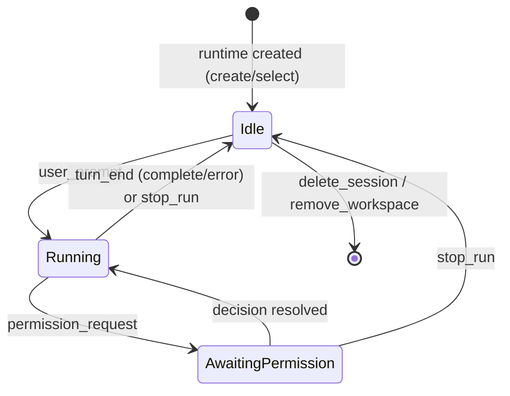
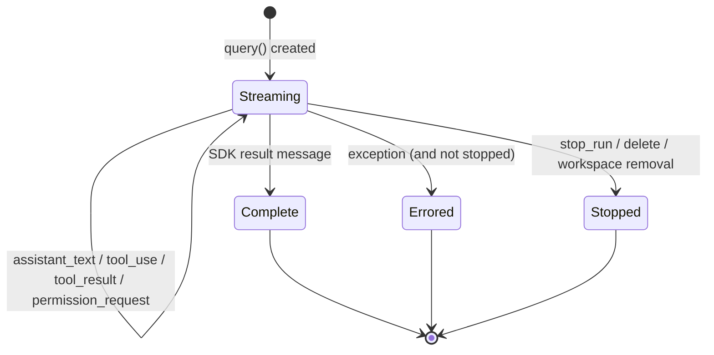

# agent-session — Domain Spec

## Overview

An agent session turns a user prompt into a Claude Agent SDK `query()` run, streams the run's
activity, gates sensitive tools through the [permission-gateway](../permission-gateway/spec.md),
and lets the user steer the run via permission mode and interruption.

A run is **not** bound to the browser connection that started it. Each session has a
process-wide **Session Runtime** that owns its run; a connection is only a **view** onto a
session (which one it currently watches). Switching the view or closing the socket never stops
a run — it keeps going in the background, and a returning view replays everything that happened
(ADR 0006). Different sessions run **concurrently** with no fixed cap; a single session is
**serial** (one turn at a time).

The run's context — working directory (`cwd`), starting permission mode, and the `resume`
session id — comes from the runtime, seeded by the
[session-registry](../session-registry/spec.md).

**Scope:** run lifecycle (start, stream, end, stop), background execution & replay buffering,
permission-mode policy, session continuity (`resume`), live status, and faithful mapping of SDK
messages to wire events. **Boundary:** it does not decide individual permissions (gateway),
does not manage the workspace/session registry (session-registry), and does not render UI
(web-console).

## Core entities

| Entity          | Description                                                                                                         |
| --------------- | ------------------------------------------------------------------------------------------------------------------- |
| Session Runtime | Process-wide owner of one session's execution: its run, `baseline + buffer` for replay, current viewers, and status |
| Agent Run       | One `query()` invocation driven by one user prompt                                                                  |
| Run Handle      | Live controls over an in-flight run (currently: set permission mode)                                                |
| Connection View | One WebSocket connection's subscription to the session it currently watches (delivers live events; replays on join) |

See [models.md](models.md).

## Business rules

| ID     | Rule                                                                                                                                                                                                                                                                           |
| ------ | ------------------------------------------------------------------------------------------------------------------------------------------------------------------------------------------------------------------------------------------------------------------------------ |
| AS-R1  | A `user_prompt` starts a new Agent Run against the viewed session's runtime, with that session's `cwd`, permission mode, and (for an existing session) `resume` id. The prompt is echoed into the stream as `user_text` so every viewer (and switch-back replay) shows it.     |
| AS-R2  | A session is **serial**: at most one Agent Run is in flight per session. A `user_prompt` for a session whose turn is already in flight is rejected with `error` and starts nothing. Different sessions run **concurrently** with no fixed cap.                                 |
| AS-R3  | Permission mode is **per session** (owned by the runtime, mirrored to session-registry). A run starts in the session's mode; `set_mode` changes only the viewed session's mode.                                                                                                |
| AS-R10 | A run reports its SDK session id (from the `init` message) so a pending session binds to a real id and subsequent prompts `resume` it. Binding **re-keys** the runtime (buffer, viewers, run move with it); a resumed run keeps the same id.                                   |
| AS-R4  | A `set_mode` applies to the viewed session's in-flight run immediately if one exists; otherwise it takes effect on that session's next run. The change is confirmed with `mode_changed`.                                                                                       |
| AS-R5  | The mode determines which tool calls are sensitive and thus reach the gateway. `bypassPermissions` authorizes auto-execution of all tools; `acceptEdits` auto-accepts edit-class tools; `default`/`auto`/`plan` route sensitive calls to the gateway per the SDK classifier.   |
| AS-R6  | A run is stopped only by `stop_run` (the viewed session), `delete_session`, or `remove_workspace` — never by switching the view or closing the socket. Stopping interrupts the underlying `query()`; a run already finished or not yet streaming is interrupted harmlessly.    |
| AS-R7  | A run ends with exactly one terminal outcome: `turn_end` with `reason: 'complete'` (the SDK produced a result, or the run was stopped) or `reason: 'error'` (an exception). `turn_end` never means the session ended — it stays alive for the next prompt.                     |
| AS-R8  | Closing the connection only unsubscribes its view; the run **continues in the background** in its runtime. Reconnecting and selecting the session replays the full record and resumes live delivery.                                                                           |
| AS-R9  | Only the model's text blocks, tool-use blocks, and tool-result blocks are mapped to the wire; other SDK message kinds are ignored.                                                                                                                                             |
| AS-R11 | Every live event is recorded in the runtime: appended to its `buffer` and fanned out to current viewers via `emit`. A view joining a session replays `baseline` (on-disk snapshot at runtime creation) then `buffer`, so the full record is reconstructed with no duplication. |
| AS-R12 | Each runtime has a status — `idle`, `running`, or `awaiting_permission`. Any change broadcasts `session_status` to **all** connections so backgrounded sessions surface their state.                                                                                           |

## States & transitions

### Session Runtime status (process-wide, per session)

Switching the view and closing the connection do **not** change runtime status — the run runs
on in the background (AS-R8). Status changes broadcast `session_status` (AS-R12).

### Connection View

```mermaid
stateDiagram-v2
    [*] --> None: connection open
    None --> Viewing: create_session / select_session (subscribe; replay baseline+buffer)
    Viewing --> Viewing: select other (unsubscribe old, subscribe new)
    Viewing --> [*]: connection close (unsubscribe only; run survives)
```

### Agent Run

## Permission modes

| Mode                | Meaning for tool gating                                                                                        |
| ------------------- | -------------------------------------------------------------------------------------------------------------- |
| `default`           | SDK invokes the gateway only for sensitive tools; read-only auto-allowed.                                      |
| `auto`              | Like default, biased toward auto-progress where the SDK deems safe.                                            |
| `plan`              | Planning mode; the agent proposes without executing changes.                                                   |
| `acceptEdits`       | Edit-class tools auto-accepted; other sensitive tools still gated.                                             |
| `bypassPermissions` | All tools auto-executed; gateway not consulted. Requires explicit user selection (constitution C-SEC-2/SEC-7). |

The exact classification is owned by the SDK; c3 selects the mode and surfaces it.

## Domain events (wire)

Emits `mode_changed`, `user_text`, `assistant_text`, `tool_use`, `tool_result`, `turn_end`,
and `session_status` (run-status broadcast). Consumes `user_prompt`, `set_mode`, `stop_run`,
`ping`. Forwards `permission_request` on behalf of the gateway. Reports the run's SDK session id
to session-registry (which emits `session_started`). Workspace/session events (`ready`,
`workspaces`, `sessions`, `session_selected`) belong to
[session-registry](../session-registry/spec.md). Shapes in the
[shared protocol](../../../shared/api-conventions/websocket-protocol.md).

## User scenarios

- **Concurrent sessions:** Given a run in flight on session A, When the user selects session B
  and submits a prompt, Then both runs execute concurrently; neither is stopped.
- **Switch away & back:** Given session A is running, When the user views B then returns to A,
  Then A's full activity since it began (prompt, output, any pending permission) is replayed and
  live delivery resumes.
- **Stop (anti-scenario):** Selecting another session or closing the socket must **never** stop
  a run (AS-R6/AS-R8); only `stop_run`/`delete_session`/`remove_workspace` may.
- **Serial within a session (anti-scenario):** A second `user_prompt` for a session whose turn
  is in flight must **never** start a second concurrent run for that session (AS-R2).

## Interactions

- **permission-gateway** — invoked from the run's `canUseTool`; blocks the run until
  resolved. A pending request survives switching away (decisions are keyed by `requestId`).
- **Claude Agent SDK** — `query()` provides the run; `setPermissionMode` and `interrupt`
  drive it.
- **claude CLI** — spawned by the SDK as the agent process; resolved from `$CLAUDE_PATH`
  or PATH.

## Data dictionary

- **In-flight run** — a Streaming Agent Run with a live Run Handle.
- **settingSources: ['user', 'project']** — the option that inherits user/project settings
  (hooks, allow/deny rules, Skills, `CLAUDE.md`); c3 is the gateway on top (ADR 0005).
