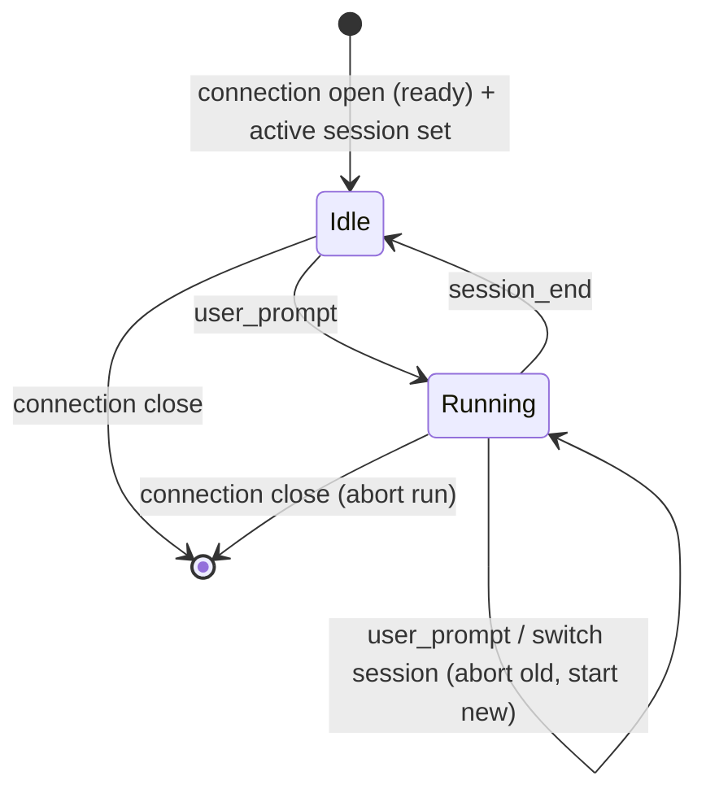
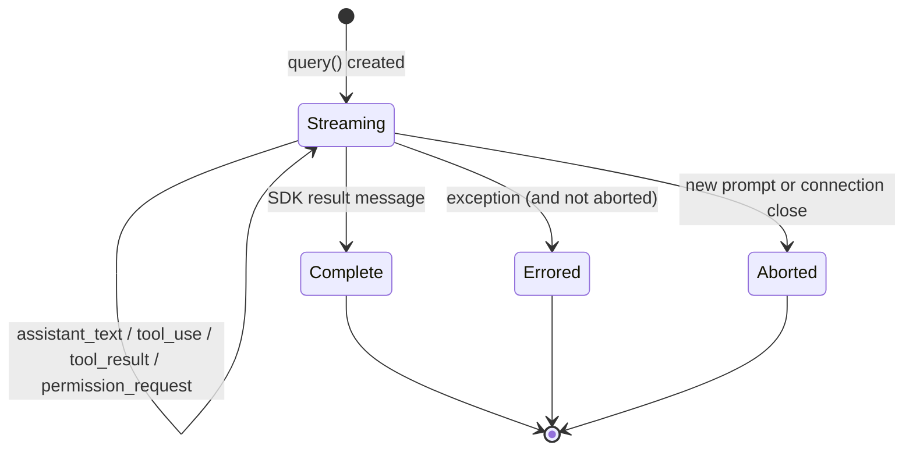

# agent-session — Domain Spec

## Overview

An agent session is the bridge between one browser connection and the Claude Agent SDK. It
turns a user prompt into a `query()` run, streams the run's activity back to the browser,
gates sensitive tools through the [permission-gateway](../permission-gateway/spec.md), and
lets the user steer the run via permission mode and interruption.

The run's context — working directory (`cwd`), starting permission mode, and the `resume`
session id — comes from the [session-registry](../session-registry/spec.md): a run executes
against the **active session**.

**Scope:** run lifecycle (start, stream, end, abort), permission-mode policy, session
continuity (`resume`), and faithful mapping of SDK messages to wire events. **Boundary:** it
does not decide individual permissions (gateway), does not manage the workspace/session
registry (session-registry), and does not render UI (web-console).

## Core entities

| Entity     | Description                                                                                         |
| ---------- | --------------------------------------------------------------------------------------------------- |
| Session    | The lifetime of one WebSocket connection; holds the current permission mode and the live run handle |
| Agent Run  | One `query()` invocation driven by one user prompt                                                  |
| Run Handle | Live controls over an in-flight run (currently: set permission mode)                                |

See [models.md](models.md).

## Business rules

| ID     | Rule                                                                                                                                                                                                                                                                         |
| ------ | ---------------------------------------------------------------------------------------------------------------------------------------------------------------------------------------------------------------------------------------------------------------------------- |
| AS-R1  | A `user_prompt` starts a new Agent Run against the active session, with that session's `cwd`, permission mode, and (for an existing session) `resume` id.                                                                                                                    |
| AS-R2  | At most one Agent Run is in flight per connection. A new `user_prompt`, or switching the active session, **aborts** the current run before starting the next (AS-R6).                                                                                                        |
| AS-R3  | Permission mode is **per session** (owned by session-registry). A run starts in the active session's mode; `set_mode` changes only that session's mode.                                                                                                                      |
| AS-R10 | A run reports its SDK session id (from the `init` message) so a pending session binds to a real id and subsequent prompts `resume` it. A resumed run keeps the same id; a new one is bound on first report.                                                                  |
| AS-R4  | A `set_mode` applies to the in-flight run immediately if one exists; otherwise it takes effect on the next run. The change is confirmed with `mode_changed`.                                                                                                                 |
| AS-R5  | The mode determines which tool calls are sensitive and thus reach the gateway. `bypassPermissions` authorizes auto-execution of all tools; `acceptEdits` auto-accepts edit-class tools; `default`/`auto`/`plan` route sensitive calls to the gateway per the SDK classifier. |
| AS-R6  | Aborting a run interrupts the underlying `query()`. A run already finished or not yet streaming is interrupted harmlessly (no crash).                                                                                                                                        |
| AS-R7  | A run ends with exactly one terminal outcome: `session_end` with `reason: 'complete'` (the SDK produced a result) or `reason: 'error'` (an exception).                                                                                                                       |
| AS-R8  | Closing the connection aborts the in-flight run and discards session state.                                                                                                                                                                                                  |
| AS-R9  | Only the model's text blocks, tool-use blocks, and tool-result blocks are mapped to the wire; other SDK message kinds are ignored.                                                                                                                                           |

## States & transitions

### Session

### Agent Run

## Permission modes

| Mode                | Meaning for tool gating                                                                                        |
| ------------------- | -------------------------------------------------------------------------------------------------------------- |
| `default`           | SDK invokes the gateway only for sensitive tools; read-only auto-allowed.                                      |
| `auto`              | Like default, biased toward auto-progress where the SDK deems safe.                                            |
| `plan`              | Planning mode; the agent proposes without executing changes.                                                   |
| `acceptEdits`       | Edit-class tools auto-accepted; other sensitive tools still gated.                                             |
| `bypassPermissions` | All tools auto-executed; gateway not consulted. Requires explicit user selection (constitution C-SEC-2/SEC-7). |

The exact classification is owned by the SDK; c3 selects the mode and surfaces it.

## Domain events (wire)

Emits `mode_changed`, `assistant_text`, `tool_use`, `tool_result`, `session_end`. Consumes
`user_prompt`, `set_mode`, `ping`. Forwards `permission_request` on behalf of the gateway.
Reports the run's SDK session id to session-registry (which emits `session_started`).
Workspace/session events (`ready`, `workspaces`, `sessions`, `session_selected`) belong to
[session-registry](../session-registry/spec.md). Shapes in the
[shared protocol](../../../shared/api-conventions/websocket-protocol.md).

## Interactions

- **permission-gateway** — invoked from the run's `canUseTool`; blocks the run until
  resolved.
- **Claude Agent SDK** — `query()` provides the run; `setPermissionMode` and `interrupt`
  drive it.
- **claude CLI** — spawned by the SDK as the agent process; resolved from `$CLAUDE_PATH`
  or PATH.

## Data dictionary

- **In-flight run** — a Streaming Agent Run with a live Run Handle.
- **settingSources: ['user', 'project']** — the option that inherits user/project settings
  (hooks, allow/deny rules, Skills, `CLAUDE.md`); c3 is the gateway on top (ADR 0005).
