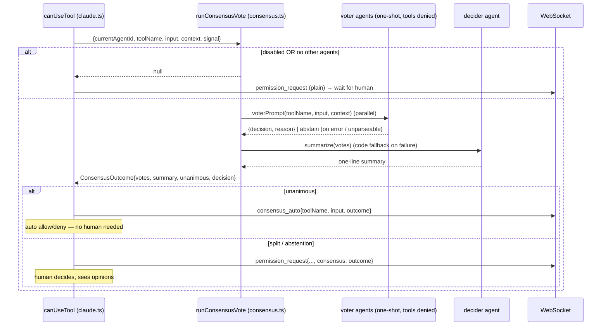

# permission-gateway — Multi-agent Consensus

Implements rule [PG-R9](spec.md). An **optional** pre-step in front of the human
permission prompt: instead of asking the user immediately, c3 first asks the
_other_ configured agents whether the tool call should be allowed, and only
falls back to the human when they disagree.

Off by default. Enabled via `SystemSettings.consensus.enabled` (system settings
page). Lives in `server/src/consensus.ts` (orchestration, spawns advisor queries)
and `server/src/consensus-tally.ts` (pure vote parsing / tally / summary — kept
SDK-free for unit tests, mirroring `permissions.ts`).

## Roles

| Role    | Who                                                            | Job                                                            |
| ------- | -------------------------------------------------------------- | -------------------------------------------------------------- |
| Voters  | Every configured agent **except** the session's own (resolved) | Judge the tool call from recent context; return `allow`/`deny` |
| Decider | The session's own agent                                        | Summarize the voters' opinions in one sentence (Chinese)       |

If there are no voters (only the session's own agent), consensus is skipped and
the human is prompted as usual.

## Flow

## Advisor query

Each voter (and the decider) runs via `askAgentOnce`: a single non-interactive
`query()` under that agent's launch overrides (`launchForAgent`), with **all
tools denied** (`canUseTool` returns deny) so it reasons only from the provided
context. No setting sources are loaded, keeping the call light (no CLAUDE.md /
hooks / Skills). The run's `AbortSignal` interrupts every in-flight advisor query
when the session switches or a new prompt starts.

The recent-context buffer is the user prompt plus streamed assistant text,
capped at ~4000 chars (`claude.ts`).

## Contracts

| Function                                           | Contract                                                                                                        |
| -------------------------------------------------- | --------------------------------------------------------------------------------------------------------------- |
| `runConsensusVote(params): ConsensusOutcome\|null` | `null` ⇒ disabled or no voters (caller does the plain human prompt). Otherwise a full outcome.                  |
| `parseVote(text)`                                  | Strict-JSON first, then a keyword scan; `null` when ambiguous/empty ⇒ the caller records an **abstain**.        |
| `tally(votes)`                                     | `unanimous` only when every voter is the same `allow`/`deny`; any `abstain`, split, or empty set ⇒ no decision. |
| `summarize(...)`                                   | Decider agent produces one Chinese sentence; `fallbackSummary` (deterministic tally) on error/abort.            |

## Invariants

- **Human override preserved.** Consensus never removes the human prompt for a
  split decision; it only short-circuits the unanimous case.
- **Fail-safe to human.** Any voter error/timeout/unparseable answer is an
  abstain, which is non-unanimous, so the human decides (PG-R9).
- **No input mutation.** Auto-allow returns the original input unchanged (PG-R6).
- **No leak on abort.** Advisor queries attach to the run's `AbortSignal` and are
  interrupted on teardown, like the human prompt (PG-R4).

## Wire protocol

- `permission_request` gains an optional `consensus: ConsensusOutcome` (split case).
- New server→client `consensus_auto { toolName, input, outcome }` (unanimous case,
  informational). Both render the voters' verdicts + reasons + decider summary in
  the console (`web-console`).
