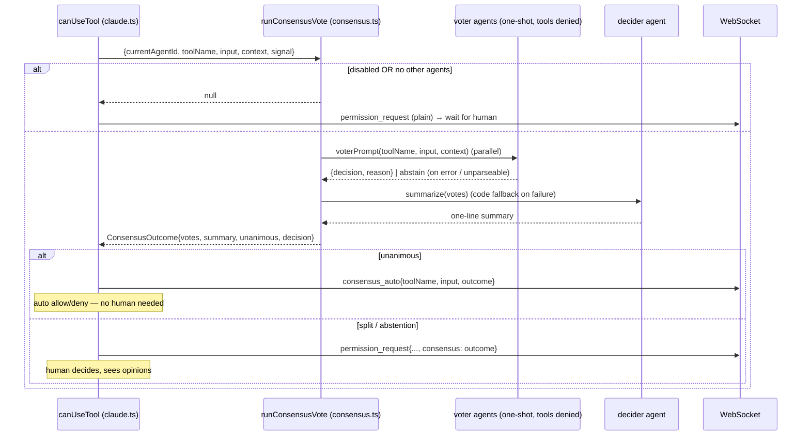

# permission-gateway — Multi-agent Consensus

Implements rule [PG-R9](spec.md). An **optional** pre-step in front of the human
permission prompt: instead of asking the user immediately, c3 first asks the
_other_ configured agents whether the tool call should be allowed, and only
falls back to the human when they disagree.

Off by default. Enabled via `SystemSettings.consensus.enabled` (system settings
page). Lives in `server/src/consensus.ts` (orchestration, spawns advisor queries)
and `server/src/consensus-tally.ts` (pure vote parsing / tally / summary — kept
SDK-free for unit tests, mirroring `permissions.ts`).

## Roles

| Role    | Who                                                            | Job                                                            |
| ------- | -------------------------------------------------------------- | -------------------------------------------------------------- |
| Voters  | Every configured agent **except** the session's own (resolved) | Judge the tool call from recent context; return `allow`/`deny` |
| Decider | The session's own agent                                        | Summarize the voters' opinions in one sentence (Chinese)       |

If there are no voters (only the session's own agent), consensus is skipped and
the human is prompted as usual.

## Flow

## Advisor query

Each voter (and the decider) runs via `askAgentOnce`: a single non-interactive
`query()` under that agent's launch overrides (`launchForAgent`), with **all
tools denied** (`canUseTool` returns deny) so it reasons only from the provided
context. No setting sources are loaded, keeping the call light (no CLAUDE.md /
hooks / Skills). The run's `AbortSignal` interrupts every in-flight advisor query
when the session switches or a new prompt starts.

The recent-context buffer is the user prompt plus streamed assistant text,
capped at ~4000 chars (`claude.ts`).

## Contracts

| Function                                           | Contract                                                                                                        |
| -------------------------------------------------- | --------------------------------------------------------------------------------------------------------------- |
| `runConsensusVote(params): ConsensusOutcome\|null` | `null` ⇒ disabled or no voters (caller does the plain human prompt). Otherwise a full outcome.                  |
| `parseVote(text)`                                  | Strict-JSON first, then a keyword scan; `null` when ambiguous/empty ⇒ the caller records an **abstain**.        |
| `tally(votes)`                                     | `unanimous` only when every voter is the same `allow`/`deny`; any `abstain`, split, or empty set ⇒ no decision. |
| `summarize(...)`                                   | Decider agent produces one Chinese sentence; `fallbackSummary` (deterministic tally) on error/abort.            |

## Invariants

- **Human override preserved.** Consensus never removes the human prompt for a
  split decision; it only short-circuits the unanimous case.
- **Fail-safe to human.** Any voter error/timeout/unparseable answer is an
  abstain, which is non-unanimous, so the human decides (PG-R9).
- **No input mutation.** Auto-allow returns the original input unchanged (PG-R6).
  The sole exception is `AskUserQuestion` (see below), where the chosen answers
  are deliberately injected into the input — the only headless channel to answer.
- **No leak on abort.** Advisor queries attach to the run's `AbortSignal` and are
  interrupted on teardown, like the human prompt (PG-R4).

## AskUserQuestion — per-question answering

`AskUserQuestion` is **not** an allow/deny tool: it carries `questions[]`, each
with `options[]` (and a `multiSelect` flag), and needs an _answer per question_,
not a verdict. So the gateway routes it to a separate path (`runAskConsensus`)
that runs **even when consensus is disabled** — it is also the base mechanism
that makes AskUserQuestion answerable at all in c3's headless (no-TTY) setup.

| Role    | Job (ask path)                                                                        |
| ------- | ------------------------------------------------------------------------------------- |
| Voters  | Answer **every** question — pick option label(s) or write a custom reply, with reason |
| Decider | Summarize the per-question answers in one Chinese sentence                            |

- Each voter gets `askVoterPrompt(questions, context)` and returns structured
  per-question choices; `parseAskVote` matches labels case-insensitively and marks
  any missing/garbled question an **abstain** (ignored in that question's tally).
- `tallyQuestion` makes a question **unanimous** only when every voter produced a
  parseable answer (≥1, none abstained) and they all normalize identically
  (`answerKey`: option labels sorted + comma-joined, else the custom text).
- `fullyUnanimous` ⇒ every question agreed. Then the gateway **auto-answers**:
  `consensus_auto { outcome.kind: 'ask' }` and `allow` with the answers injected.
- Otherwise the human gets the **answer panel** (`permission_request` with
  `consensus.kind: 'ask'`): agreed questions pre-filled, split ones highlighted
  with each agent's pick. The human's `permission_response.answers` are injected.

**Answer injection (verified).** The SDK's AskUserQuestion reads a pre-supplied
`answers` map (keyed by question text; multi-select comma-separated) from the
tool input and echoes it as the tool result. So both paths resolve via
`{ behavior: 'allow', updatedInput: { ...input, answers } }` (`withAnswers` in
`claude.ts`). This is the documented PG-R6 exception, AskUserQuestion-only.

| Function                                             | Contract                                                                                            |
| ---------------------------------------------------- | --------------------------------------------------------------------------------------------------- |
| `runAskConsensus(params): AskConsensusOutcome\|null` | `null` ⇒ disabled, no voters, or input has no questions (caller still shows the panel).             |
| `askQuestions(input)`                                | Extracts/validates the questions array; `null` for non-ask input.                                   |
| `parseAskVote(text, qs, …)`                          | One `AgentAnswer` per question; unmatched label / missing entry ⇒ `abstain`.                        |
| `tallyQuestion(q, i, answers)`                       | `unanimous` only when all voters answered (no abstain) and agree; `agreed` is the SDK-ready string. |

## Wire protocol

- `permission_request.consensus` is `AnyConsensusOutcome` — the allow/deny
  `ConsensusOutcome` (`kind: 'tool'`) **or** the per-question `AskConsensusOutcome`
  (`kind: 'ask'`).
- `consensus_auto.outcome` is likewise `AnyConsensusOutcome`.
- `permission_response` gains optional `answers` (question text → label(s)/custom)
  for the AskUserQuestion panel; the gateway injects them into the tool input.
- The console renders the allow/deny verdicts (tool kind) or the per-question
  answer panel / auto-answer roll-up (ask kind).
