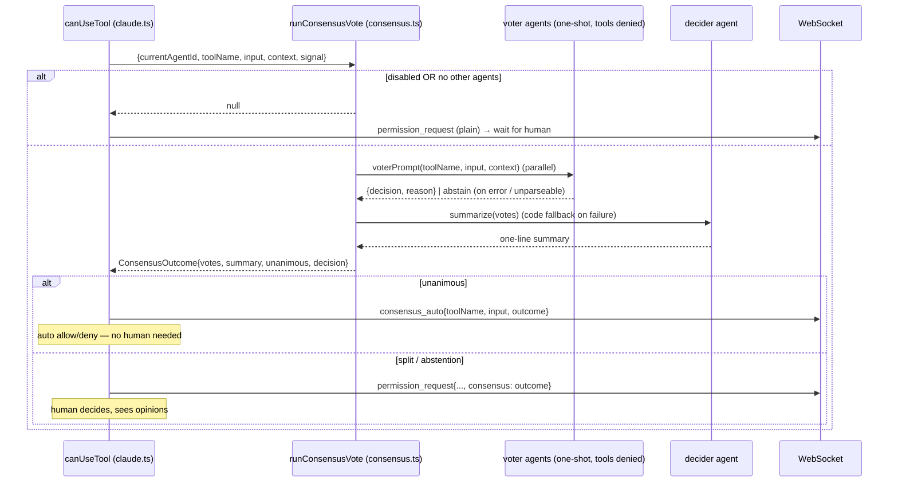

# permission-gateway — Multi-agent Consensus

Implements rule [PG-R9](spec.md). An **optional** pre-step in front of the human
permission prompt: instead of asking the user immediately, c3 first asks the
_other_ configured agents whether the tool call should be allowed, and only
falls back to the human when they disagree.

Off by default. Enabled via `SystemSettings.consensus.enabled` (system settings
page). Lives in `server/src/consensus.ts` (orchestration, spawns advisor queries)
and `server/src/consensus-tally.ts` (pure vote parsing / tally / summary — kept
SDK-free for unit tests, mirroring `permissions.ts`).

## Roles

| Role    | Who                                                            | Job                                                            |
| ------- | -------------------------------------------------------------- | -------------------------------------------------------------- |
| Voters  | Every configured agent **except** the session's own (resolved) | Judge the tool call from recent context; return `allow`/`deny` |
| Decider | The session's own agent                                        | Summarize the voters' opinions in one sentence (Chinese)       |

If there are no voters (only the session's own agent), consensus is skipped and
the human is prompted as usual.

## Flow

## Advisor query

Each voter (and the decider) runs via `askAgentOnce`: a single non-interactive
`query()` under that agent's launch overrides (`launchForAgent`), with **all
tools denied** (`canUseTool` returns deny) so it reasons only from the provided
context. No setting sources are loaded, keeping the call light (no CLAUDE.md /
hooks / Skills). The run's `AbortSignal` interrupts every in-flight advisor query
when the session switches or a new prompt starts.

The recent-context buffer is the user prompt plus streamed assistant text,
capped at ~4000 chars (`claude.ts`).

## Contracts

| Function                                           | Contract                                                                                                        |
| -------------------------------------------------- | --------------------------------------------------------------------------------------------------------------- |
| `runConsensusVote(params): ConsensusOutcome\|null` | `null` ⇒ disabled or no voters (caller does the plain human prompt). Otherwise a full outcome.                  |
| `parseVote(text)`                                  | Strict-JSON first, then a keyword scan; `null` when ambiguous/empty ⇒ the caller records an **abstain**.        |
| `tally(votes)`                                     | `unanimous` only when every voter is the same `allow`/`deny`; any `abstain`, split, or empty set ⇒ no decision. |
| `summarize(...)`                                   | Decider agent produces one Chinese sentence; `fallbackSummary` (deterministic tally) on error/abort.            |

## Invariants

- **Human override preserved.** Consensus never removes the human prompt for a
  split decision; it only short-circuits the unanimous case.
- **Fail-safe to human.** Any voter error/timeout/unparseable answer is an
  abstain, which is non-unanimous, so the human decides (PG-R9). On the ask path
  the decider may rescue a split/abstained question into consensus, but only with a
  re-validated exact-label answer; a decider error/abort/parse-failure or invalid
  answer emits no upgrade, so the question stays split and defers to the human.
- **De-bias is presentation-only.** Asker recommendation markers are stripped only
  in the text shown to voters/decider (`stripRecommendation`). The option set, the
  tally, and SDK answer injection still operate on the **original** labels: a
  marker-free echo is restored to its original exact label by `matchOption`'s
  stripped-exact pass, so `withAnswers` (which matches by original label) is never
  affected. Stripping a label with no marker is a no-op — the literal-exact pass
  already resolves it, so existing matching behaviour is unchanged.
- **No input mutation.** Auto-allow returns the original input unchanged (PG-R6).
  The sole exception is `AskUserQuestion` (see below), where the chosen answers
  are deliberately injected into the input — the only headless channel to answer.
- **No leak on abort.** Advisor queries attach to the run's `AbortSignal` and are
  interrupted on teardown, like the human prompt (PG-R4).
- **Consensus window never drops a live prompt.** `runAskConsensus` spawns one
  advisor `query()` subprocess per voter plus a decider — a multi-second window in
  which the AskUserQuestion tool-use is pending and the request is not yet visible
  to the human. The pass is fully contained (`.catch ⇒ null`): an advisor
  error/abort/slowness can never throw into or abort the main run; the worst case
  is "no opinions, ask the human". Crucially, while a run is **alive** and a prompt
  has been emitted but not yet answered, a stray `turn_end` must NOT settle the
  session to `idle` — the runtime holds it at `awaiting_permission` (`runs.ts`
  `emit` guard, backed by the `pending` request-id set) so the answer panel stays
  actionable instead of downgrading to a static "曾请求…" history line. The guard
  releases per-request when the human answers (`resolvePending`) and wholesale on
  teardown (`clearPending`); once the run is genuinely gone (`rt.run` null) `idle`
  is correct (the prompt can no longer be answered). A teardown deny that beats the
  human answer is logged (`[c3] AskUserQuestion <id> denied by run abort …`) so the
  precise trigger can be confirmed in a live multi-agent setup.
- **No unanswerable residue.** If the run signal is already aborted when the
  consensus pass returns (the run was torn down _inside_ the window, before the
  request was ever shown), the gateway does **not** emit the `permission_request`
  at all — it denies immediately. Emitting it would leave a phantom prompt in the
  buffer that renders as a dead static "曾请求…" line nobody can answer. Both the
  AskUserQuestion and the allow/deny consensus branches apply this guard.

## AskUserQuestion — per-question answering

`AskUserQuestion` is **not** an allow/deny tool: it carries `questions[]`, each
with `options[]` (and a `multiSelect` flag), and needs an _answer per question_,
not a verdict. So the gateway routes it to a separate branch (`claude.ts`,
guarded by `askQuestions(input)`) that **always** runs — rendering the answer
panel and injecting the chosen answers is the base mechanism that makes
AskUserQuestion answerable at all in c3's headless (no-TTY) setup. The consensus
_voting_ within that branch, however, only happens when consensus is **enabled**:
`runAskConsensus` returns `null` when disabled (or with no voters / no questions),
so there is no auto-answer and the human fills the panel unaided.

| Role    | Job (ask path)                                                                                          |
| ------- | ------------------------------------------------------------------------------------------------------- |
| Voters  | Answer **every** question — pick option label(s) or write a custom reply, with reason                   |
| Decider | Summarize the per-question answers (Chinese) **and** adjudicate split questions for effective consensus |

- Each voter gets `askVoterPrompt(questions, context)` and returns structured
  per-question choices; `parseAskVote` resolves each choice to an option label via
  `matchOption` and marks any missing/garbled question an **abstain** (ignored in
  that question's tally).
- **Recommendation de-bias (`stripRecommendation`).** The AskUserQuestion
  convention lets the asker flag its preferred choice by appending a trailing
  marker (`方案A (推荐)`, `Use X (Recommended)`). Feeding that to the advisors would
  anchor them to the asker's leaning and defeat independent judgement, so the
  voter prompt (`askVoterPrompt`) and the decider prompt (`deciderAskPrompt` — both
  its option list **and** the echoed advisor answers) present labels with the
  marker stripped. Stripping is **end-anchored and bracketed only**
  (`()（）[]【】` × 推荐/建议/默认/recommended/recommend/default), so a label that
  merely ends in such a word without brackets (`使用系统默认`) is untouched. The
  ordering is **not** changed — only the textual marker is removed (a deliberate
  scope choice; positional reordering was considered and rejected).
- **Tolerant label matching (`matchOption`).** Advisors often echo a label with
  reasoning appended (`"方案A：扩展协议: <why>"`) or embed it in a sentence. Match
  order is: exact (case-insensitive) → **stripped-exact** (de-biased label compared
  to de-biased options, see below) → longest label that prefixes / is prefixed
  by the choice → longest label contained in / containing it. Longest-first keeps a
  specific label from losing to a shorter sibling. Without this, a clear pick is
  mis-recorded as an abstain, wrongly splitting the question. The stripped-exact
  pass is what **restores** an advisor's marker-free echo (it only ever saw the
  de-biased label) to the **original exact label** the SDK must be answered with.
- `tallyQuestion` makes a question **unanimous** only when every voter produced a
  parseable answer (≥1, none abstained) and they all normalize identically
  (`answerKey`: option labels sorted + comma-joined, else the custom text).
- **Decider escalation (`decideAndSummarizeAsk`).** In ONE decider call (which
  also writes the summary), every **split** question is put to the session's own
  agent, which sees each advisor's actual answer + reason. Where the advisors are
  in _effective_ consensus (a mis-parsed reply, or differently-worded answers that
  mean the same option) the decider returns the agreed answer using an exact option
  label; `parseDeciderAsk` re-validates it via `matchOption` and, on success,
  **upgrades** that question to unanimous with `decidedByAgent: true`. The decider
  only ever upgrades a split question — string-unanimous ones are never re-judged
  (already stronger consensus), and it can never downgrade one.
- `fullyUnanimous` ⇒ every question agreed (by literal vote **or** decider ruling).
  Then the gateway **auto-answers**: `consensus_auto { outcome.kind: 'ask' }` and
  `allow` with the answers injected.
- Otherwise the human gets the **answer panel** (`permission_request` with
  `consensus.kind: 'ask'`): agreed questions pre-filled, split ones highlighted
  with each agent's pick. The human's `permission_response.answers` are injected.

**Answer injection (verified).** The SDK's AskUserQuestion reads a pre-supplied
`answers` map (keyed by question text; multi-select comma-separated) from the
tool input and echoes it as the tool result. So both paths resolve via
`{ behavior: 'allow', updatedInput: { ...input, answers } }` (`withAnswers` in
`claude.ts`). This is the documented PG-R6 exception, AskUserQuestion-only.

| Function                                             | Contract                                                                                                                                                                                   |
| ---------------------------------------------------- | ------------------------------------------------------------------------------------------------------------------------------------------------------------------------------------------ |
| `runAskConsensus(params): AskConsensusOutcome\|null` | `null` ⇒ disabled, no voters, or input has no questions (caller still shows the panel).                                                                                                    |
| `askQuestions(input)`                                | Extracts/validates the questions array; `null` for non-ask input.                                                                                                                          |
| `stripRecommendation(label)`                         | Removes an end-anchored, bracketed recommendation marker (推荐/建议/默认/recommended/…); idempotent; no-op when absent. Used only for prompt presentation.                                 |
| `matchOption(choice, options)`                       | Resolves a free-form choice to a canonical option label (exact → stripped-exact → prefix → substring); `null` if none fit. Stripped-exact restores a de-biased echo to the original label. |
| `parseAskVote(text, qs, …)`                          | One `AgentAnswer` per question; choice resolved via `matchOption`, unmatched / missing entry ⇒ `abstain`.                                                                                  |
| `tallyQuestion(q, i, answers)`                       | `unanimous` only when all voters answered (no abstain) and agree; `agreed` is the SDK-ready string.                                                                                        |
| `deciderAskPrompt(perQuestion, qs)`                  | Builds the combined judge+summary prompt; lists option labels only for the split questions.                                                                                                |
| `parseDeciderAsk(text, qs)`                          | `{ summary, overrides }`; an override is emitted only for `consensus:true` rulings whose answer re-validates to a label/custom — else dropped (stays split).                               |

## Wire protocol

- `permission_request.consensus` is `AnyConsensusOutcome` — the allow/deny
  `ConsensusOutcome` (`kind: 'tool'`) **or** the per-question `AskConsensusOutcome`
  (`kind: 'ask'`).
- `consensus_auto.outcome` is likewise `AnyConsensusOutcome`.
- `permission_response` gains optional `answers` (question text → label(s)/custom)
  for the AskUserQuestion panel; the gateway injects them into the tool input.
- `QuestionConsensus.decidedByAgent?: boolean` flags a question whose literal vote
  was split but the decider ruled an effective consensus — so the console can label
  an AI-adjudicated agreement honestly rather than implying a unanimous vote.
- The console renders the allow/deny verdicts (tool kind) or the per-question
  answer panel / auto-answer roll-up (ask kind).
