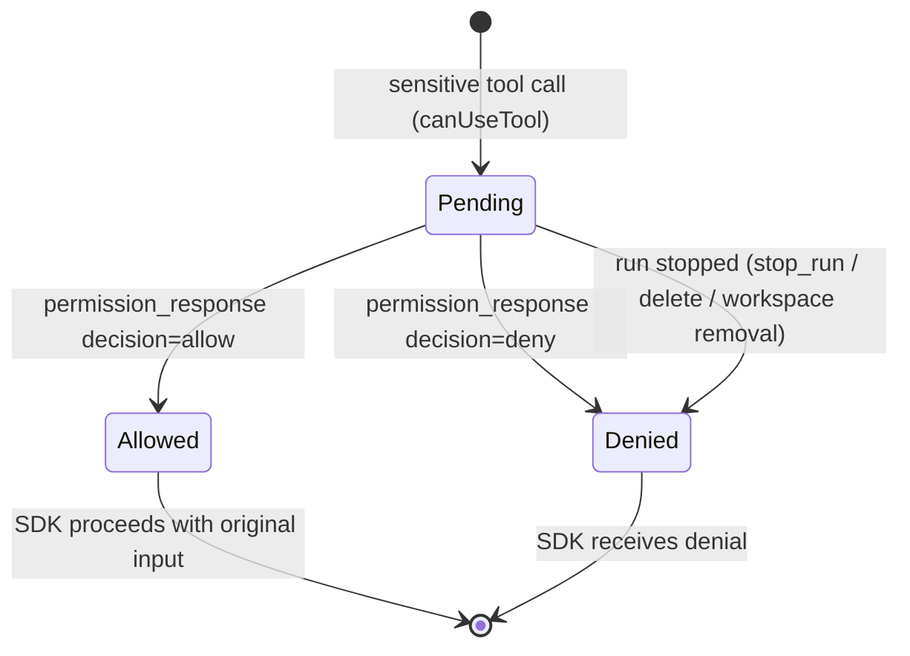

# permission-gateway — Domain Spec

## Overview

The permission gateway is the decision boundary of c3. When the agent wants to run a tool
the SDK classifies as sensitive, the gateway turns that into a question for the human, waits
for the answer, and reports `allow` or `deny` back to the SDK. It is the mechanism that
makes c3 "the place where Claude Code's tool use is approved."

**Scope:** correlating a single tool call with a single human decision, and enforcing a
default-deny outcome. **Boundary:** it does not run the agent (that's `agent-session`) and
it does not render anything (that's `web-console`).

## Core entities

| Entity              | Description                            | Key attributes                                |
| ------------------- | -------------------------------------- | --------------------------------------------- |
| Permission Request  | A pending question about one tool call | `requestId`, `toolName`, `input`              |
| Permission Decision | The resolution of a request            | `allow` \| `deny`, source (`user` \| `abort`) |

See [models.md](models.md) for full attributes.

## Business rules

| ID     | Rule                                                                                                                                                                                                                                                                                                                                                                                                                                                                                                                                                                                                                                                                                                                                                                                                                                                                                                                                                                                                                                                                               |
| ------ | ---------------------------------------------------------------------------------------------------------------------------------------------------------------------------------------------------------------------------------------------------------------------------------------------------------------------------------------------------------------------------------------------------------------------------------------------------------------------------------------------------------------------------------------------------------------------------------------------------------------------------------------------------------------------------------------------------------------------------------------------------------------------------------------------------------------------------------------------------------------------------------------------------------------------------------------------------------------------------------------------------------------------------------------------------------------------------------- |
| PG-R1  | Every sensitive tool call produces exactly one Permission Request with a unique `requestId`.                                                                                                                                                                                                                                                                                                                                                                                                                                                                                                                                                                                                                                                                                                                                                                                                                                                                                                                                                                                       |
| PG-R2  | A Permission Request blocks the agent's progress on that tool until it is resolved. It **waits indefinitely** for the human — there is no timeout, mirroring the terminal CLI's blocking prompt.                                                                                                                                                                                                                                                                                                                                                                                                                                                                                                                                                                                                                                                                                                                                                                                                                                                                                   |
| PG-R3  | A request resolves in exactly one of two ways: a matching `permission_response` from the browser (answerable whenever the user returns to that session, since correlation is by `requestId`), or the run being stopped (`stop_run` / delete / workspace removal). The first to arrive wins; the other is discarded. Switching the viewed session does **not** resolve it.                                                                                                                                                                                                                                                                                                                                                                                                                                                                                                                                                                                                                                                                                                          |
| PG-R4  | The default outcome is **deny**: absence of an explicit `allow` ⇒ deny. A stopped run clears the pending request and resolves it as `deny` (the outcome is moot — the run is being torn down).                                                                                                                                                                                                                                                                                                                                                                                                                                                                                                                                                                                                                                                                                                                                                                                                                                                                                     |
| PG-R5  | A `permission_response` for an unknown or already-resolved `requestId` is a no-op.                                                                                                                                                                                                                                                                                                                                                                                                                                                                                                                                                                                                                                                                                                                                                                                                                                                                                                                                                                                                 |
| PG-R6  | `allow` lets the SDK proceed with the **original, unmodified** tool input. The gateway does not rewrite tool inputs. **Exception:** for `AskUserQuestion` the chosen `answers` (from consensus auto-answer or the human answer panel) are injected into the input — the only headless channel to answer the prompt. See [consensus.md](consensus.md).                                                                                                                                                                                                                                                                                                                                                                                                                                                                                                                                                                                                                                                                                                                              |
| PG-R7  | A `deny` returns a denial reason to the SDK ("User denied in c3 UI").                                                                                                                                                                                                                                                                                                                                                                                                                                                                                                                                                                                                                                                                                                                                                                                                                                                                                                                                                                                                              |
| PG-R8  | Read-only / trivial tools never reach the gateway — the SDK auto-allows them under the active mode and emits no request. (Which tools count depends on permission mode; see agent-session spec.)                                                                                                                                                                                                                                                                                                                                                                                                                                                                                                                                                                                                                                                                                                                                                                                                                                                                                   |
| PG-R9  | When **multi-agent consensus** is enabled (system settings) and at least one agent besides the session's own exists, a request is first put to those other agents. If they **unanimously** agree it auto-resolves with their verdict (a `consensus_auto` event records how); any split or abstention falls back to the human prompt (PG-R1–R7) with their opinions attached. Consensus is best-effort: a voter that errors abstains, which is non-unanimous and therefore defers to the human (default-deny direction preserved). For `AskUserQuestion` the voters instead **answer each question** (option label(s) or a custom reply); a question split by the literal tally may be rescued when the **decider** agent judges the voters to be in effective consensus and supplies a re-validated answer (`decidedByAgent`). Every question agreed (by vote or decider) ⇒ auto-answer, otherwise the human fills the answer panel with agreed questions pre-filled. See [consensus.md](consensus.md).                                                                            |
| PG-R10 | The gateway is **vendor-neutral at the request boundary** but the suspend/resume _mechanism_ differs per vendor (ADR-0011). Claude suspends **in-loop** inside the SDK `canUseTool` callback; OpenCode suspends **out-of-loop** — the agent halts server-side on a `permission.updated` event and resumes only when c3 writes the decision back over REST. Both produce the same `permission_request` wire frame and the same `allow`/`deny` outcome via the same browser registry, so PG-R1–R7 hold unchanged. (2026-06-06-003)                                                                                                                                                                                                                                                                                                                                                                                                                                                                                                                                                   |
| PG-R11 | For an **out-of-loop** vendor the request blocks in the _vendor's_ process, not c3's, so PG-R2's "wait indefinitely" cannot be the only backstop: a permission lost in an SSE-reconnect window would hang the agent forever. The OpenCode adapter therefore adds a per-request **timeout → deny + `reject` write-back**, write-back **retry with backoff** (a structured `404 PermissionNotFoundError` ⇒ stale id, stop), and **`permission.replied` idempotency** (another client/rule answered first ⇒ settle, no double-write). This is a deliberate, vendor-scoped divergence from PG-R2; the in-loop Claude path keeps PG-R2 verbatim. (2026-06-06-003)                                                                                                                                                                                                                                                                                                                                                                                                                       |
| PG-R12 | **preApproved audit.** A decision the vendor's own rule engine (or an external client) made _without_ a c3/human decision — observed as a `permission.replied` for an id c3 never asked-and-wrote — is recorded for the audit trail via the top-level `CanonicalMessage.preApproved` flag (the request/response stream still rides the approval bridge, never the message model). It surfaces as an observability marker, not a second decision path. (2026-06-06-003) The marker now **crosses the wire** on the `tool_use` frame (the driver path's `WireEmitter` carries the sticky message-level flag at first-seen) so `web-console` colors a pre-approved tool distinctly from a c3/human-gated `allow`: the two-color provenance makes explicit that **c3 is a gateway, not the sole permission authority** (superseding the deprecated ADR-0001 "sole authority" stance — a vendor rule engine can pre-approve without ever reaching the prompt). A pre-approved tool raises **no** `permission_request`, so the two colors never collide on one surface. (2026-06-06-004) |

## States & transitions

A Permission Request lifecycle:

There are no other states. A request cannot return to `Pending` once resolved.

## Vendor approval mechanisms (2026-06-06-003)

The gateway's contract is vendor-neutral; each vendor adapter translates its native
permission concept into it (ADR-0011 `ApprovalBridge`). Two reference mechanisms exist:

- **Claude — in-loop.** The SDK's blocking `canUseTool` callback IS the suspend point;
  "write back" is resolving that promise. c3 blocks inside its own process (PG-R2 verbatim).
- **OpenCode — out-of-loop (event + REST).** The agent halts server-side on a
  `permission.updated` event; the bridge suspends a Promise keyed by `permissionID`, raises
  the `permission_request`, and on the human decision writes back
  `POST /session/{id}/permissions/{permissionID}` (`once`→allow / `reject`→deny). Because the
  block lives in OpenCode's process across an SSE link, the bridge owns four extra
  responsibilities the SDK does not (PG-R11): timeout, write-back retry + stale-404, SSE
  re-subscribe (there is no "list pending permissions" endpoint to reconcile against), and
  `permission.replied` idempotency. A reply c3 never authored is audited as `preApproved`
  (PG-R12).

Both reach the **same** browser registry (`permission_request` + `waitForDecision`), so the
human experience and the default-deny invariant are identical across vendors.

## Domain events

The gateway does not emit business events of its own. It produces a `permission_request`
on the wire (consumed by `web-console`) and consumes `permission_response`. The terminal
result is returned synchronously to the SDK, not broadcast.

## Interactions

- **agent-session** supplies the `send` function (to push the request) and the transport;
  it calls the gateway from the `canUseTool` callback.
- **web-console** renders the request and sends the decision.
- **Claude Agent SDK** is the caller that blocks on the gateway's resolution.

## Invariants

- **At most one outcome per request** (PG-R3). Resolving twice must not double-resolve or
  leak a pending entry / abort listener.
- **Default-deny** (PG-R4) is absolute: absence of an explicit allow ⇒ deny.

## Data dictionary

- **Pending request** — a request awaiting resolution; tracked in an in-memory registry.
- **Stale id** — a `requestId` with no pending entry (already resolved or never existed).
