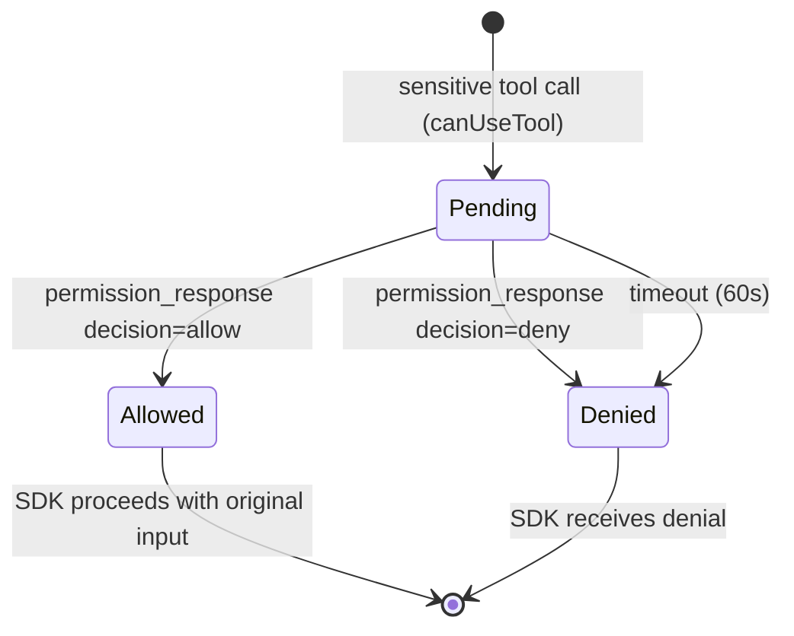

# permission-gateway — Domain Spec

## Overview

The permission gateway is the decision boundary of c3. When the agent wants to run a tool
the SDK classifies as sensitive, the gateway turns that into a question for the human, waits
for the answer, and reports `allow` or `deny` back to the SDK. It is the mechanism that
makes c3 "the place where Claude Code's tool use is approved."

**Scope:** correlating a single tool call with a single human decision, and enforcing a
default-deny outcome. **Boundary:** it does not run the agent (that's `agent-session`) and
it does not render anything (that's `web-console`).

## Core entities

| Entity              | Description                            | Key attributes                                  |
| ------------------- | -------------------------------------- | ----------------------------------------------- |
| Permission Request  | A pending question about one tool call | `requestId`, `toolName`, `input`                |
| Permission Decision | The resolution of a request            | `allow` \| `deny`, source (`user` \| `timeout`) |

See [models.md](models.md) for full attributes.

## Business rules

| ID    | Rule                                                                                                                                                                                             |
| ----- | ------------------------------------------------------------------------------------------------------------------------------------------------------------------------------------------------ |
| PG-R1 | Every sensitive tool call produces exactly one Permission Request with a unique `requestId`.                                                                                                     |
| PG-R2 | A Permission Request blocks the agent's progress on that tool until it is resolved.                                                                                                              |
| PG-R3 | A request resolves in exactly one of two ways: a matching `permission_response` from the browser, or the timeout. The first to arrive wins; the other is discarded.                              |
| PG-R4 | The default outcome is **deny**. If the timeout elapses with no response, the request auto-denies.                                                                                               |
| PG-R5 | A `permission_response` for an unknown or already-resolved `requestId` is a no-op.                                                                                                               |
| PG-R6 | `allow` lets the SDK proceed with the **original, unmodified** tool input. The gateway does not rewrite tool inputs.                                                                             |
| PG-R7 | A `deny` returns a denial reason to the SDK ("User denied in c3 UI").                                                                                                                            |
| PG-R8 | Read-only / trivial tools never reach the gateway — the SDK auto-allows them under the active mode and emits no request. (Which tools count depends on permission mode; see agent-session spec.) |

## States & transitions

A Permission Request lifecycle:

There are no other states. A request cannot return to `Pending` once resolved.

## Domain events

The gateway does not emit business events of its own. It produces a `permission_request`
on the wire (consumed by `web-console`) and consumes `permission_response`. The terminal
result is returned synchronously to the SDK, not broadcast.

## Interactions

- **agent-session** supplies the `send` function (to push the request) and the transport;
  it calls the gateway from the `canUseTool` callback.
- **web-console** renders the request and sends the decision.
- **Claude Agent SDK** is the caller that blocks on the gateway's resolution.

## Invariants

- **At most one outcome per request** (PG-R3). Resolving twice must not double-resolve or
  leak a timer.
- **Default-deny** (PG-R4) is absolute: absence of an explicit allow ⇒ deny.

## Data dictionary

- **Pending request** — a request awaiting resolution; tracked in an in-memory registry.
- **Stale id** — a `requestId` with no pending entry (already resolved or never existed).
