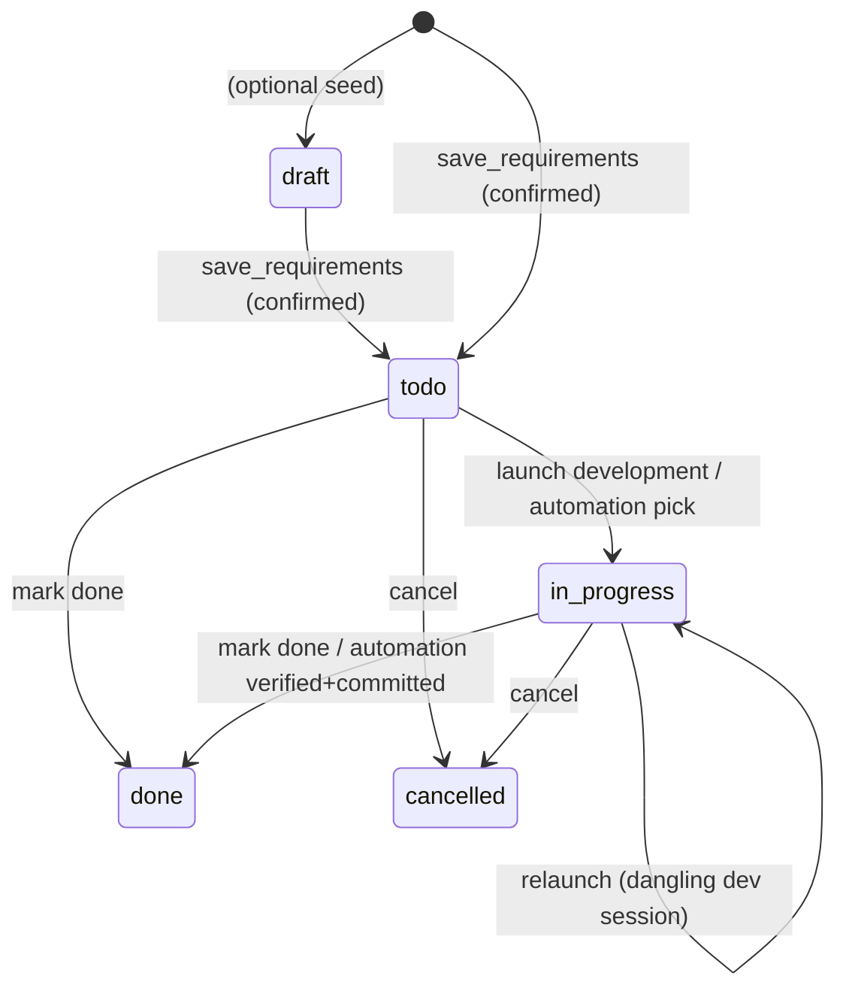

# requirement-management — Domain Spec

## Overview

requirement-management gives c3 a **project-scoped, cross-session requirement ledger**. Where
the rest of c3 operates at the session level (prompt, gate, stream), this domain captures _what
the user wants to build_ against a project, helps refine it, and drives it into development.

It has three moving parts:

1. **The ledger** — requirements persisted in a local SQLite database (`~/.c3/c3.db`), keyed by
   the project's resolved absolute workspace path, each with a priority, status, content, and
   optional intra-project dependencies.
2. **A read-only requirement-communication agent** — a long-lived hidden session per project
   that reads project material, converses with the user, and proposes discrete, verifiable
   requirement items. It can **never** edit, write, run commands, spawn sub-agents, or invoke
   slash commands (ADR 0007).
3. **Launch development** — turning a `todo` requirement into a background normal session that
   runs the configurable development skill (`devSkill` in system settings; empty by default ⇒ no prefix),
   with a back-link to that development session.
4. **Automation orchestrator** — an opt-in, per-project background loop that develops
   `automate`-flagged requirements one at a time (by priority then dependency order), verifies
   true completion from the dev session's last message + the working-tree diff, commits & pushes,
   then advances — stopping with a recorded reason on any abnormal end (RM-A1–RM-A9).

**Scope:** the requirement ledger and its CRUD; the read-only communication agent and its
`save_requirements` confirmation; refine (restart communication on one item); launch development
(background, configurable development skill from system settings, empty by default); development back-link; the `draft→todo→in_progress→done/cancelled`
status machine; dependency recording and unmet-dependency warnings; hiding communication sessions
from the normal list; the per-requirement automation flag and the automation orchestrator
(completion judging, commit/push, sequencing).

**Boundary:** it does **not** define the agent run loop (agent-session) or the permission flow
(permission-gateway) — it reuses both. It owns no permission state. **Manual** launch development
never auto-completes a requirement (the development run finishing does not change status; the user
marks `done`, RM-R9). The **automation orchestrator** is the single, explicit, user-opt-in
exception: it marks a requirement `done` only after an independent completion judge confirms it and
the change is committed & pushed (RM-A5).

## Core entities

| Entity                  | Description                                                                                                                                         |
| ----------------------- | --------------------------------------------------------------------------------------------------------------------------------------------------- |
| Requirement             | A ledger item: `title`, `content`, `priority` (P0–P3), `module` (模块名称), `status`, `dependsOn[]`, `lastDevSessionId`, scoped to a `projectPath`  |
| Requirement Dependency  | A directed `requirement → depends-on` edge within one project (display + warning only; no topological enforcement in v1)                            |
| Communication Session   | The per-project hidden agent session used to refine requirements; a real SDK session kept out of the normal list (the hidden set)                   |
| Automation Orchestrator | A per-project background loop (one at a time) that develops `automate` requirements, judges completion, commits/pushes, and sequences (RM-A1–RM-A9) |

See [models.md](models.md).

## Concepts

- **Project key (path-key).** Every requirement and communication-session row is keyed by the
  **resolved absolute workspace path** — identical to the session-registry workspace key, the
  runtime `workspacePath`, and the SDK `cwd`. All inbound `projectPath` is `resolve()`d before
  any read or write so the ledger, hidden-set filtering, and `cwd` always agree (RM-R10).
- **Hidden set.** The set of communication-session ids for a project. The normal session list
  (`list_sessions`) is filtered to exclude them, so a project keeps exactly one _current_
  communication session that never clutters the sidebar (RM-R4).
- **Requirement priority / 需求级别.** One of `P0`, `P1`, `P2`, `P3` (P0 highest).
- **Module / 模块名称.** A free-text label naming the requirement's owning module, inferred by
  the communication agent from the item's title/content (e.g. 认证、会话、需求管理). Optional at
  proposal time and `''` when unidentified or for historical rows; lays the data groundwork for
  later module-based organization/filtering/display (RM-R14).
- **Automation flag (`automate`).** A per-requirement, user-toggled boolean (`false` by default).
  Only `automate` requirements are candidates for the automation orchestrator (RM-A1).
- **Automation orchestrator.** A per-project, in-memory background loop. **Eligibility:** a
  requirement is eligible when `automate` AND `status ∈ {todo, in_progress}` AND every known
  `dependsOn` item is `done`. It develops the highest-priority (P0→P3, then oldest) eligible item,
  first **attaching** to its `lastDevSessionId` when that session is already running a turn (a run
  outlives its turn — don't double-run / preempt; RM-A10), else **resuming** it when the session
  still exists on disk (continuing the half-built context), and otherwise starting a **fresh**
  development session (configurable skill, empty by default ⇒ no prefix) — a `todo` item or a dangling session, the same dangling rule as manual launch
  (RM-R8). **Completion judge:** because the dev skill is often
  checkpoint-driven, a turn ending does not mean "done" — a fresh, tool-less judge reads the
  dev session's last assistant message + the working-tree `git diff` and returns `done` /
  `in_progress` / `stuck`, deciding **stuck → done → in_progress** with no bias toward continuing
  (RM-A4). **Continuation:** `in_progress` resumes the same session with continue up to a cap
  (clearing checkpoints); the cap prevents an infinite loop (RM-A8). **Permission parity:** a
  permission prompt during a dev turn (including a non-unanimous `AskUserQuestion`) behaves **exactly
  like a manual session** — the run is **not** aborted; it stays alive (`awaiting_permission`), the
  prompt is surfaced to the browser, and a watching human answers it there, after which the turn
  continues; the status shows an "awaiting authorization" hint meanwhile (RM-A9). **Human-decision
  guard:** the orchestrator still keeps an independent `pendingQuestion` guard so a turn that
  **settled** (was torn down) carrying an unanswered `AskUserQuestion` in its buffer is **never**
  auto-continue-ed — it stops the requirement with a recorded reason (RM-A11).

## Business rules

| ID     | Rule                                                                                                                                                                                                                                                                                                                                                                                                                                                                                                                                                                                                                                                                                                                                                                                                                                                                                                                                                                                                                                                                                                                                                                                                                                                                                                                                                                                                                                                |
| ------ | --------------------------------------------------------------------------------------------------------------------------------------------------------------------------------------------------------------------------------------------------------------------------------------------------------------------------------------------------------------------------------------------------------------------------------------------------------------------------------------------------------------------------------------------------------------------------------------------------------------------------------------------------------------------------------------------------------------------------------------------------------------------------------------------------------------------------------------------------------------------------------------------------------------------------------------------------------------------------------------------------------------------------------------------------------------------------------------------------------------------------------------------------------------------------------------------------------------------------------------------------------------------------------------------------------------------------------------------------------------------------------------------------------------------------------------------------- |
| RM-R1  | A requirement belongs to exactly one project, keyed by the resolved absolute workspace path. Lists are per single project; there is no cross-project aggregate view.                                                                                                                                                                                                                                                                                                                                                                                                                                                                                                                                                                                                                                                                                                                                                                                                                                                                                                                                                                                                                                                                                                                                                                                                                                                                                |
| RM-R2  | The communication agent is **read-only**. It may use read-class tools (Read/Grep/Glob/WebFetch/WebSearch, auto-allowed) and may use `AskUserQuestion` (a clarifying-only tool — allowed, routed via user-answer injection, no consensus) but **never** edits, writes, runs commands, spawns sub-agents, or runs slash commands. This is enforced at the tool layer, not by prompt alone (ADR 0007).                                                                                                                                                                                                                                                                                                                                                                                                                                                                                                                                                                                                                                                                                                                                                                                                                                                                                                                                                                                                                                                 |
| RM-R3  | The communication session runs in **forced `default` permission mode**, regardless of the system default mode. It does not honor `set_mode`, and the requirement view renders no mode selector. (`bypassPermissions` would skip `canUseTool` and silently save — forbidden.)                                                                                                                                                                                                                                                                                                                                                                                                                                                                                                                                                                                                                                                                                                                                                                                                                                                                                                                                                                                                                                                                                                                                                                        |
| RM-R4  | Each project has at most one _current_ communication session. Communication sessions are in the hidden set and **never** appear in the normal session list. Entering the requirement view re-loads the project's current communication session (history + live stream).                                                                                                                                                                                                                                                                                                                                                                                                                                                                                                                                                                                                                                                                                                                                                                                                                                                                                                                                                                                                                                                                                                                                                                             |
| RM-R5  | A requirement is written to the ledger only through `save_requirements`, which surfaces a human confirmation (reusing the permission gateway, tool `mcp__c3__save_requirements`). Allow → the tool handler writes; Deny → nothing is written and the agent is told it was rejected.                                                                                                                                                                                                                                                                                                                                                                                                                                                                                                                                                                                                                                                                                                                                                                                                                                                                                                                                                                                                                                                                                                                                                                 |
| RM-R6  | Newly saved requirements start in status `todo`, scoped to the current project path.                                                                                                                                                                                                                                                                                                                                                                                                                                                                                                                                                                                                                                                                                                                                                                                                                                                                                                                                                                                                                                                                                                                                                                                                                                                                                                                                                                |
| RM-R7  | **Refine** restarts the communication session for one requirement: a fresh communication session is started and seeded with a first message carrying the requirement's id, title, and content. It does not change the requirement's status.                                                                                                                                                                                                                                                                                                                                                                                                                                                                                                                                                                                                                                                                                                                                                                                                                                                                                                                                                                                                                                                                                                                                                                                                         |
| RM-R8  | **Launch development** is allowed when the requirement is `todo`, or `in_progress` with a dangling (deleted) `lastDevSessionId`. It starts a **background normal session** running the configurable development skill (`devSkill`; empty by default ⇒ no prefix) with the requirement content, sets status `in_progress`, and records `lastDevSessionId`. The development session is a normal session and appears in the sidebar.                                                                                                                                                                                                                                                                                                                                                                                                                                                                                                                                                                                                                                                                                                                                                                                                                                                                                                                                                                                                                   |
| RM-R9  | The development run finishing does **not** change requirement status (no auto-complete). The user marks `done` or `cancelled` manually from the list. **Exception:** on entering the requirement view (`open_requirement_chat`), the server reconciles every `in_progress` requirement; a dev session whose process is dead AND whose last 3 assistant messages the completion judge confirms as `done` is **automatically** marked `done` — even for manually-launched runs (RM-R18). This reconcile auto-`done` is the only auto-`done` path outside the automation orchestrator (RM-A5).                                                                                                                                                                                                                                                                                                                                                                                                                                                                                                                                                                                                                                                                                                                                                                                                                                                         |
| RM-R10 | Every inbound `projectPath` is `resolve()`d before any ledger read/write or hidden-set filtering, matching the workspace key / runtime `workspacePath` / SDK `cwd`.                                                                                                                                                                                                                                                                                                                                                                                                                                                                                                                                                                                                                                                                                                                                                                                                                                                                                                                                                                                                                                                                                                                                                                                                                                                                                 |
| RM-R11 | Launching development with one or more **unmet dependencies** (a `dependsOn` item not `done`) is **warned** but not blocked — the user may proceed.                                                                                                                                                                                                                                                                                                                                                                                                                                                                                                                                                                                                                                                                                                                                                                                                                                                                                                                                                                                                                                                                                                                                                                                                                                                                                                 |
| RM-R12 | If the ledger (SQLite) is unavailable, requirement features degrade per entry point (requirement messages return `error`; the normal list is **not** filtered) and c3 still boots and serves normal sessions.                                                                                                                                                                                                                                                                                                                                                                                                                                                                                                                                                                                                                                                                                                                                                                                                                                                                                                                                                                                                                                                                                                                                                                                                                                       |
| RM-R13 | The development back-link opens the `lastDevSessionId` session (reusing `select_session`). If that session no longer exists, the user gets a friendly prompt (with restart/cancel options), not a crash.                                                                                                                                                                                                                                                                                                                                                                                                                                                                                                                                                                                                                                                                                                                                                                                                                                                                                                                                                                                                                                                                                                                                                                                                                                            |
| RM-R14 | Each requirement carries a `module` (模块名称). The communication agent **infers** it from the item's title/content (scheme a; future-extensible to the project's module structure) and passes it per item to `save_requirements`; a missing/blank `module` persists as `''` (the agent is never blocked on it). The ledger column is `TEXT NOT NULL DEFAULT ''`; old dbs migrate via an idempotent `ALTER TABLE … ADD COLUMN` (schema v1→v2) with historical rows defaulting to `''` (no backfill). All read paths return `module`. The data groundwork is consumed by RM-R16 (list display); module-based filtering remains out of scope.                                                                                                                                                                                                                                                                                                                                                                                                                                                                                                                                                                                                                                                                                                                                                                                                         |
| RM-R16 | The requirement list shows each item's `module` as a neutral pill tag (`.req-module`) rendered between the date prefix and the title. A blank `module` (`''`) renders nothing (`v-if`) — no placeholder, no layout break; the tag is `flex-shrink:0` with a max-width + ellipsis so a long module name never squeezes the title. Display-only; it does not affect ordering or filtering.                                                                                                                                                                                                                                                                                                                                                                                                                                                                                                                                                                                                                                                                                                                                                                                                                                                                                                                                                                                                                                                            |
| RM-R15 | **Code + tests + companion docs are one requirement (a single goal is never split).** When one goal touches code and its tests and/or its companion docs (spec / README / comments), the communication agent folds the test- and doc-sync work into the **same** requirement's content + acceptance points — it must **not** emit a separate「更新测试」or「文档更新」requirement. Code, its tests, and its docs are one change, kept on one ticket so no half is scheduled apart or dropped (which would drift tests/docs out of sync with code). Enforced by prompt guidance only (no tool-layer check).                                                                                                                                                                                                                                                                                                                                                                                                                                                                                                                                                                                                                                                                                                                                                                                                                                          |
| RM-R17 | **A `save_requirements` batch can declare dependencies on its own siblings.** Each `ProposedRequirement` carries, besides `dependsOn` (ids of **already-existing** requirements), an optional `dependsOnIndexes` (0-based indexes into the **same batch's** `requirements` array). Sibling ids don't exist at proposal time, so先后关系 within a batch can only be named by index. `insertRequirements` mints every row's id **up front**, then resolves each index to the sibling's real id and writes it — merged & de-duplicated with `dependsOn` — into `requirement_deps`, all in one transaction. **Validation (atomic reject):** an out-of-range index, a self reference, or a cycle among the batch's intra-batch edges throws **before any write**, so the whole batch is rejected and the `save_requirements` handler returns `isError` (nothing half-written); existing-id `dependsOn` behaviour is unchanged (cross-batch cycles are impossible — brand-new rows have ids nothing else references yet). **Stable secondary order:** a batch's rows are stamped with `created_at = now + index`, so same-priority, dependency-free items keep a deterministic submission-order rank in the orchestrator's oldest-first tiebreak (RM-A3) instead of an arbitrary one. The communication agent is prompted to **actively fill `dependsOnIndexes`** whenever a batch has先后关系 (prompt guidance; the validation is the tool-layer guard). |

| RM-R19 | **The communication agent has two read-only ledger query tools.** Besides `save_requirements`, the `c3` in-process MCP server exposes `find_requirements` (search THIS project's requirements by `keyword` — fuzzy `LIKE` over title/content, wildcards escaped — and/or `module`/`status`; returns a slim list of `id`/`title`/`module`/`priority`/`status`/`dependsOn`) and `view_requirement` (one requirement's full detail by `id`; an unknown or other-project id returns a friendly not-found, not an error). Both are **read-only** and **project-bound in the tool closure** (the agent can never read another project's ledger — `view_requirement` reuses `getRequirement(id)` then guards `projectPath`). The requirement gate **auto-allows** both (no confirmation), unlike `save_requirements` which still prompts; both inherit `alwaysLoad` so the agent need not ToolSearch them back. The prompt directs the agent to **search the ledger before** breaking down new items or setting `dependsOn`, to reuse related items, avoid duplicates, and reference the correct existing id. (ADR 0007.) |
| RM-R18 | **Requirement reconcile on entry (`open_requirement_chat`).** Every time a client enters the requirement view, the server reconciles that project's `in_progress` requirements -- checking each `lastDevSessionId` against the process table and, when the process is dead (server restart, crash, normal exit), loading the session's last 3 assistant messages and running the completion judge. **Liveness check:** a still-running dev session yields derived `runStatus = 'running'` (tracking). **Judge `done`:** auto-completes: calls `commitAndPush` (`feat: <title>`) and `updateStatus(done)` -- works for BOTH manually-launched and automation-started requirements. This is the explicit, documented exception to RM-R9's no-auto-complete rule for process death. **Judge `in_progress` / `stuck`:** leaves the requirement `in_progress` and sets `runStatus = 'dangling'`. **No `lastDevSessionId`:** also `dangling`. The reconcile result is reflected in the `requirements` message payload (each `Requirement` carries `runStatus: RequirementRunStatus`). A `broadcastRequirements` push follows when any requirement was auto-completed, so other connections see the update. |

### Automation orchestrator

| ID     | Rule                                                                                                                                                                                                                                                                                                                                                                                                                                                                                                                                                                                                                                                                                                                                                                                                                                                                                                                                                                                                                                                                                                                                                                                                                                                                                                                                                                                                                                                                                                                       |
| ------ | -------------------------------------------------------------------------------------------------------------------------------------------------------------------------------------------------------------------------------------------------------------------------------------------------------------------------------------------------------------------------------------------------------------------------------------------------------------------------------------------------------------------------------------------------------------------------------------------------------------------------------------------------------------------------------------------------------------------------------------------------------------------------------------------------------------------------------------------------------------------------------------------------------------------------------------------------------------------------------------------------------------------------------------------------------------------------------------------------------------------------------------------------------------------------------------------------------------------------------------------------------------------------------------------------------------------------------------------------------------------------------------------------------------------------------------------------------------------------------------------------------------------------- |
| RM-A1  | Each requirement carries an `automate` flag (`INTEGER NOT NULL DEFAULT 0`; schema v3→v4 idempotent `ALTER TABLE … ADD COLUMN`, historic rows default to `0`). It is user-toggled (a per-row checkbox) and gates orchestrator eligibility — nothing else reads it.                                                                                                                                                                                                                                                                                                                                                                                                                                                                                                                                                                                                                                                                                                                                                                                                                                                                                                                                                                                                                                                                                                                                                                                                                                                          |
| RM-A2  | At most **one** orchestrator runs per project. `start_automation` while one is `running` is a no-op (returns the live status). The orchestrator is in-memory; it does **not** survive a server restart (state resets to `idle`).                                                                                                                                                                                                                                                                                                                                                                                                                                                                                                                                                                                                                                                                                                                                                                                                                                                                                                                                                                                                                                                                                                                                                                                                                                                                                           |
| RM-A3  | The orchestrator develops eligible requirements **one at a time**, ordered **priority (P0→P3) then oldest-first**. Eligible = `automate` AND `status ∈ {todo, in_progress}` AND every known `dependsOn` item is `done`. An unknown dependency id (cross-project/deleted) does not block. For the picked requirement, the starting action is decided in this precedence: (1) if its `lastDevSessionId` is **already running a turn** in the background, **attach** and track it (RM-A10) — never launch a second turn; else (2) an `in_progress` requirement whose `lastDevSessionId` **still exists on disk** is **resumed** (its half-built dev-skill context is continued via `runDevTurn` with the real id, first prompt continue); else (3) a `todo` item or a **dangling** one (empty/deleted `lastDevSessionId`) starts a **fresh** dev session — the same dangling rule as manual `start_development` (RM-R8).                                                                                                                                                                                                                                                                                                                                                                                                                                                                                                                                                                                                      |
| RM-A4  | After a dev turn ends normally, an independent, **tool-less** completion judge reads the requirement + the dev session's last assistant message + **code-change evidence** (`git diff HEAD --stat` for uncommitted work AND `git log --oneline` for recent commits) and returns `done` / `in_progress` / `stuck`, **deciding in the order stuck → done → in_progress**. Because the dev skill may **self-commit** (clean tree), an empty uncommitted diff is **not** evidence of incompleteness — evidence in either source counts. The judge **first** checks for a human-intervention signal (`stuck`, see RM-A11), **then** real completion (`done`, requires consistent change evidence — the agent's word alone is not enough), and **only otherwise** falls back to `in_progress`. There is **no bias toward `done`/`in_progress`**: `in_progress` is the residue after `stuck` and `done` are ruled out, not a default-to-continue. The turn ending alone is **never** taken as completion (the dev skill is often checkpoint-driven).                                                                                                                                                                                                                                                                                                                                                                                                                                                                              |
| RM-A5  | On `done`: the orchestrator commits any uncommitted changes (`feat: <title>`, skipped when the tree is already clean because the agent committed) and **always pushes** (so agent-made local commits reach the remote), then marks the requirement `done` and advances. This is the orchestrator's auto-`done` path (one of two auto-`done` paths; the entry reconcile RM-R18 is the other). A failed commit/push is a hard stop (RM-A6).                                                                                                                                                                                                                                                                                                                                                                                                                                                                                                                                                                                                                                                                                                                                                                                                                                                                                                                                                                                                                                                                                  |
| RM-A6  | The orchestrator **stops** (state `error`, reason recorded) on any abnormal end: the dev turn errored; the judge returned `stuck`; the continuation cap was exceeded (RM-A8); a torn-down turn carried an unanswered `AskUserQuestion` (RM-A11); or commit/push failed. The reason is surfaced next to the automation button. A **live** permission prompt is **not** an abnormal end — it waits for a watching human like a manual session (RM-A9).                                                                                                                                                                                                                                                                                                                                                                                                                                                                                                                                                                                                                                                                                                                                                                                                                                                                                                                                                                                                                                                                       |
| RM-A7  | When no eligible requirement remains, the orchestrator finishes with state `done` (success). `stop_automation` aborts the current dev run and returns the orchestrator to `idle` (no error recorded).                                                                                                                                                                                                                                                                                                                                                                                                                                                                                                                                                                                                                                                                                                                                                                                                                                                                                                                                                                                                                                                                                                                                                                                                                                                                                                                      |
| RM-A8  | A `in_progress` judge verdict resumes the **same** dev session with continue (to clear dev-skill checkpoints), up to a fixed cap per requirement; exceeding the cap is an abnormal stop (RM-A6). The continue is only ever sent for a **pure checkpoint** — never to answer a human-decision point (RM-A11 takes precedence and stops first).                                                                                                                                                                                                                                                                                                                                                                                                                                                                                                                                                                                                                                                                                                                                                                                                                                                                                                                                                                                                                                                                                                                                                                              |
| RM-A11 | **A real human-decision point must never be steamrolled by an automatic continue.** `stuck` (RM-A4) explicitly covers every signal that the turn needs a human: the agent asked the user a question / presented options / sought a preference, direction, scope, or trade-off (**including any `AskUserQuestion`**); it is waiting on a permission/authorization no one can grant; it is blocked for lack of context only a human can supply; it errored / gave up / repeatedly failed; or it claims completion with no consistent change evidence. On top of the judge, the orchestrator runs an **independent guard**: a turn that ended on an **unanswered `AskUserQuestion`** (an `AskUserQuestion` `tool_use` in the runtime buffer with no matching `tool_result` — detected by the pure `hasPendingQuestion`) is flagged `pendingQuestion`. A **live** AskUserQuestion no longer aborts the run — it waits for the watching human to answer in the browser (RM-A9), so in the normal path the question is resolved before `turn_end` and never reaches this guard. The guard remains for the **torn-down / attach buffer-replay** edge: a run that was killed (or whose buffer is replayed after settling) with a still-unanswered question can surface as `complete`. When `pendingQuestion` is set, `develop()` **forces a stop** (`error`, reason recorded) **even if the judge returned `in_progress`** — defence in depth so a mis-judged verdict can't drive a blind continue over the user's choice (RM-A6). |
| RM-A12 | **Global concurrency gate (project-wide).** Before picking the next eligible requirement (`pickNext`), the orchestrator checks whether ANY `in_progress` requirement in the same project has a dev session that is **truly running** (`lastDevSessionId` non-null AND `isRunning` returns true) — including manually-launched (non-`automate`) requirements. If one exists, the orchestrator **attaches** an internal viewer to that running session and waits for the current turn to **settle** before looping back to re-check the gate and, when clear, proceeding to `pickNext`. A **dangling** session (exists on disk but `isRunning` is false) does **not** block — it is treated as idle regardless of its `in_progress` status (the reconcile path handles dead sessions). The gate prevents concurrent dev sessions in the same working tree that would conflict on file modifications.                                                                                                                                                                                                                                                                                                                                                                                                                                                                                                                                                                                                                         |
| RM-A9  | The dev runs use the **system default permission mode** (not a forced bypass), and on a permission prompt the orchestrator **mirrors manual execution**: the dev viewer does **not** abort the run. The prompt is already surfaced to the browser (the run sits in `awaiting_permission`), and a **watching human answers it there** — the premise being that automation is supervised, not unattended. While paused the orchestrator sets `awaitingPermission = true` on the status (an "awaiting authorization" hint next to the automation button) and clears it once the turn resumes; the turn then settles `complete`/`error` normally per the human's answer. (Deliberate trade-off: with nobody watching, a turn can wait indefinitely on an unanswered prompt — fully unattended runs should pre-authorize via mode/allow rules. A non-unanimous `AskUserQuestion` is one such prompt; a unanimous one is auto-answered by consensus and never pauses.)                                                                                                                                                                                                                                                                                                                                                                                                                                                                                                                                                           |
| RM-A10 | A run **outlives its turn** — a session is not "done" when its run settles — so on (re-)start the picked requirement's `lastDevSessionId` may already have a turn executing in the background. The orchestrator **detects this first** (`isRunning(lastDevSessionId)`) and, when true, **attaches** to that in-flight turn instead of launching/pushing a second one (which would double-run / preempt): it registers only the internal viewer, marks the requirement `in_progress` with `currentSessionId` pointing at that session **up front** (status reflects "tracking" before the turn ends), and on `turn_end` enters the same completion judge (RM-A4) as a normal turn. Any subsequent continue continuation (RM-A8) goes through the ordinary resume path, since the attached turn settled the run. A run that settles in the race between the check and the viewer registration is resolved from the session's buffered `turn_end` (never hangs). This takes precedence over the resume/fresh branch (RM-A3).                                                                                                                                                                                                                                                                                                                                                                                                                                                                                                  |

## States & transitions

- **Save → `todo`.** Confirmed `save_requirements` produces `todo` items (RM-R6).
- **Launch → `in_progress`.** Sets `lastDevSessionId`; also re-allowed for an `in_progress`
  item whose development session was deleted (RM-R8). The automation orchestrator likewise sets
  `in_progress` when it picks a requirement up (RM-A3).
- **Done / cancelled are manual — except automation and reconcile.** A **manual** development run
  never moves status itself (RM-R9). The **automation orchestrator** is one auto-`done` path: it marks
  `done` only after the completion judge confirms it and the change is committed & pushed (RM-A5).
  The **entry reconcile** (`open_requirement_chat`) is a second auto-`done` path: when a dev session's
  process is dead and the completion judge, reading the last 3 assistant messages, confirms `done`,
  the requirement is automatically marked `done` — including for manually-launched runs (RM-R18).
  Refine does not change status (RM-R7); it may add/update items via `save_requirements`.
- **`completedAt` tracks `done`.** Transitioning to `done` stamps `completedAt` with the current
  time; any transition out of `done` clears it back to null (RM-R9).

## User scenarios

- **US-1 Enter the requirement view.** Each workspace row has an idea (💡) button left of the
  add-session (＋) button. Clicking it switches the main area to the requirement view (list left,
  communication chat right), loads that project's requirements, and re-loads the project's
  current communication session (replays history + resumes the live stream) — including after WS
  reconnect and full-page refresh (RM-R4). On entry the server **reconciles** every `in_progress`
  requirement: checking liveness of the dev session, auto-completing those whose process is dead
  and whose last 3 messages the judge confirms as `done`, and tagging leftovers as `dangling`
  (RM-R18). Each requirement in the list carries a `runStatus` field the UI may render as a badge
  (running/dangling/idle).
- **US-2 List & filter.** The list shows each requirement (title/summary, P0–P3 badge, status,
  dependency hint) with a status filter (All + each status); it refreshes live on save/status
  change (RM-R6).
- **US-3 Read-only refinement chat.** The right pane is an independent agent session with its own
  system prompt; it reads project material but is rejected on any edit/write/command/sub-agent/
  slash attempt (RM-R2). It may ask the user clarifying questions via `AskUserQuestion` — surfaced
  through the standard answer panel and injected back as the agent's tool result (RM-R2). It may
  also query the project's existing ledger read-only via `find_requirements` / `view_requirement`
  (auto-allowed, no prompt) to discover related items, avoid duplicates, and set `dependsOn`
  correctly (RM-R19). It proposes discrete, verifiable, right-sized items for confirmation. When one goal spans code, its
  tests, and its companion docs, all are folded into one item rather than split into a separate
  「更新测试」/「文档更新」requirement (RM-R15). It does not appear in the normal session list (RM-R4).
- **US-4 Confirm & persist.** The agent calls `save_requirements`; c3 pops a confirmation listing
  each proposed item (title/priority/dependency, incl. any intra-batch "依赖本批" reference). Allow →
  written to `c3.db` as `todo` for the current project, with intra-batch `dependsOnIndexes` resolved
  to sibling ids (RM-R17); Deny → not written, agent told it was rejected (RM-R5/RM-R6). An invalid
  intra-batch reference (out-of-range / self / cycle) rejects the whole batch with an error result,
  even after Allow (RM-R17).
- **US-5 Refine an item.** A `todo` item has a Refine button; clicking restarts the
  communication session seeded with that item's id/content (RM-R7); further dialog can update/add
  items via US-4.
- **US-6 Launch development.** A `todo` item has a Launch-development button; clicking creates a
  background session running the configurable development skill (`devSkill` in system settings;
  empty by default ⇒ no prefix) with the requirement content, moves it to
  `in_progress`, and records `lastDevSessionId`. The run survives disconnect (RM-R8).
- **US-7 Development back-link.** A launched item has a Development-details entry that switches to
  the normal session view at `lastDevSessionId` (history + live stream). If deleted, a friendly
  prompt instead of a crash (RM-R13).
- **US-8 Dependencies.** A requirement records the ids of intra-project requirements it depends
  on (RM-R1). When proposing a batch, the agent may name dependencies on **already-existing**
  requirements (`dependsOn`, by id) and on **sibling** items in the same batch (`dependsOnIndexes`,
  by array index, resolved to real ids on save — RM-R17); the confirmation card shows both
  ("依赖" and "依赖本批:#N「title」"). Items with unmet dependencies show a visual hint; launching
  with unmet dependencies warns but does not block (RM-R11).
- **Read-only (anti-scenario).** A communication session must **never** be able to write a file —
  even via a spawned sub-agent or slash command. `Task`/`SlashCommand` are disallowed and the
  gateway denies by default (RM-R2, ADR 0007).
- **Silent-save (anti-scenario).** A `save_requirements` call must **never** persist without the
  user's allow — even if the system default mode is `bypassPermissions` (RM-R3/RM-R5).
- **US-9 Automate a backlog.** The user checks the `automate` box on the requirements they want
  built (RM-A1) and clicks the **automation** button in the list header. The orchestrator develops
  them one by one in priority/dependency order; for each it runs the configurable development skill
  (empty by default ⇒ no prefix), judges true
  completion, commits & pushes, and advances (RM-A3–A5). The header shows the current item live and,
  on an abnormal end, the stop reason next to the button (RM-A6). Stop halts the loop (RM-A7).
- **Auto-complete (anti-scenario).** A **manual** development run completing must **never** flip a
  requirement to `done` (RM-R9). The automation orchestrator is one auto-`done` path, and only
  after a verified completion judge + a successful commit/push (RM-A5) — never on the bare turn end.
  The entry reconcile (RM-R18) is a second auto-`done` path, and only when the dev session's process
  is dead and the judge confirms completion from the last 3 assistant messages — never on a live
  process.
- **Permission parity (scenario).** Automation is **supervised**, so a permission prompt during a
  dev turn must behave like a manual session: the orchestrator **keeps the run alive** and surfaces
  the prompt to the browser for a watching human to answer (it does **not** abort), showing an
  "awaiting authorization" hint meanwhile (RM-A9). The orchestrator must **not** silently steamroll
  a **torn-down** turn that still carries an unanswered question with an automatic continue — the
  `pendingQuestion` guard stops it with a recorded reason instead (RM-A11). Trade-off: with nobody
  watching, a prompt can wait indefinitely; fully unattended runs pre-authorize via mode/allow rules.

## Domain events (wire)

Consumes (new): `list_requirements`, `open_requirement_chat`, `refine_requirement`,
`discussion_to_requirement`, `start_development`, `update_requirement_status`,
`set_requirement_automate`, `start_automation`, `stop_automation`. Emits (new): `requirements`,
`automation_status`.

`discussion_to_requirement` is a `refine_requirement` variant owned by the
[discussion domain](../discussion/discussion-overview.md) trigger: it seeds the communication
session with a completed discussion's `conclusion` instead of an existing requirement's content,
then funnels into the same `save_requirements` flow (RM-R7). The save path is unchanged.

Reuses (existing): chat I/O is `user_prompt` (routed to the communication runtime) plus
`session_selected` / `user_text` / `assistant_text` / `tool_use` / `tool_result` / `turn_end`;
the save confirmation and any `AskUserQuestion` clarification both ride `permission_request` /
`permission_response` (`toolName = mcp__c3__save_requirements` for the save,
`toolName = AskUserQuestion` for clarifications — the latter carries no `consensus`); the
development back-link is `select_session`. See the
[shared protocol](../../../shared/api-conventions/websocket-protocol.md).

## Interactions

- **agent-session** — runs the communication agent as a `requirement`-kind runtime (forced
  `default` mode, read-only tool set) and the development session as a normal background runtime.
- **permission-gateway** — gates `save_requirements` through the existing `canUseTool` flow, and
  routes `AskUserQuestion` through the same flow's answer-injection path (no consensus); the same
  flow denies any other non-read tool by default for the communication agent (ADR 0007).
- **session-registry** — its `listWorkspaceSessions` excludes this domain's hidden set so
  communication sessions stay out of the sidebar.
- **web-console** — renders the requirement list + reuses the chat components, the idea button,
  and a specialized render of the `save_requirements` confirmation.
- **Claude Agent SDK** — the communication agent uses `disallowedTools`, an `appendSystemPrompt`
  preset, and an in-process MCP server (`c3`) exposing `save_requirements` (write, confirmed) plus
  the read-only `find_requirements` / `view_requirement` query tools (RM-R19). The automation completion
  judge runs a separate **tool-less one-shot** SDK query (`askOneShot`) that reasons purely over
  the text it's given.
- **agent-session (automation)** — the orchestrator reuses the shared launcher and the runtime
  registry: it observes a dev run via an internal viewer to detect `turn_end` / `permission_request`
  and capture the last assistant message, and **resumes** (`resume` id, AS-R1/AS-R10) a session
  both for the continue continuation **and** when it picks an `in_progress` requirement whose
  `lastDevSessionId` still exists on disk — restoring the half-built context instead of restarting.
- **git (local)** — on a verified `done`, the orchestrator commits & pushes directly (a small
  `server/src/git.ts` helper), so it can detect and report failure rather than trusting the agent.
  The helper is **multi-repo aware**: if the project root is itself a repo it commits that one repo
  (classic behaviour); otherwise it discovers the git repos under the root and commits each affected
  one independently, naming the offending repo on any push failure (RM-A5).

## Data dictionary

- **Requirement** — a ledger item scoped to a project path; the unit the list, refine, and
  launch all operate on.
- **Module / 模块名称** — a free-text label for a requirement's owning module, inferred by the
  communication agent from title/content; `''` when unidentified (RM-R14).
- **Communication session** — the per-project hidden agent session used to refine requirements;
  a real SDK session in the hidden set.
- **Hidden set** — the communication-session ids for a project, excluded from `list_sessions`.
- **c3.db** — the SQLite ledger at `~/.c3/c3.db` (note: distinct from the registry's
  `state.json`, which lives under `~/.claude/c3/`).
- **lastDevSessionId** — the id of the session a requirement's last development run produced; the
  back-link target.
