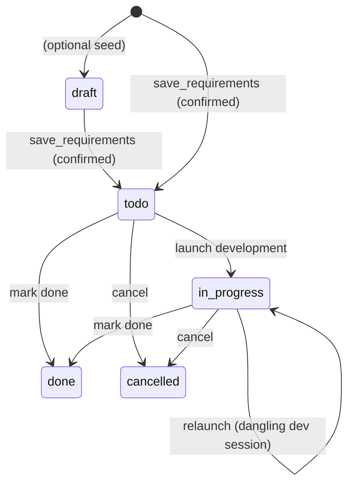

# requirement-management — Domain Spec

## Overview

requirement-management gives c3 a **project-scoped, cross-session requirement ledger**. Where
the rest of c3 operates at the session level (prompt, gate, stream), this domain captures _what
the user wants to build_ against a project, helps refine it, and drives it into development.

It has three moving parts:

1. **The ledger** — requirements persisted in a local SQLite database (`~/.c3/c3.db`), keyed by
   the project's resolved absolute workspace path, each with a priority, status, content, and
   optional intra-project dependencies.
2. **A read-only requirement-communication agent** — a long-lived hidden session per project
   that reads project material, converses with the user, and proposes discrete, verifiable
   requirement items. It can **never** edit, write, run commands, spawn sub-agents, or invoke
   slash commands (ADR 0007).
3. **Launch development** — turning a `todo` requirement into a background normal session that
   runs `/sdd-lite`, with a back-link to that development session.

**Scope:** the requirement ledger and its CRUD; the read-only communication agent and its
`save_requirements` confirmation; refine (restart communication on one item); launch development
(background `/sdd-lite`); development back-link; the `draft→todo→in_progress→done/cancelled`
status machine; dependency recording and unmet-dependency warnings; hiding communication sessions
from the normal list.

**Boundary:** it does **not** define the agent run loop (agent-session) or the permission flow
(permission-gateway) — it reuses both. It owns no permission state and never auto-completes a
requirement (the development run finishing does not change status; the user marks `done`).

## Core entities

| Entity                 | Description                                                                                                                                        |
| ---------------------- | -------------------------------------------------------------------------------------------------------------------------------------------------- |
| Requirement            | A ledger item: `title`, `content`, `priority` (P0–P3), `module` (模块名称), `status`, `dependsOn[]`, `lastDevSessionId`, scoped to a `projectPath` |
| Requirement Dependency | A directed `requirement → depends-on` edge within one project (display + warning only; no topological enforcement in v1)                           |
| Communication Session  | The per-project hidden agent session used to refine requirements; a real SDK session kept out of the normal list (the hidden set)                  |

See [models.md](models.md).

## Concepts

- **Project key (path-key).** Every requirement and communication-session row is keyed by the
  **resolved absolute workspace path** — identical to the session-registry workspace key, the
  runtime `workspacePath`, and the SDK `cwd`. All inbound `projectPath` is `resolve()`d before
  any read or write so the ledger, hidden-set filtering, and `cwd` always agree (RM-R10).
- **Hidden set.** The set of communication-session ids for a project. The normal session list
  (`list_sessions`) is filtered to exclude them, so a project keeps exactly one _current_
  communication session that never clutters the sidebar (RM-R4).
- **Requirement priority / 需求级别.** One of `P0`, `P1`, `P2`, `P3` (P0 highest).
- **Module / 模块名称.** A free-text label naming the requirement's owning module, inferred by
  the communication agent from the item's title/content (e.g. 认证、会话、需求管理). Optional at
  proposal time and `''` when unidentified or for historical rows; lays the data groundwork for
  later module-based organization/filtering/display (RM-R14).

## Business rules

| ID     | Rule                                                                                                                                                                                                                                                                                                                                                                                                                                                                                                                                                                                                                          |
| ------ | ----------------------------------------------------------------------------------------------------------------------------------------------------------------------------------------------------------------------------------------------------------------------------------------------------------------------------------------------------------------------------------------------------------------------------------------------------------------------------------------------------------------------------------------------------------------------------------------------------------------------------- |
| RM-R1  | A requirement belongs to exactly one project, keyed by the resolved absolute workspace path. Lists are per single project; there is no cross-project aggregate view.                                                                                                                                                                                                                                                                                                                                                                                                                                                          |
| RM-R2  | The communication agent is **read-only**. It may use read-class tools (Read/Grep/Glob/WebFetch/WebSearch, auto-allowed) and may use `AskUserQuestion` (a clarifying-only tool — allowed, routed via user-answer injection, no consensus) but **never** edits, writes, runs commands, spawns sub-agents, or runs slash commands. This is enforced at the tool layer, not by prompt alone (ADR 0007).                                                                                                                                                                                                                           |
| RM-R3  | The communication session runs in **forced `default` permission mode**, regardless of the system default mode. It does not honor `set_mode`, and the requirement view renders no mode selector. (`bypassPermissions` would skip `canUseTool` and silently save — forbidden.)                                                                                                                                                                                                                                                                                                                                                  |
| RM-R4  | Each project has at most one _current_ communication session. Communication sessions are in the hidden set and **never** appear in the normal session list. Entering the requirement view re-loads the project's current communication session (history + live stream).                                                                                                                                                                                                                                                                                                                                                       |
| RM-R5  | A requirement is written to the ledger only through `save_requirements`, which surfaces a human confirmation (reusing the permission gateway, tool `mcp__c3__save_requirements`). Allow → the tool handler writes; Deny → nothing is written and the agent is told it was rejected.                                                                                                                                                                                                                                                                                                                                           |
| RM-R6  | Newly saved requirements start in status `todo`, scoped to the current project path.                                                                                                                                                                                                                                                                                                                                                                                                                                                                                                                                          |
| RM-R7  | **Refine** restarts the communication session for one requirement: a fresh communication session is started and seeded with a first message carrying the requirement's id, title, and content. It does not change the requirement's status.                                                                                                                                                                                                                                                                                                                                                                                   |
| RM-R8  | **Launch development** is allowed when the requirement is `todo`, or `in_progress` with a dangling (deleted) `lastDevSessionId`. It starts a **background normal session** running `/sdd-lite` with the requirement content, sets status `in_progress`, and records `lastDevSessionId`. The development session is a normal session and appears in the sidebar.                                                                                                                                                                                                                                                               |
| RM-R9  | The development run finishing does **not** change requirement status (no auto-complete). The user marks `done` or `cancelled` manually from the list.                                                                                                                                                                                                                                                                                                                                                                                                                                                                         |
| RM-R10 | Every inbound `projectPath` is `resolve()`d before any ledger read/write or hidden-set filtering, matching the workspace key / runtime `workspacePath` / SDK `cwd`.                                                                                                                                                                                                                                                                                                                                                                                                                                                           |
| RM-R11 | Launching development with one or more **unmet dependencies** (a `dependsOn` item not `done`) is **warned** but not blocked — the user may proceed.                                                                                                                                                                                                                                                                                                                                                                                                                                                                           |
| RM-R12 | If the ledger (SQLite) is unavailable, requirement features degrade per entry point (requirement messages return `error`; the normal list is **not** filtered) and c3 still boots and serves normal sessions.                                                                                                                                                                                                                                                                                                                                                                                                                 |
| RM-R13 | The development back-link opens the `lastDevSessionId` session (reusing `select_session`). If that session no longer exists, the user gets a friendly prompt (with restart/cancel options), not a crash.                                                                                                                                                                                                                                                                                                                                                                                                                      |
| RM-R14 | Each requirement carries a `module` (模块名称). The communication agent **infers** it from the item's title/content (scheme a; future-extensible to the project's module structure) and passes it per item to `save_requirements`; a missing/blank `module` persists as `''` (the agent is never blocked on it). The ledger column is `TEXT NOT NULL DEFAULT ''`; old dbs migrate via an idempotent `ALTER TABLE … ADD COLUMN` (schema v1→v2) with historical rows defaulting to `''` (no backfill). All read paths return `module`. This requirement only produces the data; module-based display/filtering is out of scope. |

## States & transitions

- **Save → `todo`.** Confirmed `save_requirements` produces `todo` items (RM-R6).
- **Launch → `in_progress`.** Sets `lastDevSessionId`; also re-allowed for an `in_progress`
  item whose development session was deleted (RM-R8).
- **Done / cancelled are manual.** The development run never moves status itself (RM-R9). Refine
  does not change status (RM-R7); it may add/update items via `save_requirements`.

## User scenarios

- **US-1 Enter the requirement view.** Each workspace row has an idea (💡) button left of the
  add-session (＋) button. Clicking it switches the main area to the requirement view (list left,
  communication chat right), loads that project's requirements, and re-loads the project's
  current communication session (replays history + resumes the live stream) — including after WS
  reconnect and full-page refresh (RM-R4).
- **US-2 List & filter.** The list shows each requirement (title/summary, P0–P3 badge, status,
  dependency hint) with a status filter (All + each status); it refreshes live on save/status
  change (RM-R6).
- **US-3 Read-only refinement chat.** The right pane is an independent agent session with its own
  system prompt; it reads project material but is rejected on any edit/write/command/sub-agent/
  slash attempt (RM-R2). It may ask the user clarifying questions via `AskUserQuestion` — surfaced
  through the standard answer panel and injected back as the agent's tool result (RM-R2). It
  proposes discrete, verifiable, right-sized items for confirmation. It does not appear in the
  normal session list (RM-R4).
- **US-4 Confirm & persist.** The agent calls `save_requirements`; c3 pops a confirmation listing
  each proposed item (title/priority/dependency). Allow → written to `c3.db` as `todo` for the
  current project; Deny → not written, agent told it was rejected (RM-R5/RM-R6).
- **US-5 Refine an item.** A `todo` item has a Refine button; clicking restarts the
  communication session seeded with that item's id/content (RM-R7); further dialog can update/add
  items via US-4.
- **US-6 Launch development.** A `todo` item has a Launch-development button; clicking creates a
  background session running `/sdd-lite` with the requirement content, moves it to
  `in_progress`, and records `lastDevSessionId`. The run survives disconnect (RM-R8).
- **US-7 Development back-link.** A launched item has a Development-details entry that switches to
  the normal session view at `lastDevSessionId` (history + live stream). If deleted, a friendly
  prompt instead of a crash (RM-R13).
- **US-8 Dependencies.** A requirement records the ids of intra-project requirements it depends
  on (RM-R1). Items with unmet dependencies show a visual hint; launching with unmet dependencies
  warns but does not block (RM-R11).
- **Read-only (anti-scenario).** A communication session must **never** be able to write a file —
  even via a spawned sub-agent or slash command. `Task`/`SlashCommand` are disallowed and the
  gateway denies by default (RM-R2, ADR 0007).
- **Silent-save (anti-scenario).** A `save_requirements` call must **never** persist without the
  user's allow — even if the system default mode is `bypassPermissions` (RM-R3/RM-R5).
- **Auto-complete (anti-scenario).** A development run completing must **never** flip a
  requirement to `done` (RM-R9).

## Domain events (wire)

Consumes (new): `list_requirements`, `open_requirement_chat`, `refine_requirement`,
`start_development`, `update_requirement_status`. Emits (new): `requirements`.

Reuses (existing): chat I/O is `user_prompt` (routed to the communication runtime) plus
`session_selected` / `user_text` / `assistant_text` / `tool_use` / `tool_result` / `turn_end`;
the save confirmation and any `AskUserQuestion` clarification both ride `permission_request` /
`permission_response` (`toolName = mcp__c3__save_requirements` for the save,
`toolName = AskUserQuestion` for clarifications — the latter carries no `consensus`); the
development back-link is `select_session`. See the
[shared protocol](../../../shared/api-conventions/websocket-protocol.md).

## Interactions

- **agent-session** — runs the communication agent as a `requirement`-kind runtime (forced
  `default` mode, read-only tool set) and the development session as a normal background runtime.
- **permission-gateway** — gates `save_requirements` through the existing `canUseTool` flow, and
  routes `AskUserQuestion` through the same flow's answer-injection path (no consensus); the same
  flow denies any other non-read tool by default for the communication agent (ADR 0007).
- **session-registry** — its `listWorkspaceSessions` excludes this domain's hidden set so
  communication sessions stay out of the sidebar.
- **web-console** — renders the requirement list + reuses the chat components, the idea button,
  and a specialized render of the `save_requirements` confirmation.
- **Claude Agent SDK** — the communication agent uses `disallowedTools`, an `appendSystemPrompt`
  preset, and an in-process MCP server exposing `save_requirements`.

## Data dictionary

- **Requirement** — a ledger item scoped to a project path; the unit the list, refine, and
  launch all operate on.
- **Module / 模块名称** — a free-text label for a requirement's owning module, inferred by the
  communication agent from title/content; `''` when unidentified (RM-R14).
- **Communication session** — the per-project hidden agent session used to refine requirements;
  a real SDK session in the hidden set.
- **Hidden set** — the communication-session ids for a project, excluded from `list_sessions`.
- **c3.db** — the SQLite ledger at `~/.c3/c3.db` (note: distinct from the registry's
  `state.json`, which lives under `~/.claude/c3/`).
- **lastDevSessionId** — the id of the session a requirement's last development run produced; the
  back-link target.
