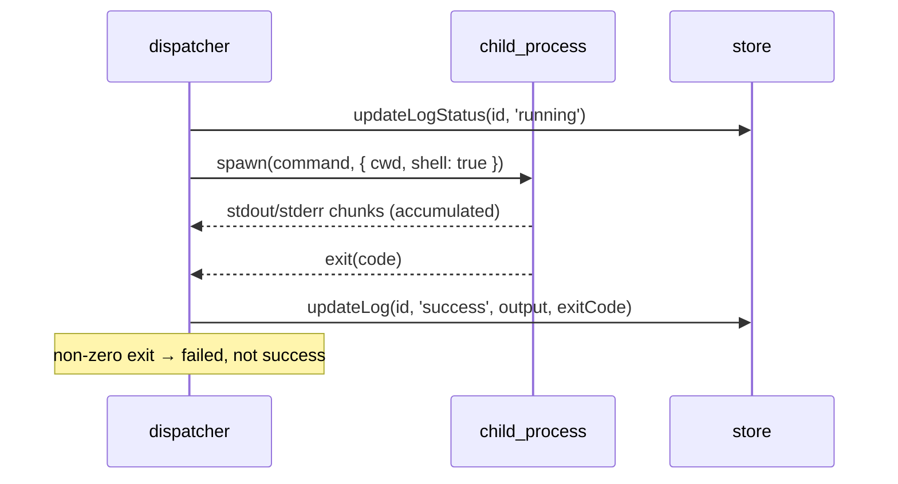
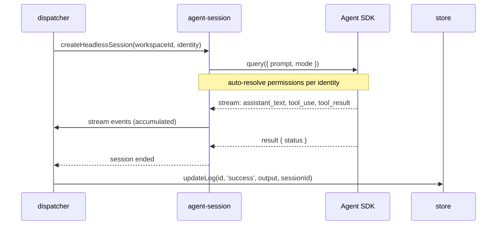
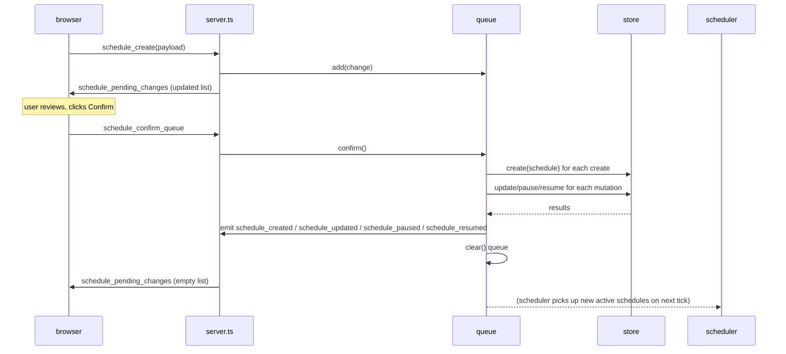
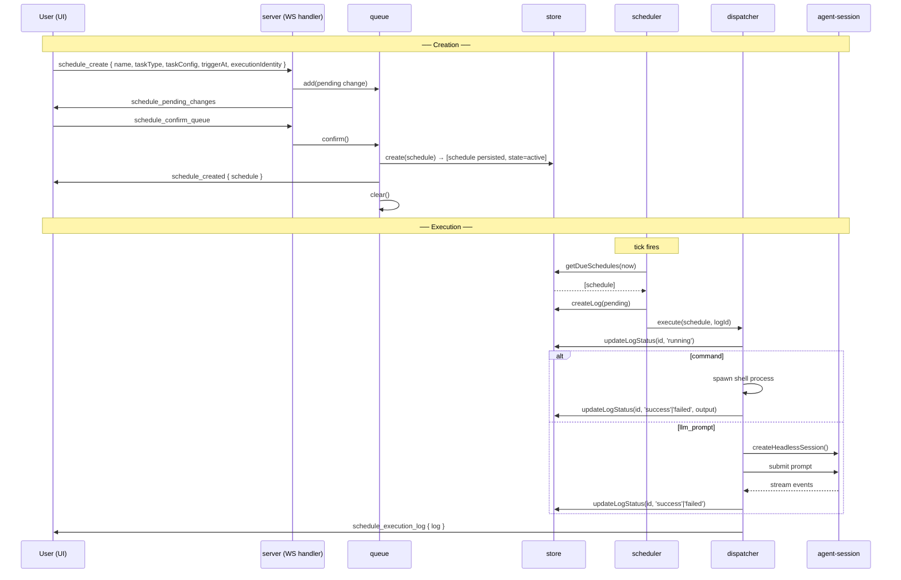

# schedules — Design

Implements the [spec](spec.md). Lives in `server/src/schedules/` — a self-contained module with
its own store, scheduler loop, and execution dispatcher.

## Module split

| Concern               | File / Area                              | Notes                                                                      |
| --------------------- | ---------------------------------------- | -------------------------------------------------------------------------- |
| Store (CRUD + SQLite) | `server/src/schedules/store.ts`          | Workspace-validated CRUD for schedules + execution logs                    |
| Scheduler engine      | `server/src/schedules/scheduler.ts`      | Fixed-interval tick loop; dispatches due schedules                         |
| Execution dispatcher  | `server/src/schedules/dispatcher.ts`     | Spawns command process or llm_prompt session; writes log                   |
| Write queue           | `server/src/schedules/queue.ts`          | Per-connection pending change queue; confirm/discard lifecycle             |
| WS handler            | `server/src/server.ts` (schedule events) | Route schedule-related WS events to the store/scheduler/queue              |
| Workspace archiving   | `server/src/schedules/archiver.ts`       | Listens for workspace removal; archives all schedules under that workspace |

## Data model (SQLite)

Two tables in the project-level SQLite database (same database as
[requirement-management](../requirement-management/design.md) and
[session-registry](../../core/session-registry/design.md)):

### `schedules`

```sql
CREATE TABLE schedules (
    id                TEXT PRIMARY KEY,                      -- UUID v4
    workspace_id      TEXT NOT NULL,                         -- FK → workspace
    name              TEXT NOT NULL,
    description       TEXT,                                  -- nullable
    task_type         TEXT NOT NULL CHECK(task_type IN ('command', 'llm_prompt')),
    task_config       TEXT NOT NULL,                         -- JSON string
    trigger_at        TEXT,                                  -- ISO 8601 timestamp; nullable (null = recurring)
    cron_expression   TEXT,                                  -- nullable; always null in v1
    state             TEXT NOT NULL DEFAULT 'active' CHECK(state IN ('active', 'paused', 'archived')),
    execution_identity TEXT NOT NULL DEFAULT 'sandboxed' CHECK(execution_identity IN ('read-only', 'sandboxed', 'full-access')),
    last_executed_at  TEXT,                                  -- ISO 8601; nullable
    created_by        TEXT NOT NULL,
    created_at        TEXT NOT NULL DEFAULT (datetime('now')),
    updated_at        TEXT NOT NULL DEFAULT (datetime('now')),

    FOREIGN KEY (workspace_id) REFERENCES state(workspace_id) ON DELETE CASCADE,

    CONSTRAINT exactly_one_timing CHECK (
        (trigger_at IS NOT NULL AND cron_expression IS NULL)
        OR
        (trigger_at IS NULL AND cron_expression IS NOT NULL)
        OR
        (trigger_at IS NOT NULL AND cron_expression IS NOT NULL)  -- v1 allows trigger_at only; constraint relaxed for future
    )
);

CREATE INDEX idx_schedules_workspace ON schedules(workspace_id);
CREATE INDEX idx_schedules_state ON schedules(state);
CREATE INDEX idx_schedules_trigger ON schedules(state, trigger_at)
    WHERE state = 'active' AND trigger_at IS NOT NULL;
```

Design notes:

- `task_config` is a JSON blob, not a normalised sub-table. The two task types share most behaviour
  (scheduling, logging, workspace binding, identity); only the execution driver differs. A JSON
  column avoids a single-table inheritance or separate tables while keeping validation at the
  application layer.
- The `exactly_one_timing` CHECK constraint enforces mutual exclusion between `trigger_at` and
  `cron_expression` at the DB level. In v1, `trigger_at` is always set and `cron_expression` is
  always null; the constraint is written to accommodate future recurring schedules.
- `ON DELETE CASCADE` on `workspace_id` is **not** used for schedule deletion when a workspace is
  removed — schedules are **archived** (not deleted) per SCH-R1. The archiving is handled by the
  application layer (`archiver.ts`). The FK exists for referential integrity; deletion from the
  workspace table is handled by the application only.
- Partial index on active, non-null `trigger_at` for efficient scheduler ticks.

### `schedule_execution_logs`

```sql
CREATE TABLE schedule_execution_logs (
    id              TEXT PRIMARY KEY,                                  -- UUID v4
    schedule_id     TEXT NOT NULL,                                     -- FK → schedules
    status          TEXT NOT NULL DEFAULT 'pending' CHECK(status IN ('pending', 'running', 'success', 'failed', 'cancelled')),
    trigger         TEXT NOT NULL DEFAULT 'scheduled' CHECK(trigger IN ('scheduled', 'manual')),
    scheduled_at    TEXT NOT NULL,                                     -- ISO 8601 — when it was supposed to trigger
    started_at      TEXT,                                              -- ISO 8601; nullable
    completed_at    TEXT,                                              -- ISO 8601; nullable
    output          TEXT,                                              -- captured stdout or stream data; nullable
    error_message   TEXT,                                              -- nullable
    exit_code       INTEGER,                                          -- nullable (command type only)
    duration_ms     INTEGER,                                          -- nullable until completed
    session_id      TEXT,                                              -- nullable (llm_prompt type only)

    FOREIGN KEY (schedule_id) REFERENCES schedules(id) ON DELETE CASCADE
);

CREATE INDEX idx_logs_schedule ON schedule_execution_logs(schedule_id);
CREATE INDEX idx_logs_status ON schedule_execution_logs(status);
CREATE INDEX idx_logs_scheduled ON schedule_execution_logs(scheduled_at);
```

Design notes:

- `ON DELETE CASCADE` on `schedule_id` — when a schedule is deleted, its logs are removed
  (SCH-R14).
- `output` stores the full execution output as plain text. For `llm_prompt` types, this is a
  concatenated stream of `assistant_text` and `tool_result` entries. For `command` types, this is
  stdout + stderr. Large outputs may be capped at an implementation-defined limit (e.g. 1 MB) to
  avoid excessive storage; the cap is logged if hit.
- `duration_ms` is computed as `(completed_at - started_at)` in milliseconds at the application
  layer when the execution reaches a terminal state.

## Store design (`store.ts`)

The store provides workspace-validated CRUD for schedules and logs.

```typescript
interface ScheduleStore {
  // --- Schedules ---

  /** Create a schedule. Validates workspaceId exists in session-registry (SCH-R1). */
  create(data: CreateScheduleInput): Schedule

  /** Get a single schedule by id (for the requesting workspace). */
  getById(id: string): Schedule | null

  /** List schedules for a workspace, with optional state filter. */
  listByWorkspace(workspaceId: string, filter?: { state?: ScheduleState }): Schedule[]

  /** Update mutable fields. Does not change state (use pause/resume/archive instead). */
  update(id: string, fields: UpdateScheduleFields): Schedule

  /** Transition state. Only valid transitions per state machine in spec. */
  transitionState(id: string, target: 'paused' | 'active' | 'archived'): Schedule

  /** Hard delete. Deletes schedule + cascade-execution logs (SCH-R14). */
  delete(id: string): void

  /** Called by the engine when an execution starts — updates last_executed_at. */
  markExecuted(id: string, executedAt: string): void

  // --- Execution Logs ---

  /** Create a new execution log entry in `pending` status. */
  createLog(data: CreateLogInput): ExecutionLog

  /** Transition log status. Enforces forward-only (SCH-R10). */
  updateLogStatus(id: string, status: ExecutionStatus, extra?: LogStatusExtra): ExecutionLog

  /** List execution logs for a schedule, most recent first. */
  listLogs(scheduleId: string, limit?: number, offset?: number): ExecutionLog[]

  /** Get a single execution log. */
  getLogById(id: string): ExecutionLog | null

  // --- Scheduler queries ---

  /** Get all active schedules whose trigger_at <= now, with no pending/running execution. */
  getDueSchedules(now: string): Schedule[]

  /** Check if a schedule has an in-flight execution (pending or running). */
  hasInFlightExecution(scheduleId: string): boolean
}
```

Key design decisions:

- **Workspace validation** (`create`): runs a `SELECT 1 WHERE workspace_id IN (…)` against
  session-registry's workspace table. This is a lightweight synchronous check; the store does not
  hold a lock.
- **Update mutability**: only `name`, `description`, `task_config`, `trigger_at`,
  `execution_identity` are mutable after creation. `task_type`, `workspace_id`, and `cron_expression`
  are immutable.
- **`getDueSchedules`** is the scheduler's tick query: `WHERE state = 'active' AND trigger_at <= ?
AND trigger_at IS NOT NULL`. It excludes schedules with in-flight executions via an application
  filter (not SQL — the in-flight set is small and checking per-row SQL is over-optimisation).
- **Log status transitions**: the store enforces the forward-only chain:
  `pending → running → (success | failed | cancelled)`. A transition that would violate this
  (e.g. `success → failed`) throws an error.

## Scheduler engine (`scheduler.ts`)

The scheduler runs a fixed-interval tick loop:

```
[interval] → query due schedules → for each: create pending log → dispatch → track in-flight
```

```typescript
interface SchedulerConfig {
  tickIntervalMs: number // default 30_000 (30 seconds)
}

class Scheduler {
  private timer: NodeJS.Timeout | null = null
  private inFlight: Map<string, Promise<void>> = new Map() // scheduleId → running execution promise

  start(config: SchedulerConfig): void
  stop(): void

  // Called on each tick
  private async onTick(): Promise<void> {
    const now = new Date().toISOString()
    const due = store.getDueSchedules(now)

    // Filter: skip schedules already in-flight (SCH-R7)
    const toRun = due.filter((s) => !this.inFlight.has(s.id))

    for (const schedule of toRun) {
      // Create pending log
      const log = store.createLog({
        scheduleId: schedule.id,
        scheduledAt: schedule.triggerAt!,
        trigger: 'scheduled',
      })

      // Dispatch and track
      const execution = dispatcher
        .execute(schedule, log.id)
        .finally(() => this.inFlight.delete(schedule.id))

      this.inFlight.set(schedule.id, execution)
    }
  }
}
```

Design notes:

- **Tick interval** is configurable; default 30 seconds strikes a balance between prompt triggering
  and unnecessary DB polling.
- **In-flight tracking** via `Map<scheduleId, Promise>` ensures serial execution per schedule
  (SCH-R7). The promise is removed on completion (`.finally()`).
- **No catch-up for missed ticks**: if the server was down, missed trigger windows are not
  retroactively executed. The schedule fires on the next tick if `trigger_at` has not passed the
  scheduled time. For past triggers, the engine skips them after a grace window (default 5 minutes
  past `trigger_at`).
- **Scheduler starts on server boot** after the store has loaded its workspace list and the
  database connection is ready. It stops gracefully on server shutdown (joins in-flight executions
  with a timeout).

### Grace window for stale triggers

When the server starts or recovers from downtime, some schedules' `trigger_at` may be in the past.
The engine applies a grace window:

- If `trigger_at` is within the grace window (default 5 minutes), the schedule fires immediately.
- If `trigger_at` is beyond the grace window, the execution is recorded as `failed` with
  `errorMessage: 'missed_trigger_window'` and the schedule is **not** auto-paused.
- This prevents a burst of stale executions after a long server restart.

### Manual trigger (run now)

A `schedule_run_now` event triggers immediate execution outside the normal tick:

```typescript
async function triggerRunNow(scheduleId: string): Promise<void> {
  const schedule = store.getById(scheduleId)
  if (!schedule || schedule.state !== 'active') return // reject: inactive
  if (scheduler.inFlight.has(scheduleId)) return // reject: already running

  const log = store.createLog({
    scheduleId: schedule.id,
    scheduledAt: new Date().toISOString(),
    trigger: 'manual',
  })
  scheduler.inFlight.set(scheduleId, dispatcher.execute(schedule, log.id))
}
```

## Execution dispatcher (`dispatcher.ts`)

The dispatcher takes a schedule and an execution log id, executes the task, and writes the result
back to the log.

```typescript
interface Dispatcher {
  execute(schedule: Schedule, executionLogId: string): Promise<void>
}

async function execute(schedule: Schedule, executionLogId: string): Promise<void> {
  // Phase 1: transition log to running
  const startedAt = new Date().toISOString()
  store.updateLogStatus(executionLogId, 'running', { startedAt })
  store.markExecuted(schedule.id, startedAt)

  try {
    if (schedule.taskType === 'command') {
      await executeCommand(schedule, executionLogId)
    } else {
      await executeLlmPrompt(schedule, executionLogId)
    }

    // Phase 3: success
    const completedAt = new Date().toISOString()
    store.updateLogStatus(executionLogId, 'success', {
      completedAt,
      durationMs: computeDuration(startedAt, completedAt),
    })
  } catch (err) {
    // Phase 3b: failure
    const completedAt = new Date().toISOString()
    store.updateLogStatus(executionLogId, 'failed', {
      completedAt,
      errorMessage: err.message,
      durationMs: computeDuration(startedAt, completedAt),
    })
  }
}
```

### Command execution (`executeCommand`)



1. Spawn `child_process.spawn(schedule.taskConfig.command, { cwd: workspacePath, shell: true })`.
2. Accumulate stdout + stderr into `output` buffer.
3. On `exit`: exit code 0 ⇒ `success`; non-zero ⇒ `failed` with `errorMessage: 'exit_code_N'`.
4. On `error` (process not spawned): `failed` with the error message.

Security: the command runs in the workspace directory with the server's own process user. No
sandbox beyond OS-level process isolation. Execution identity (`read-only`) does not constrain
the shell command directly — it is a semantic tag for UI clarity; the v1 implementation trusts
that command schedules are created by workspace editors/owners.

### LLM prompt execution (`executeLlmPrompt`)



1. Create a **headless session** via agent-session — a session runtime with no WebSocket viewer,
   auto-resolving permission prompts according to `executionIdentity`.
2. Submit the prompt as the first user turn.
3. Accumulate `assistant_text`, `tool_use`, `tool_result` stream events into `output`.
4. Map terminal SDK status:
   - `complete` → `success`
   - `error` → `failed` with error message
5. Record the agent `sessionId` in the log for traceability.

Headless sessions:

- Use a generated session id (`headless:schedules:<scheduleId>:<executionId>`).
- Are not listed in the sidebar (filtered by session-registry's hidden-set mechanism).
- Are removed from the SDK on execution completion (cleanup).

## Write queue (`queue.ts`)

Per-connection pending change queue.

```typescript
interface WriteQueue {
  // Per-connection instance

  /** Add a change to the pending queue. */
  add(change: PendingChange): void

  /** Remove a pending change by id. */
  remove(changeId: string): void

  /** Get all pending changes for this connection. */
  list(): PendingChange[]

  /** Atomically confirm all pending changes: persist to store, then clear. */
  confirm(): PendingChangeResult[]

  /** Discard all pending changes without persisting. */
  discard(): void

  /** Replace an existing pending change (update_field scenario). */
  replace(changeId: string, newPayload: JSON): void
}
```

Implementation:

- A `Map<connectionId, PendingChange[]>` lives in `queue.ts`.
- `confirm()` iterates the pending list in order, calling the appropriate store methods. If any
  store operation fails (e.g. FK constraint violation), the batch is **not** partially applied —
  the implementation uses a simple sequential approach: each operation runs independently; a
  failure logs an error and continues to other items. This is acceptable because:
  - Schedule mutations are independent (they each reference a different schedule).
  - A failed individual mutation emits a `schedule_error` event to the connection.
  - The queue design prioritises simplicity over distributed atomicity for v1.
- `archive` and `delete` operations **do not** enter the pending queue — they are dispatched
  immediately to the store.

### Confirmation flow



## Workspace archiving (`archiver.ts`)

Listens for workspace removal events and archives all schedules belonging to that workspace.

```typescript
// Called when workspace is removed from session-registry
function onWorkspaceRemoved(workspaceId: string): void {
  const schedules = store.listByWorkspace(workspaceId)

  for (const schedule of schedules) {
    // Cancel any in-flight execution
    scheduler.cancelInFlight(schedule.id)

    // Archive the schedule
    store.transitionState(schedule.id, 'archived')
  }
}
```

This is triggered by the workspace removal event from session-registry. The archiving is
synchronous — all schedules are archived before the workspace removal response is sent to the
client.

## Schedule lifecycle flow (end-to-end)



## Technology choices

- **SQLite** for persistence — shares the existing project-level database. No additional runtime
  dependency.
- **`child_process.spawn`** with `shell: true` for command execution. Simple, well-understood, no
  external runner dependency.
- **Fixed-interval tick** rather than event-driven timer per schedule. Avoids managing `N` timers
  and is simpler to reason about. 30-second granularity is acceptable for v1 (schedules are not
  sub-minute precision).
- **In-process dispatcher** — no job queue (Bull, RabbitMQ, etc.). For v1, all executions run in
  the server process. A future iteration may extract the dispatcher to a worker process for
  resource isolation.
- **`task_config` as JSON** avoids schema evolution complexity across two task types that share
  most behaviour.
- **Per-connection, in-memory write queue** — not persisted. Simplifies implementation (no stale
  queue recovery) at the cost of losing unconfirmed changes on reconnect. Acceptable because
  pending changes are ephemeral intent, not committed state.

## Non-functional considerations

- **Latency:** Scheduler ticks are low-latency (DB query + in-memory filter). Execution latency is
  task-dependent and unbounded.
- **Reliability:** The scheduler loop is a single `setInterval`. If a tick's handler throws, the
  error is caught and logged; the interval continues. The loop never silently stops.
- **Memory:** In-flight tracking uses a `Map<scheduleId, Promise>`. With typical usage (tens of
  schedules), memory is negligible. The map is bounded by the number of schedules, not executions.
- **Storage:** Execution logs grow indefinitely. A log retention policy (e.g. auto-prune logs
  older than 90 days) is deferred to a future iteration.
- **Security:** Command schedules run with the server process's user. Execution identity
  (`read-only`) is a semantic tag, not a security boundary, in v1. LLM prompt schedules
  auto-resolve permission prompts per identity — this is enforced server-side and bypasses the
  permission gateway's human gate.

## Dependencies

- **Inbound:** `session-registry` (workspace existence validation, workspace removal events);
  `agent-session` (headless session creation for `llm_prompt` type).
- **Outbound:** SQLite (`better-sqlite3`); `child_process` (Node built-in); shared database with
  session-registry.
- **Consumed by:** `web-console` (renders schedule UI).
