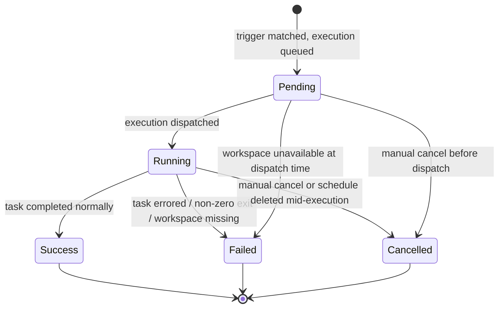

# schedules — Domain Spec

## Overview

The schedules domain adds **time-based task execution** to c3. A **Schedule** holds a task definition
(a shell command or LLM prompt) plus timing, workspace binding, and execution identity. When its
trigger condition is met (wall-clock match for one-shot, cron match for recurring), the scheduler
engine spawns an execution in the workspace's context and records the outcome in an **ExecutionLog**.

Schedules are **workspace-scoped**: every schedule belongs to exactly one workspace (the directory
registered in session-registry). This means a schedule runs with that workspace's `cwd`, environment,
project settings, sessions, and agent configuration — just like a user-initiated run from that workspace.

The user views schedules and logs in the web-console and manages them through a confirmation queue
("pending changes" before effects take hold).

**Scope:** schedule CRUD, timing/state management, execution dispatch, log recording, write confirmation queue.
**Boundary:** it does not run the agent (`agent-session`), does not decide per-call permissions
(`permission-gateway`), and does not render UI (`web-console`).

## Core entities

| Entity       | Description                                                     | Key attributes                                                           |
| ------------ | --------------------------------------------------------------- | ------------------------------------------------------------------------ |
| Schedule     | A time-bound task: command or LLM prompt, one-shot or recurring | `id`, `workspaceId`, `taskType`, `state`, `triggerAt` / `cronExpression` |
| ExecutionLog | The record of a single execution of a schedule                  | `id`, `scheduleId`, `status`, `startedAt`, `output`                      |

See [models.md](models.md) for full attributes.

## Business rules

| ID      | Rule                                                                                                                                                                                                                                                                                                                                                                                                                                                          |
| ------- | ------------------------------------------------------------------------------------------------------------------------------------------------------------------------------------------------------------------------------------------------------------------------------------------------------------------------------------------------------------------------------------------------------------------------------------------------------------- |
| SCH-R1  | A schedule **must** reference a workspace that exists in the session-registry at creation time. Deleting the workspace causes all its schedules to be **archived** (not deleted — logs are preserved); archived schedules are no longer evaluated by the scheduler.                                                                                                                                                                                           |
| SCH-R2  | A schedule's task is one of exactly two types: `command` (a shell command string) or `llm_prompt` (a prompt text sent to an agent session). The type is immutable after creation.                                                                                                                                                                                                                                                                             |
| SCH-R3  | Timing is either **one-shot** (a concrete `triggerAt` timestamp) or **recurring** (a `cronExpression`). Exactly one timing field is set; a schedule with both or neither is rejected at creation. (Recurring schedules are **not implemented in v1**; see v1-exclusion list.)                                                                                                                                                                                 |
| SCH-R4  | A schedule's **execution identity** is one of `read-only`, `sandboxed`, or `full-access` (see § Execution Identity). It is mutable and applies to every execution of the schedule.                                                                                                                                                                                                                                                                            |
| SCH-R5  | A schedule in `active` state is evaluated by the scheduler. A schedule in `paused` state exists but is **not** evaluated — its trigger is skipped until resumed. A schedule in `archived` state is frozen for record-keeping; it is not evaluated and its state cannot revert to `paused` or `active`.                                                                                                                                                        |
| SCH-R6  | Writing a schedule (create / update fields / change state) produces a **pending change** visible in the web-console. The change takes effect only after explicit user confirmation from the queue. The queue blocks until the user accepts or rejects — there is no auto-approve. (Exception: `archive` and `delete` are immediate on confirmation — they are not deferrable.)                                                                                |
| SCH-R7  | A schedule execution is **serial per schedule**: at most one execution can be in-flight for a given schedule at any time. If a recurring schedule's next trigger fires while the previous execution is still running, the new trigger is skipped (not queued).                                                                                                                                                                                                |
| SCH-R8  | An execution runs in the schedule's workspace context (`cwd`, project settings, sessions, etc.). If the workspace has been removed between schedule creation and execution time, the execution fails immediately with `workspace_removed`.                                                                                                                                                                                                                    |
| SCH-R9  | An execution's agent run uses the execution identity to determine permission sensitivity. `read-only` forces `plan`/`bypassPermissions`-equivalent mode; `full-access` uses the session's current mode; `sandboxed` applies a restricted tool allowlist (see § Execution Identity).                                                                                                                                                                           |
| SCH-R10 | Execution logs are **append-only** once `startedAt` is set. An execution status transitions forward: `pending` → `running` → `success` \| `failed` \| `cancelled`. A `pending` execution that never starts (e.g. workspace unavailable at trigger time) is set to `failed` with a descriptive `errorMessage`.                                                                                                                                                 |
| SCH-R11 | Schedules and their logs are subject to the same **visibility rules** as the workspace they belong to. Only users with `Owner` or `Editor` access to the workspace may modify schedules; `Viewer` access grants read-only listing. See [permission-gateway](../permission-gateway/spec.md) for the access model.                                                                                                                                              |
| SCH-R12 | A `command`-type schedule's execution spawns a **headless shell process** in the workspace directory. No permission prompts are shown — the command is run with the workspace's project-level `allow`/`deny` rules and the schedule's `executionIdentity` mode. If the command yields a non-zero exit code, the log records `failed`.                                                                                                                         |
| SCH-R13 | An `llm_prompt`-type schedule's execution starts an agent session (via `agent-session`) with the workspace context. The prompt is submitted as the first user turn. The run streams `assistant_text` and `tool_use`/`tool_result` into the log. Permission prompts during the run are auto-resolved according to the execution identity (see § Execution Identity). The run's terminal status (`complete` / `error`) maps to `success` / `failed` in the log. |
| SCH-R14 | `archive` and `delete` are final. An archived schedule can only be deleted; it cannot transition back to `paused` or `active`. Deleting a schedule also deletes its **execution logs** (cascade). This is a hard delete — logs are permanently removed.                                                                                                                                                                                                       |
| SCH-R15 | The write confirmation queue is **per-user** (per WebSocket connection), not per-workspace. Unconfirmed changes are visible only to the user who created them and remain editable (can be replaced or discarded) until confirmed. Confirming commits all pending changes for that user atomically — there is no partial confirm at the schedule level (SCH-R6 exception: archive/delete).                                                                     |

## States & transitions

### Schedule lifecycle

```mermaid
stateDiagram-v2
    [*] --> Active: created + confirmed
    Active --> Paused: pause (confirmed via queue)
    Paused --> Active: resume (confirmed via queue)
    Active --> Archived: archive (immediate; final)
    Paused --> Archived: archive (immediate; final)
    Active --> [*]: delete (immediate; cascade logs)
    Paused --> [*]: delete
    Archived --> [*]: delete (only)
```

Only `active` schedules are evaluated by the scheduler engine. `paused` schedules are preserved but
skipped. `archived` schedules are frozen records; they are never evaluated and never return to an
active state.

### ExecutionLog lifecycle

An execution log is **append-only** once `startedAt` is set and follows the forward-only status
chain from `pending` to a terminal state.

## Task types

| Type         | Config                              | Execution model                                                                                                                                                  |
| ------------ | ----------------------------------- | ---------------------------------------------------------------------------------------------------------------------------------------------------------------- |
| `command`    | Shell command string                | Spawn a headless OS process (`exec`/`spawn`) in the workspace `cwd`. Stdout + stderr captured into `output`. Exit code 0 ⇒ `success`; non-zero/error ⇒ `failed`. |
| `llm_prompt` | Prompt text + optional session mode | Submit the text as the first user turn to a fresh agent session in the workspace. Run streams are captured. Session ends after the turn.                         |
|              |                                     |                                                                                                                                                                  |

Both types share the common scheduling, permission, and logging infrastructure. Differences are in
the execution driver only.

## Workspace binding

Every schedule has a mandatory `workspaceId` that references a workspace in session-registry. This
binding is **immutable after creation** — a schedule cannot be moved to another workspace.

When a workspace is removed from session-registry:

- All its schedules are **automatically archived** (SCH-R1).
- In-flight executions are cancelled (`cancelled` in the log).
- The archived schedules remain visible in the web-console with `workspace_removed` annotation.

## Permissions

Schedules reuse the existing workspace-level permission model (`Owner` / `Editor` / `Viewer`):

| Capability                 | Owner | Editor | Viewer |
| -------------------------- | ----- | ------ | ------ |
| List schedules & logs      | ✓     | ✓      | ✓      |
| Create schedule            | ✓     | ✓      | —      |
| Edit schedule fields       | ✓     | ✓      | —      |
| Pause / Resume             | ✓     | ✓      | —      |
| Archive / Delete           | ✓     | —      | —      |
| Confirm write queue        | ✓     | —      | —      |
| Manual trigger (run now)   | ✓     | ✓      | —      |
| Cancel in-flight execution | ✓     | ✓      | —      |

The permission model is enforced at **write time** (user action in the web-console). The schedule's
execution at trigger time runs with the schedule's own `executionIdentity` — not the creating user's.

## Execution identity model

Each schedule carries an **execution identity** that determines how its runs behave with respect to
permissions and tool access. This is separate from the creating user's identity — it is the
schedule's own persona at runtime.

| Identity      | Permission mode at runtime         | Tool access                                            | Use case                                         |
| ------------- | ---------------------------------- | ------------------------------------------------------ | ------------------------------------------------ |
| `read-only`   | `plan`-equivalent (no write tools) | Read-only tools only. Any write tool attempt → denied. | Monitor health checks, read data.                |
| `sandboxed`   | Restricted allowlist               | A curated subset of safe tools (see below).            | Routine maintenance, non-destructive operations. |
| `full-access` | Uses the workspace session's mode  | All tools permitted by the workspace session's mode.   | Automated deployment, data manipulation.         |

### Sandboxed tool allowlist (v1 baseline)

| Tool category       | Allowed? |
| ------------------- | -------- |
| Bash (read-only)    | ✓        |
| Read / Glob / Grep  | ✓        |
| Write / Edit        | —        |
| Agent / Agent tool  | —        |
| WebFetch            | ✓        |
| WebSearch           | ✓        |
| Bash (write/mutate) | —        |

The allowlist is a v1 baseline and may be extended by system configuration in future iterations.

### Auto-resolution of permission prompts

During an `llm_prompt` execution, the agent may issue permission requests. The execution identity
determines auto-resolution:

| Identity      | Permission prompt handling                                                                    |
| ------------- | --------------------------------------------------------------------------------------------- |
| `read-only`   | Any sensitive tool → denied immediately; no user prompt is displayed.                         |
| `sandboxed`   | Only tools on the allowlist are auto-allowed; tools not on the allowlist are denied silently. |
| `full-access` | All tools are auto-allowed (no permission gate for schedule executions).                      |

On the wire, no `permission_request` reaches the web-console for schedule-initiated runs — they are
resolved entirely server-side.

## Write confirmation queue

All schedule mutations (create, edit field, change state except archive/delete) follow a two-phase
flow:

1. **Phase 1 (propose):** The user's change is captured as a **pending change** and shown in the
   web-console's write queue panel. It is not yet persisted or scheduled.
2. **Phase 2 (confirm):** The user reviews all pending changes and clicks "Confirm". Changes are
   committed in a single atomic batch. Until confirmed, the user may discard individual items or
   the entire queue.

Rationale: Schedules control autonomous execution. An accidental save should not immediately cause
a destructive run at 3 AM. The confirmation queue gives the user a deliberate review step.

**Per-user isolation** (SCH-R15): Each WebSocket connection has its own queue. If the user refreshes
or reconnects, the queue is lost — the changes must be re-proposed. This is intentional: the queue
is ephemeral, not persisted, to avoid stale pending changes surviving across sessions.

**Exception:** `archive` and `delete` bypass the queue — they take effect immediately on user action
(but still require user confirmation in a single-prompt dialog, not a multi-item queue). These are
destructive and the user expects instant effect.

## v1 exclusion list

The following capabilities are explicitly **out of scope** for the v1 schedules implementation:

| Feature                        | Rationale                                                                                                               |
| ------------------------------ | ----------------------------------------------------------------------------------------------------------------------- |
| Recurring schedules (cron)     | Adds state-machine complexity (next-tick calculation, cron-parsing library, missed-tick catch-up). One-shot only in v1. |
| Schedule chains / dependencies | "Run schedule B after schedule A succeeds" requires directed-acyclic-graph tracking and circular-detection.             |
| Shared schedule templates      | Cross-workspace or org-level schedule templates require a template store and namespace.                                 |
| Schedule groups / tags         | Organizational metadata (tags, folders, groups) adds query/index overhead with no v1 user need.                         |
| Calendars / visual timeline    | A Gantt or calendar view of scheduled events is pure UI scope; deferred to web-console backlog.                         |
| Email / webhook notifications  | External notification channels are out of domain for c3 v1. Exceptions are surfaced in the UI.                          |
| Schedule import / export       | Bulk migrate schedules between instances. Requires schema versioning.                                                   |
| Execution retry policy         | Configurable retry on failure (count, backoff) adds state and queue complexity.                                         |
| Parallel executions            | Multiple concurrent runs of the same schedule (SCH-R7 parallelism relaxation).                                          |

## Domain events (wire)

Consumed by the schedules domain:

| Event                       | Payload           | Description                                            |
| --------------------------- | ----------------- | ------------------------------------------------------ |
| `schedule_create`           | ScheduleFields    | Propose a new schedule (→ pending change)              |
| `schedule_update`           | `{ id, fields }`  | Propose edits to an existing schedule                  |
| `schedule_pause`            | `{ id }`          | Propose pause (SCH-R5)                                 |
| `schedule_resume`           | `{ id }`          | Propose resume (SCH-R5)                                |
| `schedule_archive`          | `{ id }`          | Archive immediately (SCH-R14)                          |
| `schedule_delete`           | `{ id }`          | Delete immediately (cascade logs)                      |
| `schedule_confirm_queue`    | `—`               | Atomically confirm all pending changes                 |
| `schedule_discard_queue`    | `—`               | Discard all pending changes                            |
| `schedule_run_now`          | `{ id }`          | Manual trigger: execute outside normal schedule timing |
| `schedule_cancel_execution` | `{ executionId }` | Cancel an in-flight execution                          |

Emitted by the schedules domain:

| Event                       | Payload              | Description                               |
| --------------------------- | -------------------- | ----------------------------------------- |
| `schedule_created`          | ScheduleFull         | Schedule persisted and active             |
| `schedule_updated`          | ScheduleFull         | Schedule fields changed                   |
| `schedule_paused`           | `{ id }`             | State → `paused`                          |
| `schedule_resumed`          | `{ id }`             | State → `active`                          |
| `schedule_archived`         | `{ id }`             | State → `archived`                        |
| `schedule_deleted`          | `{ id }`             | Schedule removed + logs cascaded          |
| `schedule_pending_changes`  | `PendingChange[]`    | Current pending changes (on connect sync) |
| `schedule_queue_confirmed`  | `—`                  | Pending changes applied                   |
| `schedule_queue_discarded`  | `—`                  | Pending changes discarded                 |
| `schedule_execution_log`    | ExecutionLog         | New or updated execution log entry        |
| `schedule_execution_stream` | ExecutionStreamEvent | Live streaming event during execution     |

Wire shapes are defined in the [shared protocol](../../../shared/api-conventions/websocket-protocol.md).

## User scenarios

- **Create a one-shot command:** Given a workspace, When the user fills the schedule form
  (`command` type, trigger time, execution identity) and confirms the queue, Then a schedule is
  created in `active` state and evaluated by the scheduler. The display `name` is generated
  server-side from the task content (command / prompt) on create — the form does not collect a
  name. There is no `description` field; any present in legacy rows is ignored.
- **Run now:** Given an existing schedule, When the user clicks "Run Now", Then an execution is
  immediately dispatched (bypassing the scheduler tick), a new `running` execution log appears.
- **Pause and resume:** Given an active schedule, When the user pauses it (via queue), Then it is
  no longer evaluated. Resuming returns it to evaluation.
- **Archive a schedule:** Given a schedule, When the user archives it, Then it is frozen,
  its logs preserved, and it cannot be un-archived.
- **Write queue safety (anti-scenario):** Changing a schedule's trigger time or command must
  **never** take effect before the user explicitly confirms the queue (SCH-R6).
- **Workspace deletion (anti-scenario):** Removing the workspace must **never** delete schedules
  silently — they are archived, not deleted, preserving their logs (SCH-R1).
- **Concurrent execution (anti-scenario):** A second trigger for the same schedule while its first
  run is in-flight must **never** start a second concurrent execution for that schedule (SCH-R7).

## Interactions

- **session-registry** — provides workspace existence validation (`workspaceId`) and workspace
  removal notification (triggering archiving).
- **agent-session** — executes `llm_prompt` schedules (submits prompt to a session runtime) and
  `command` schedules (spawns shell process in workspace context).
- **permission-gateway** — not consulted for schedule executions; the execution identity logic is
  a server-side override that may route through the gateway API for `read-only` enforcement but
  never blocks on a human decision.
- **web-console** — renders the schedule list, schedule detail/log view, write queue panel,
  create/edit forms, and live execution stream.
- **SQLite** — schedules and execution logs are persisted in the existing project-level SQLite
  database.

## Invariants

- **Workspace-scoped uniqueness:** A schedule is uniquely identified by `(workspaceId, id)`.
  Deleting the workspace archives the schedules, never orphans them.
- **Single active status:** A schedule is in exactly one of `active`, `paused`, or `archived`.
  `archived` is terminal (no transition back).
- **Execution serialization:** A schedule's executions are strictly serial (SCH-R7).
- **No silent execution:** A schedule in `paused` or `archived` state never executes (SCH-R5).
- **Confirm before effect:** Mutations (except archive/delete) never take effect without explicit
  user confirmation (SCH-R6).
