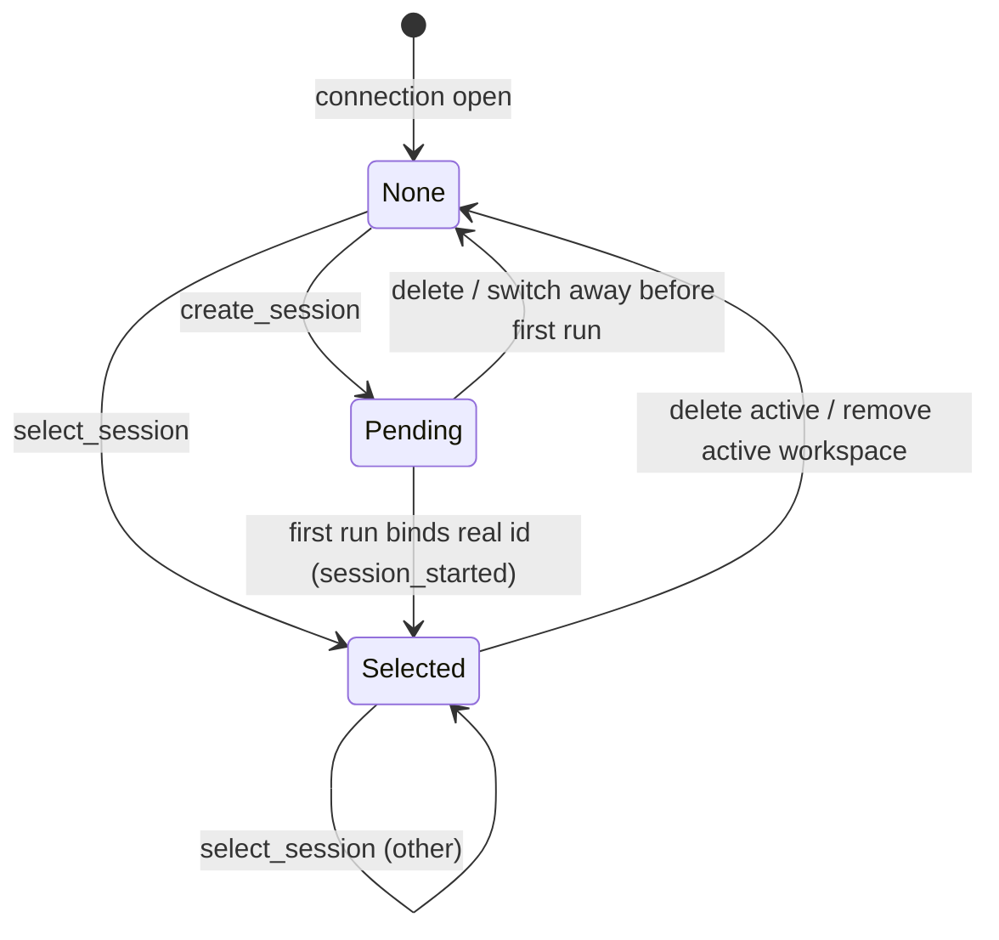

# session-registry — Domain Spec

## Overview

The session-registry manages the workspaces and sessions surfaced in the sidebar. A
**workspace** is a project directory (the SDK `cwd`); a **session** is a Claude conversation
inside it, persisted by the Agent SDK. The registry owns the c3-specific metadata the SDK does
not track — the workspace list, recent-access order, per-session permission mode, and the active
session — and persists it across restarts (ADR 0004).

**Scope:** workspace registration & ordering, session enumeration/create/select/rename/delete,
per-session mode, active-session tracking, and history replay on select.
**Boundary:** it does not drive `query()` (agent-session) and holds no permission state.

## Core entities

| Entity          | Description                                                                                                          |
| --------------- | -------------------------------------------------------------------------------------------------------------------- |
| Workspace       | A registered project directory: `path`, display `name`, `lastAccessed` (sort key)                                    |
| Session         | A Claude conversation in a workspace: SDK `sessionId`, `title`, `lastModified`, c3 `mode`                            |
| Pending Session | A session created in the UI but not yet started; a `pending:<uuid>` id until its first run binds it to a real SDK id |

See [models.md](models.md).

## Business rules

| ID     | Rule                                                                                                                                                                             |
| ------ | -------------------------------------------------------------------------------------------------------------------------------------------------------------------------------- |
| SR-R1  | A workspace is an existing directory. `add_workspace` on a non-directory is rejected with `error` and changes nothing.                                                           |
| SR-R2  | The workspace registry is persisted and ordered by `lastAccessed` descending — most recently accessed first.                                                                     |
| SR-R3  | Selecting or creating a session in a workspace bumps that workspace's `lastAccessed` (re-sorting the sidebar).                                                                   |
| SR-R4  | Sessions within a workspace are listed via the SDK (`listSessions({ dir })`), newest (`lastModified`) first. The SDK is the source of truth for existence, history, and title.   |
| SR-R5  | Permission mode is **per session**, persisted, and defaults to `default`. Changing the active session's mode (`set_mode`) affects only that session.                             |
| SR-R6  | `create_session` makes a Pending Session active with an empty history and `default` mode. It has a `pending:` id and is not yet on disk.                                         |
| SR-R7  | On the first run of a Pending (or freshly forked) session, the registry binds its client id to the real SDK `sessionId` (`session_started`) and persists the mode under that id. |
| SR-R8  | `select_session` replays the session's transcript as `session_selected.history` and reports the session's stored mode.                                                           |
| SR-R9  | `delete_session` removes the transcript via the SDK and drops its mode entry. If it was active, the active session is cleared.                                                   |
| SR-R10 | `remove_workspace` unregisters a directory but never deletes sessions on disk. If it was the active workspace, the active session is cleared.                                    |
| SR-R11 | Permission decisions/approvals are **never** persisted — only workspace/session metadata (ADR 0004, 0001).                                                                       |

## States & transitions

### Active session (per connection)

## User scenarios

- **Add a workspace:** Given a valid directory path, When `add_workspace` arrives, Then it is
  registered, the sidebar re-sorts (it is now most-recent), and its session list is returned.
- **New session:** Given a workspace, When `create_session` arrives, Then a Pending Session
  becomes active with empty history; the first `user_prompt` starts it and `session_started`
  binds the real id.
- **Resume a session:** Given an existing session, When `select_session` arrives, Then its
  history is replayed and its stored mode is applied; the next `user_prompt` resumes it.
- **Per-session mode (anti-scenario):** Changing mode on session A must **never** change session
  B's mode (SR-R5).
- **Delete (anti-scenario):** `remove_workspace` must **never** delete on-disk transcripts
  (SR-R10).

## Domain events (wire)

Consumes `add_workspace`, `remove_workspace`, `list_sessions`, `create_session`,
`select_session`, `rename_session`, `delete_session`, `set_mode`. Emits `ready`, `workspaces`,
`sessions`, `session_selected`, `session_started`, `mode_changed`, `error`. See the
[shared protocol](../../../shared/api-conventions/websocket-protocol.md).

## Interactions

- **agent-session** — supplies the active workspace `cwd`, per-session mode, and `resume` id to
  each run; receives the bound `sessionId` back from a run's `init` message.
- **Claude Agent SDK** — `listSessions` / `getSessionMessages` / `renameSession` /
  `deleteSession` for session enumeration, history, and mutation.
- **web-console** — renders the workspace/session tree and sends the management events above.

## Data dictionary

- **Workspace** — a registered `cwd`; the key for `listSessions({ dir })`.
- **Active session** — the session the next `user_prompt` runs against (real or pending).
- **state.json** — the persisted registry at `${CLAUDE_CONFIG_DIR:-~/.claude}/c3/state.json`.
