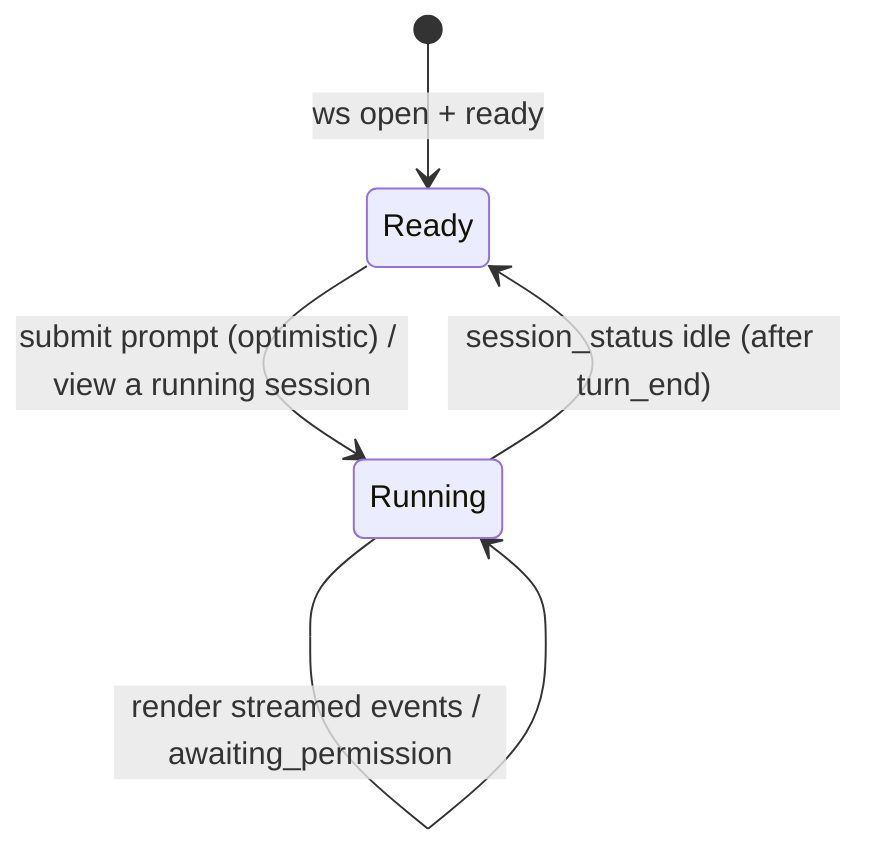

# web-console — Domain Spec

## Overview

The web console is the human surface of c3. It connects to the server's WebSocket, presents a
**sidebar** of workspaces and their sessions, lets the user send prompts to the active
session, renders the agent's activity as an ordered chat-like stream, and is the only place a
permission decision or mode change is made.

**Scope:** presenting the workspace/session sidebar and the wire stream, and capturing user
intent (workspace/session management, prompt, decision, per-session mode).
**Boundary:** it holds no authority — every decision and management action is sent to the
server, which enforces and persists it. It does not run the agent or own session state.

## Core entities

| Entity       | Description                                                                                                          |
| ------------ | -------------------------------------------------------------------------------------------------------------------- |
| Chat Message | One rendered item in the stream: user text, assistant text, tool-use, tool-result, permission prompt, or system note |

See [models.md](models.md).

## Business rules

| ID     | Rule                                                                                                                                                                                                                                                                                                                                                                |
| ------ | ------------------------------------------------------------------------------------------------------------------------------------------------------------------------------------------------------------------------------------------------------------------------------------------------------------------------------------------------------------------- |
| WC-R1  | The console renders every wire event in arrival order as a Chat Message.                                                                                                                                                                                                                                                                                            |
| WC-R2  | A prompt is sent only when the input is non-empty, the socket is connected, and the **viewed session** is not running (idle). While the viewed session's turn is in flight (running or awaiting permission) the input is blocked. "Running" is derived from `session_status`.                                                                                       |
| WC-R3  | A permission prompt can be answered exactly once. After Allow or Deny it is locked and shows the chosen decision.                                                                                                                                                                                                                                                   |
| WC-R4  | A mode change is applied optimistically in the UI and confirmed when `mode_changed` arrives. The UI also adopts the mode the server reports in `ready`.                                                                                                                                                                                                             |
| WC-R5  | `turn_end` is informational — the input unlocks via `session_status` (server broadcasts idle), not from `turn_end` itself. A `turn_end{error}` (and any `error`) appends a system note. `turn_end` never clears the session.                                                                                                                                        |
| WC-R6  | Connection status (`connecting` / `open` / `closed`) is always visible to the user.                                                                                                                                                                                                                                                                                 |
| WC-R7  | The console never executes a tool or makes a decision on the user's behalf — it only sends what the user explicitly chose.                                                                                                                                                                                                                                          |
| WC-R8  | The sidebar lists workspaces (recent-access order from the server) and, when expanded, their sessions. The user can add/remove workspaces and create/select/rename/delete sessions; each action is a wire message, never a local mutation.                                                                                                                          |
| WC-R9  | Selecting a session replaces the stream with the replayed `session_selected.history`, then renders the live buffer tail (replayed stream events) for an in-flight turn, adopts the session's `mode`, sets running from `session_selected.running`, and shows `workspace › title` in the header. Prompts and the mode select are disabled until a session is viewed. |
| WC-R10 | A pending session (created locally via `create_session`) is shown active until `session_started` swaps its `pending:` id for the real session id.                                                                                                                                                                                                                   |
| WC-R12 | The sidebar reflects each session's live status from `session_status`: a `running` badge, and an `awaiting_permission` highlight on sessions blocked on a decision — including sessions the user is not currently viewing.                                                                                                                                          |
| WC-R13 | When a **background** session (not the viewed one) enters `awaiting_permission`, the console raises a browser notification (requesting permission once; a no-op if denied).                                                                                                                                                                                         |
| WC-R14 | While the viewed session is running, the Send button is replaced by a Stop button that sends `stop_run`; switching sessions never stops a run.                                                                                                                                                                                                                      |
| WC-R11 | The full-page settings view edits a local draft of `SystemSettings` (fetched via `get_settings`); each agent's fields sit on one row, the system agent's Claude config is read-only, and it cannot be removed. Save sends `save_settings` and adopts the normalized `settings` reply.                                                                               |

## States & transitions

UI run state of the **viewed** session (derived from `session_status`):

A permission Chat Message: `Unanswered → Allowed | Denied`, one-way (WC-R3).

## User scenarios

- **Send a prompt (success):** Given the socket is open and no run is in flight, When the
  user submits non-empty text, Then a user Chat Message appears, a `user_prompt` is sent,
  and the UI enters Running.
- **Answer a permission prompt:** Given an unanswered permission Chat Message, When the user
  clicks Allow, Then a `permission_response{decision:'allow'}` is sent and the message locks
  showing "allow".
- **Background session needs approval:** Given a session running in the background enters
  `awaiting_permission`, When the `session_status` arrives, Then the sidebar highlights it and a
  browser notification is raised; switching to it replays the pending prompt to answer (WC-R12/R13).
- **Stop a run:** Given the viewed session is running, When the user clicks Stop, Then `stop_run`
  is sent; other sessions' runs are unaffected (WC-R14).
- **Anti-scenario:** A permission prompt must **never** be answerable twice, and the
  console must never auto-answer one (WC-R3, WC-R7).
- **Anti-scenario:** A prompt must **never** be sent while the viewed session's turn is in
  flight or the socket is closed (WC-R2).
- **Anti-scenario:** Selecting another session must **never** stop a run (WC-R14).

## Domain events (wire)

Sends `user_prompt`, `permission_response`, `set_mode`, `stop_run`, `add_workspace`,
`remove_workspace`, `list_sessions`, `create_session`, `select_session`, `rename_session`,
`delete_session`, `get_settings`, `save_settings`, `ping`. Consumes `ready`, `workspaces`,
`sessions`, `session_selected`, `session_started`, `session_status`, `mode_changed`,
`user_text`, `assistant_text`, `tool_use`, `tool_result`, `permission_request`, `consensus_auto`,
`turn_end`, `settings`, `error`, `pong`. See the
[shared protocol](../../../shared/api-conventions/websocket-protocol.md).

## Interactions

- **agent-session** — the server side of the same WebSocket; streams run activity.
- **session-registry** — serves the workspace/session sidebar data and persists management
  actions; the console renders its state but owns none of it.
- **agent-config** — serves the agent registry/default for the settings view and persists
  changes; the console edits a draft and sends `save_settings` (WC-R11).

## Data dictionary

- **Running (viewed session)** — the viewed session's `session_status` is not `idle`; the
  prompt input is disabled and the Stop button shows (WC-R2, WC-R14).
- **Session status badge** — sidebar indicator from `session_status`: `running` dot or
  `awaiting_permission` highlight, shown for every session including backgrounded ones (WC-R12).
- **Unanswered prompt** — a permission Chat Message with no decision yet.
