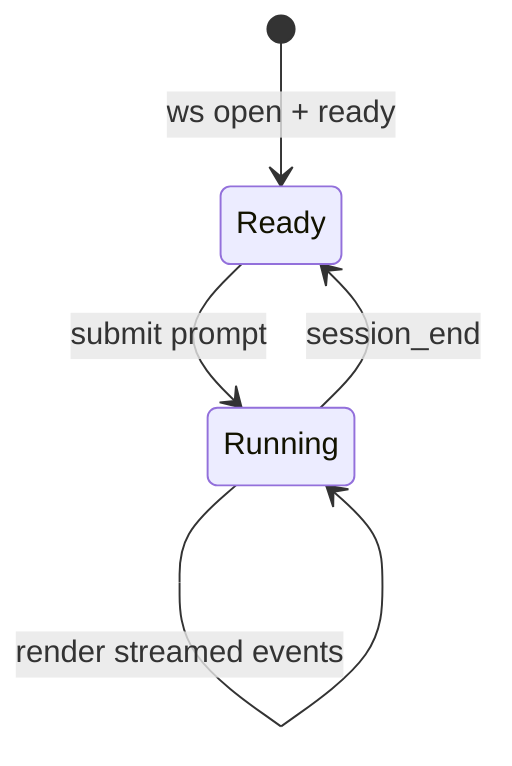

# web-console — Domain Spec

## Overview

The web console is the human surface of c3. It connects to the server's WebSocket, lets the
user send prompts, renders the agent's activity as an ordered chat-like stream, and is the
only place a permission decision or mode change is made.

**Scope:** presenting the wire stream and capturing user intent (prompt, decision, mode).
**Boundary:** it holds no authority — every decision is sent to the server, which enforces
it. It does not run the agent or persist anything.

## Core entities

| Entity       | Description                                                                                                          |
| ------------ | -------------------------------------------------------------------------------------------------------------------- |
| Chat Message | One rendered item in the stream: user text, assistant text, tool-use, tool-result, permission prompt, or system note |

See [models.md](models.md).

## Business rules

| ID    | Rule                                                                                                                                                        |
| ----- | ----------------------------------------------------------------------------------------------------------------------------------------------------------- |
| WC-R1 | The console renders every wire event in arrival order as a Chat Message.                                                                                    |
| WC-R2 | A prompt is sent only when the input is non-empty, the socket is connected, and no run is currently running. While a run is in flight the input is blocked. |
| WC-R3 | A permission prompt can be answered exactly once. After Allow or Deny it is locked and shows the chosen decision.                                           |
| WC-R4 | A mode change is applied optimistically in the UI and confirmed when `mode_changed` arrives. The UI also adopts the mode the server reports in `ready`.     |
| WC-R5 | `session_end` clears the running state and appends a system note (`complete` or `error: <message>`).                                                        |
| WC-R6 | Connection status (`connecting` / `open` / `closed`) is always visible to the user.                                                                         |
| WC-R7 | The console never executes a tool or makes a decision on the user's behalf — it only sends what the user explicitly chose.                                  |

## States & transitions

UI run state:

A permission Chat Message: `Unanswered → Allowed | Denied`, one-way (WC-R3).

## User scenarios

- **Send a prompt (success):** Given the socket is open and no run is in flight, When the
  user submits non-empty text, Then a user Chat Message appears, a `user_prompt` is sent,
  and the UI enters Running.
- **Answer a permission prompt:** Given an unanswered permission Chat Message, When the user
  clicks Allow, Then a `permission_response{decision:'allow'}` is sent and the message locks
  showing "allow".
- **Anti-scenario:** A permission prompt must **never** be answerable twice, and the
  console must never auto-answer one (WC-R3, WC-R7).
- **Anti-scenario:** A prompt must **never** be sent while a run is in flight or the socket
  is closed (WC-R2).

## Domain events (wire)

Sends `user_prompt`, `permission_response`, `set_mode`, `ping`. Consumes `ready`,
`mode_changed`, `assistant_text`, `tool_use`, `tool_result`, `permission_request`,
`session_end`, `pong`. See the
[shared protocol](../../../shared/api-conventions/websocket-protocol.md).

## Interactions

- **agent-session** — the server side of the same WebSocket; the console's sole backend.

## Data dictionary

- **Running** — a run is in flight; the prompt input is disabled (WC-R2).
- **Unanswered prompt** — a permission Chat Message with no decision yet.
