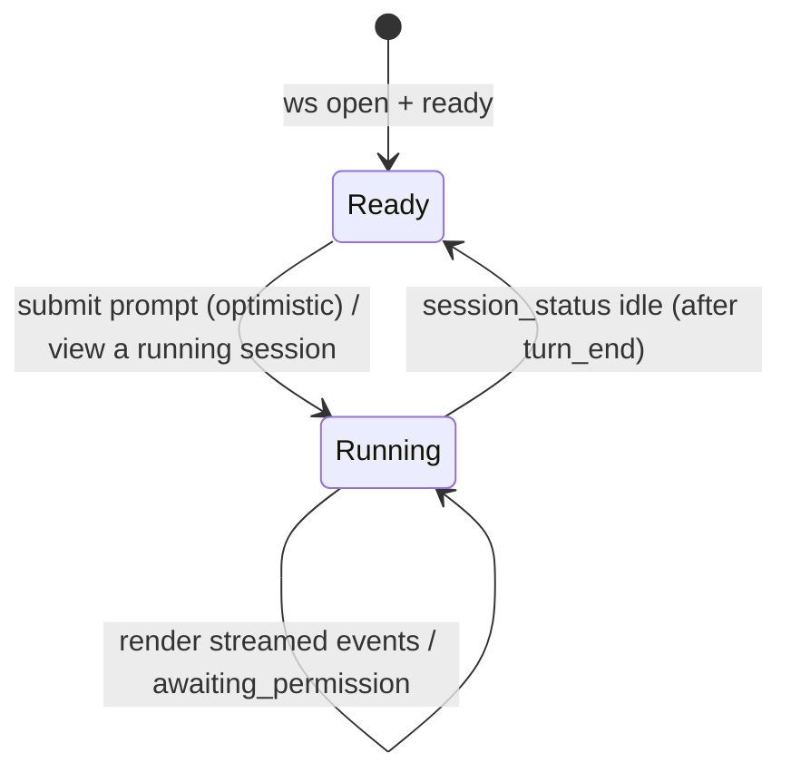

# web-console — Domain Spec

## Overview

The web console is the human surface of c3. It connects to the server's WebSocket, presents a
top-bar **workspace switcher** (the single global current workspace), a **tab nav** that
explicitly switches the content area between pages (会话 / 需求, extensible), and — on the 「会话」
tab — a left **session list** of that workspace's sessions beside the chat console (each tab owns
its left column; the chat console on the right is shared). It lets the user send prompts to the active session, renders the agent's
activity as an ordered chat-like stream, and is the only place a permission decision or mode
change is made.

**Scope:** presenting the workspace switcher / session list and the wire stream, and capturing user
intent (workspace/session management, prompt, decision, per-session mode).
**Boundary:** it holds no authority — every decision and management action is sent to the
server, which enforces and persists it. It does not run the agent or own session state.

## Core entities

| Entity       | Description                                                                                                          |
| ------------ | -------------------------------------------------------------------------------------------------------------------- |
| Chat Message | One rendered item in the stream: user text, assistant text, tool-use, tool-result, permission prompt, or system note |

See [models.md](models.md).

## Business rules

| ID     | Rule                                                                                                                                                                                                                                                                                                                                                                                                                                                                                                                                                                                                                                                                                                                                                                                                                                                                                                                                                                                                                                                                                                                                                                                                                                                                                                                                                                                                                                                                                                                                                                                                                                                                                                                                                                                                                                                                                                                                                                                                                                                                                                                                                                                                                                                                                                                                                                                                                                                                                                                                                                                                                                                                                                                                                                                                                                                                                                                                                                            |
| ------ | ------------------------------------------------------------------------------------------------------------------------------------------------------------------------------------------------------------------------------------------------------------------------------------------------------------------------------------------------------------------------------------------------------------------------------------------------------------------------------------------------------------------------------------------------------------------------------------------------------------------------------------------------------------------------------------------------------------------------------------------------------------------------------------------------------------------------------------------------------------------------------------------------------------------------------------------------------------------------------------------------------------------------------------------------------------------------------------------------------------------------------------------------------------------------------------------------------------------------------------------------------------------------------------------------------------------------------------------------------------------------------------------------------------------------------------------------------------------------------------------------------------------------------------------------------------------------------------------------------------------------------------------------------------------------------------------------------------------------------------------------------------------------------------------------------------------------------------------------------------------------------------------------------------------------------------------------------------------------------------------------------------------------------------------------------------------------------------------------------------------------------------------------------------------------------------------------------------------------------------------------------------------------------------------------------------------------------------------------------------------------------------------------------------------------------------------------------------------------------------------------------------------------------------------------------------------------------------------------------------------------------------------------------------------------------------------------------------------------------------------------------------------------------------------------------------------------------------------------------------------------------------------------------------------------------------------------------------------------------- |
| WC-R1  | The console renders every wire event in arrival order as a Chat Message.                                                                                                                                                                                                                                                                                                                                                                                                                                                                                                                                                                                                                                                                                                                                                                                                                                                                                                                                                                                                                                                                                                                                                                                                                                                                                                                                                                                                                                                                                                                                                                                                                                                                                                                                                                                                                                                                                                                                                                                                                                                                                                                                                                                                                                                                                                                                                                                                                                                                                                                                                                                                                                                                                                                                                                                                                                                                                                        |
| WC-R2  | A `user_prompt` is sent only when the input is non-empty, the socket is connected, and the **viewed session** is idle (or a team session, fed live). The composer stays editable while a turn is in flight; for an ordinary running session Send/Enter **enqueues** locally instead of sending (WC-R17). "Running" is derived from `session_status`.                                                                                                                                                                                                                                                                                                                                                                                                                                                                                                                                                                                                                                                                                                                                                                                                                                                                                                                                                                                                                                                                                                                                                                                                                                                                                                                                                                                                                                                                                                                                                                                                                                                                                                                                                                                                                                                                                                                                                                                                                                                                                                                                                                                                                                                                                                                                                                                                                                                                                                                                                                                                                            |
| WC-R3  | A permission prompt is answerable only while it is the live, still-pending request (see WC-R16). When answered this session it is locked and shows the chosen decision. A prompt replayed from history is never answerable; it shows as a static record (WC-R16), not a locked verdict.                                                                                                                                                                                                                                                                                                                                                                                                                                                                                                                                                                                                                                                                                                                                                                                                                                                                                                                                                                                                                                                                                                                                                                                                                                                                                                                                                                                                                                                                                                                                                                                                                                                                                                                                                                                                                                                                                                                                                                                                                                                                                                                                                                                                                                                                                                                                                                                                                                                                                                                                                                                                                                                                                         |
| WC-R4  | A mode change is applied optimistically in the UI and confirmed when `mode_changed` arrives. The UI also adopts the mode the server reports in `ready`.                                                                                                                                                                                                                                                                                                                                                                                                                                                                                                                                                                                                                                                                                                                                                                                                                                                                                                                                                                                                                                                                                                                                                                                                                                                                                                                                                                                                                                                                                                                                                                                                                                                                                                                                                                                                                                                                                                                                                                                                                                                                                                                                                                                                                                                                                                                                                                                                                                                                                                                                                                                                                                                                                                                                                                                                                         |
| WC-R5  | `turn_end` is informational — the input unlocks via `session_status` (server broadcasts idle), not from `turn_end` itself. A `turn_end{error}` (and any `error`) appends a system note. `turn_end` never clears the session.                                                                                                                                                                                                                                                                                                                                                                                                                                                                                                                                                                                                                                                                                                                                                                                                                                                                                                                                                                                                                                                                                                                                                                                                                                                                                                                                                                                                                                                                                                                                                                                                                                                                                                                                                                                                                                                                                                                                                                                                                                                                                                                                                                                                                                                                                                                                                                                                                                                                                                                                                                                                                                                                                                                                                    |
| WC-R6  | Connection status (`connecting` / `open` / `closed`) is always visible to the user.                                                                                                                                                                                                                                                                                                                                                                                                                                                                                                                                                                                                                                                                                                                                                                                                                                                                                                                                                                                                                                                                                                                                                                                                                                                                                                                                                                                                                                                                                                                                                                                                                                                                                                                                                                                                                                                                                                                                                                                                                                                                                                                                                                                                                                                                                                                                                                                                                                                                                                                                                                                                                                                                                                                                                                                                                                                                                             |
| WC-R7  | The console never executes a tool or makes a decision on the user's behalf — it only sends what the user explicitly chose.                                                                                                                                                                                                                                                                                                                                                                                                                                                                                                                                                                                                                                                                                                                                                                                                                                                                                                                                                                                                                                                                                                                                                                                                                                                                                                                                                                                                                                                                                                                                                                                                                                                                                                                                                                                                                                                                                                                                                                                                                                                                                                                                                                                                                                                                                                                                                                                                                                                                                                                                                                                                                                                                                                                                                                                                                                                      |
| WC-R8  | A top-bar **workspace switcher** (far left) names the single global **current workspace** and is the only place to add/switch/remove workspaces: `+` adds one (`add_workspace`), the `▾` dropdown lists every workspace (name + path, recent-access order from the server) to switch the current one, and each row removes it (second-confirm → `remove_workspace`). The current workspace is **client state** persisted to `localStorage` (restored on reload, falling back to the most-recent workspace) and is decoupled from the viewed session's workspace. The console tab's **session list** then lists only the current workspace's sessions; switching the current workspace refreshes that list — it does **not** auto-select a session or disturb the viewed chat. The session list's title bar also carries a manual **refresh** button (left of the `＋` New-session button, both shown only when a current workspace exists) that re-fetches the current workspace's session list (`list_sessions`) on demand. Removing the current workspace falls the selection back to the most-recent one. Create/select/rename/delete sessions stay wire messages; switching the current workspace is a client state change, never a local mutation of server-owned data.                                                                                                                                                                                                                                                                                                                                                                                                                                                                                                                                                                                                                                                                                                                                                                                                                                                                                                                                                                                                                                                                                                                                                                                                                                                                                                                                                                                                                                                                                                                                                                                                                                                                                                    |
| WC-R9  | Selecting a session replaces the stream with the replayed `session_selected.history`, then renders the live buffer tail (replayed stream events) for an in-flight turn, adopts the session's `mode`, seeds the viewed session's live status from `session_selected.status` (so the composer locks at once for a background-running session, without waiting for a `session_status` broadcast), and shows the session title in the chat column's **session title bar** (left: a **vendor colour dot** + title, right: permission-mode dropdown) — not in the top bar, which only names the workspace via the switcher. The dot's hue is the session's resolved agent vendor from `session_selected.vendor` (ADR-0015; absent ⇒ no dot, e.g. comm sessions). The mode dropdown options are derived from the active session's vendor `VendorModeCatalog` (from `settings.vendorModes`), so only that vendor's legal modes are shown; when the catalog is not yet loaded, a built-in fallback list is used. Prompts are disabled until a session is selected; the mode dropdown lives in the session title bar, which renders only on the console tab with an active session.                                                                                                                                                                                                                                                                                                                                                                                                                                                                                                                                                                                                                                                                                                                                                                                                                                                                                                                                                                                                                                                                                                                                                                                                                                                                                                                                                                                                                                                                                                                                                                                                                                                                                                                                                                                                       |
| WC-R10 | A pending session is shown active until `session_started` swaps its `pending:` id for the real session id. The session list's **＋** opens a **new-session agent picker** modal (WC-R21) rather than creating immediately; confirming sends `create_session` (optionally carrying the chosen `agentId`).                                                                                                                                                                                                                                                                                                                                                                                                                                                                                                                                                                                                                                                                                                                                                                                                                                                                                                                                                                                                                                                                                                                                                                                                                                                                                                                                                                                                                                                                                                                                                                                                                                                                                                                                                                                                                                                                                                                                                                                                                                                                                                                                                                                                                                                                                                                                                                                                                                                                                                                                                                                                                                                                        |
| WC-R12 | The session list reflects each session's live status from `session_status`: a `running` badge, and an `awaiting_permission` highlight on sessions blocked on a decision — including sessions the user is not currently viewing.                                                                                                                                                                                                                                                                                                                                                                                                                                                                                                                                                                                                                                                                                                                                                                                                                                                                                                                                                                                                                                                                                                                                                                                                                                                                                                                                                                                                                                                                                                                                                                                                                                                                                                                                                                                                                                                                                                                                                                                                                                                                                                                                                                                                                                                                                                                                                                                                                                                                                                                                                                                                                                                                                                                                                 |
| WC-R13 | When a **background** session (not the viewed one) enters `awaiting_permission`, the console raises a browser notification (requesting permission once; a no-op if denied).                                                                                                                                                                                                                                                                                                                                                                                                                                                                                                                                                                                                                                                                                                                                                                                                                                                                                                                                                                                                                                                                                                                                                                                                                                                                                                                                                                                                                                                                                                                                                                                                                                                                                                                                                                                                                                                                                                                                                                                                                                                                                                                                                                                                                                                                                                                                                                                                                                                                                                                                                                                                                                                                                                                                                                                                     |
| WC-R14 | A Stop control lives in the **status bar** (a red square button left of the refresh ↻), not the composer. It is enabled while the viewed ordinary session is running or a team is active, and sends `stop_run` (interrupting an ordinary turn, or ending the whole team); it is disabled when idle. The composer's Send button keeps a fixed label and enqueues during an in-flight turn (WC-R17); switching sessions never stops a run.                                                                                                                                                                                                                                                                                                                                                                                                                                                                                                                                                                                                                                                                                                                                                                                                                                                                                                                                                                                                                                                                                                                                                                                                                                                                                                                                                                                                                                                                                                                                                                                                                                                                                                                                                                                                                                                                                                                                                                                                                                                                                                                                                                                                                                                                                                                                                                                                                                                                                                                                        |
| WC-R11 | The full-page settings view edits a local draft of `SystemSettings` (fetched via `get_settings`); each agent's fields sit on one row, the system agent's Claude config is read-only, and it cannot be removed. Save sends `save_settings` and adopts the normalized `settings` reply. The agents section also shows a **not-retroactive note** from `settings.bindingStats` — changing the default agent only affects new sessions; existing bound sessions keep their own agent/vendor (ADR-0015). A **diagnostics section** lists each vendor's host-CLI presence from `settings.hostStatus` (ADR-0012): vendor dot + binary name + on-PATH / not-found (the missing row's install hint as a tooltip). This is the front-end surfacing the host-binary probe that ADR-0012 D3 deferred. Per-project controls (defaultMode, devSkill, maxRoundsPerStage, maxSpeechChars, consensus) were removed from SettingsPanel and moved to the dedicated project-config page (WC-R24).                                                                                                                                                                                                                                                                                                                                                                                                                                                                                                                                                                                                                                                                                                                                                                                                                                                                                                                                                                                                                                                                                                                                                                                                                                                                                                                                                                                                                                                                                                                                                                                                                                                                                                                                                                                                                                                                                                                                                                                                   |
| WC-R15 | A status bar above the input shows the viewed session's run activity. `running` (from `session_status`) is the authoritative on/off; the fine-grained label (thinking / running `<tool>` / awaiting permission / error / ready) is inferred client-side from the event stream — `tool_use`→running tool, `assistant_text`/`tool_result`→thinking, `permission_request`→awaiting, `turn_end{error}`→error (held until the next prompt). It resets on session switch (re-derived from the replayed buffer tail) and offers a refresh button that re-selects the session to resync the view (disabled when the socket is not open; it cannot revive a wedged run).                                                                                                                                                                                                                                                                                                                                                                                                                                                                                                                                                                                                                                                                                                                                                                                                                                                                                                                                                                                                                                                                                                                                                                                                                                                                                                                                                                                                                                                                                                                                                                                                                                                                                                                                                                                                                                                                                                                                                                                                                                                                                                                                                                                                                                                                                                                 |
| WC-R16 | Permission decisions are not persisted server-side, and `session_selected` replays past `permission_request` events with `decision: null`. The console therefore treats a permission as actionable **only** when the viewed session is `awaiting_permission` and it is the latest still-undecided permission in the transcript (the SDK blocks one at a time). A genuinely pending permission stays answerable after a refresh; every other replayed/superseded permission degrades to a one-line static history record (no buttons, no decision verdict) and does not force its tool batch open.                                                                                                                                                                                                                                                                                                                                                                                                                                                                                                                                                                                                                                                                                                                                                                                                                                                                                                                                                                                                                                                                                                                                                                                                                                                                                                                                                                                                                                                                                                                                                                                                                                                                                                                                                                                                                                                                                                                                                                                                                                                                                                                                                                                                                                                                                                                                                                               |
| WC-R17 | An ordinary session is single-turn, so messages composed while its turn is in flight are held in a **client-only** per-session send queue (no server/protocol change). Queued items render between the status bar and composer with edit/delete; edit returns the text to the composer, delete drops it. When the viewed ordinary session next becomes idle with a non-empty queue, the items are merged in order (joined by a blank line) into one prompt and sent via the normal `user_prompt` path, then cleared. The queue is per-`sessionId`, survives session switches, and is lost only on reload/restart. Team sessions never queue (their lead is fed live).                                                                                                                                                                                                                                                                                                                                                                                                                                                                                                                                                                                                                                                                                                                                                                                                                                                                                                                                                                                                                                                                                                                                                                                                                                                                                                                                                                                                                                                                                                                                                                                                                                                                                                                                                                                                                                                                                                                                                                                                                                                                                                                                                                                                                                                                                                           |
| WC-R19 | The status bar surfaces the agent-run socket-disconnect path (AVAIL-7) as two viewer-visible states beyond the WC-R15 activity labels. **Reconnecting middle state:** when the viewed session's `session_status` is `reconnecting` (the run hit a socket disconnect and is backing off before a single auto-`resume`), the bar shows a distinct "connection lost, reconnecting…" label (own dot color + spinner), taking precedence over the generic running labels — it is still `running`, so the composer stays locked. This is distinct from the WC-R6 connection indicator, which reflects the browser↔server WebSocket, not the server↔SDK run. **Danger state (manual continue):** when a turn ends with `turn_end { side_effect_pending: true }` (the side-effect gate refused auto-resume because a write-class `tool_use` was unclosed at the disconnect, AS-R19), the session settles to idle and the bar shows a "confirm no side effects and continue" label plus a manual **Continue** control. Clicking Continue resumes the same session via the ordinary `user_prompt` path (no new protocol message) — the next turn `resume`s the SDK session with full context. The danger flag is per-`sessionId`, cleared the moment that session runs again (the continue/any new prompt) or on (re)select. All copy goes through i18n (no raw text).                                                                                                                                                                                                                                                                                                                                                                                                                                                                                                                                                                                                                                                                                                                                                                                                                                                                                                                                                                                                                                                                                                                                                                                                                                                                                                                                                                                                                                                                                                                                                                                                                    |
| WC-R18 | A top-bar **tab nav** (right after the workspace switcher) is the single explicit control for which page the content area shows. The tabs are **data-driven** (initially 「会话」 = console, 「需求」 = intents; the list is structured so a future 「讨论」 tab is one more entry plus one body branch), the active tab is highlighted, and the whole content area switches with the tab. Selecting 「会话」 returns to the chat page; selecting 「需求」 opens the **current workspace's** intent page (the comm session becomes the viewed session, sharing the chat column) and is disabled until a workspace exists. The selected tab is **client state** persisted to `localStorage` (key `c3.viewMode`), restored on hard refresh. The top bar carries no session title or permission-mode dropdown — those live in the chat column's **session title bar** (WC-R9), which renders only on the console tab with an active session; the intent tab thus shows no title bar (its comm session is identified by the tab itself, not a breadcrumb). The console tab is a two-column page: the left **session list** + the shared chat console; the intent tab swaps the left column for IntentList. The session list's 「需求录入」 entry remains a secondary shortcut that also switches to the intent tab. The schedules tab swaps the left column for **ScheduleList**, which follows the same left-panel范式 as IntentList / DiscussionList: a title-right 「+」 opens the create form, the panel expands/collapses (960px / 480px, with a `<=1024px` viewport fallback), each row is an **accordion** (single-open — expanding a row reveals that schedule's full configuration summary inline (id, type, status, cron, upcoming runs, mode, config JSON, created/updated timestamps) and also selects it so the right pane shows its execution logs), and each row carries an **enable/disable switch** mapped to the schedule's pause/resume (`update_schedule` status; see [schedules](../schedules/spec.md) Pause and resume). The right pane (ScheduleDetail) shows **only** the selected schedule's execution-log view, titled with the schedule's name + 「Logs」; all configuration display lives in the left accordion, and there is no New/Edit toolbar on the right pane. Every schedule **time display** — the accordion's upcoming runs and created/updated timestamps, plus the create/edit form's live **next-run preview** — is both computed (`computeNextRunAt`) and formatted in the **system-configured time zone** (`SystemSettings.timezone`, an IANA name; see [schedules](../schedules/spec.md)), not the browser's local zone. The shown wall-clock therefore always matches the cron literal (e.g. `0 11 * * *` renders 11:00 under `Asia/Shanghai`, never 19:00), eliminating the compute-vs-display zone mismatch. The form's next-run hint copy reflects this ("shown in the configured time zone, e.g. Asia/Shanghai"), all through i18n. |
| WC-R20 | **Heterogeneous-roundtable rendering + approval provenance (2026-06-06-004).** A discussion transcript reuses the shared chat renderer, so a multi-speaker `agent` bubble carries a small **vendor tag** (one hue per vendor: Claude / OpenCode / Codex) resolved from the agent config by `speakerAgentId` — vendor is **derived, not persisted** (a property of the agent, not the message), so an `agent` turn whose agent no longer resolves shows no tag, and `human`/`organizer` turns never carry one. A heterogeneous table (e.g. a Claude agent beside an OpenCode agent) is thus attributable while every bubble normalizes to the same canonical layout. **Cost is never merged across vendors** — if/when surfaced it is labeled per vendor (no cross-vendor sum); Phase 1 carries no cost meter (the discussion path does not track cost), only this no-merge principle. **Approval provenance is two-color:** a tool the vendor's own rule engine pre-approved (`tool_use.preApproved`, PG-R12) renders an amber 「vendor pre-approved」 tag on its tool row, distinct from the green 「c3 allowed」 tag on a c3/human-gated `allow` (the `PermissionPrompt` decided state). The two colors make explicit that **c3 is a gateway, not the sole permission authority**, and never collide (a pre-approved tool raises no prompt). All tags' copy goes through i18n; brand names (Claude/OpenCode/Codex) are do-not-translate.                                                                                                                                                                                                                                                                                                                                                                                                                                                                                                                                                                                                                                                                                                                                                                                                                                                                                                                                                                                                                                                                                                                                                                                                                                                                                                                                                                                                                                                                                                                                      |

| WC-R21 | **New-session agent picker (ADR-0015 / ADR-0012).** The session list's **＋** opens a modal to pick the agent the new session runs on. A **vendor** dropdown defaults to **Auto** (no vendor → `agentId` omitted → the run inherits `defaultAgentId`); choosing a vendor reveals an **agent** dropdown listing that vendor's enabled agents (defaulting to the first). A vendor whose host CLI is absent (`settings.hostStatus[v].present === false`, ADR-0012) is **greyed/disabled** with a "binary not in PATH" reason, and the modal shows a **「go to detection panel」** link that opens the settings diagnostics (WC-R11). Confirm sends `create_session` with the chosen `agentId` (or none for Auto); the header carries a vendor colour dot for the effective vendor. All copy goes through i18n; brand names are do-not-translate. |

| WC-R24 | **Per-project settings page (project-config).** An overlay page (ProjectConfigPage) lets the user edit 5 project-level controls for the current workspace: defaultMode, devSkill, maxRoundsPerStage (min 8), maxSpeechChars (min 300), and consensus {enabled, majority}. An entry button in AppHeader, after the WorkspaceSwitcher, opens the page (disabled when no workspace is selected). On open, App sends `load_project_config` for the current workspace; the server replies with `project_config`. The page owns an editable draft seeded from the reply; Save sends `save_project_config` with the config. Switching the current workspace or reconnecting closes the page. The control values and thresholds mirror those formerly in SettingsPanel (WC-R11). All UI copy goes through i18n. The interaction follows the same draft-editing pattern as SettingsPanel. |

| WC-R22 | **Same-vendor agent switcher in the title bar (ADR-0015 / AS-R23).** When a viewed session carries `session_selected.agentSwitch` (a real, non-comm session with switch candidates and/or an unavailable current agent), the chat-column title bar renders an **agent dropdown** beside the mode dropdown (WC-R9): the current agent (selected) plus its **same-vendor, host-binary-present** peers — the candidate set is resolved **server-side** (`resolveSessionAgentSwitch`), so a cross-vendor agent **never appears** (vendor is frozen, AC-R17; tooltip 「已由 {vendor} 创建,vendor 不可变更」). Picking another agent sends `set_session_agent`; the server replies `session_agent_changed` and the client rebuilds the switcher locally (the picked agent becomes current; a rejected `{ ok:false }` shows a toast and leaves it untouched). The switch only re-targets the binding — the session's **next** prompt resumes the same run with the new agent (no immediate relaunch; AS-R23). When `agentSwitch.currentUnavailable` (the current agent's host CLI is missing), the switcher shows an inline 「current agent unavailable — switch to another {vendor} agent to continue」 banner. The switcher is absent for pending/comm sessions and when there is nothing actionable to offer. All copy goes through i18n; brand names are do-not-translate. |

## States & transitions

UI run state of the **viewed** session (derived from `session_status`):

A permission Chat Message, while it is the live pending request: `Unanswered → Allowed | Denied`,
one-way (WC-R3). Once superseded or replayed from history it is no longer answerable and shows as a
static record (WC-R16).

## User scenarios

- **Send a prompt (success):** Given the socket is open and no run is in flight, When the
  user submits non-empty text, Then a user Chat Message appears, a `user_prompt` is sent,
  and the UI enters Running.
- **Answer a permission prompt:** Given an unanswered permission Chat Message, When the user
  clicks Allow, Then a `permission_response{decision:'allow'}` is sent and the message locks
  showing "allow".
- **History degrades after refresh (WC-R16):** Given a permission was answered and the session
  moved on, When the user refreshes or switches back (the buffer replays the old
  `permission_request`), Then it renders as a one-line static record — no Allow/Deny (or
  Save/Cancel) buttons and no "allowed/已保存" verdict. **Anti-scenario:** a genuinely still-pending
  permission (`awaiting_permission`, latest undecided) must remain answerable after a refresh.
- **Background session needs approval:** Given a session running in the background enters
  `awaiting_permission`, When the `session_status` arrives, Then the session list highlights it and a
  browser notification is raised; switching to it replays the pending prompt to answer (WC-R12/R13).
- **Stop a run:** Given the viewed session is running (or a team is active), When the user clicks
  the status-bar Stop button (the red square left of the refresh ↻), Then `stop_run` is sent —
  interrupting an ordinary turn or ending the whole team; other sessions' runs are unaffected. When
  the viewed session is idle and no team is active, Then the Stop button is disabled (WC-R14).
- **Reconnecting middle state (WC-R19):** Given the viewed session's `session_status` becomes
  `reconnecting` (its run hit a socket disconnect and is backing off before a single auto-resume),
  When the status broadcast arrives, Then the status bar shows a distinct "reconnecting…" label
  (own dot + spinner) instead of a plain "thinking", the composer stays locked, and no Continue
  control appears; it resolves to the normal running labels on `resume` or to idle on `turn_end`.
- **Danger state, manual continue (WC-R19):** Given a turn ends with
  `turn_end { side_effect_pending: true }` (auto-resume refused by the side-effect gate, AS-R19),
  When the session settles to idle, Then the status bar shows a "confirm no side effects and
  continue" label plus a **Continue** button; When the user clicks Continue, Then the same session
  is resumed via `user_prompt` (the danger flag clears and the button disappears). Selecting another
  session or re-selecting this one also clears the flag.
- **Queue while running (WC-R17):** Given the viewed ordinary session's turn is in flight, When
  the user sends text, Then it is appended to that session's client-only queue (not sent) and
  shown with edit/delete; When the session next becomes idle, Then the queue is merged into one
  prompt, sent via `user_prompt`, and cleared. Switching away and back keeps the queue intact.
- **Switch tabs (WC-R18):** Given a current workspace is selected, When the user clicks the
  「需求」 tab, Then the content area switches to that workspace's intent page and the
  permission-mode dropdown is hidden; clicking 「会话」 returns to the chat page. A hard refresh
  restores the last-selected tab. **Anti-scenario:** with no current workspace the tabs are
  disabled and clicking does nothing.
- **Anti-scenario:** A permission prompt must **never** be answerable twice, and the
  console must never auto-answer one (WC-R3, WC-R7).
- **Anti-scenario:** A `user_prompt` must **never** be sent while the viewed ordinary session's
  turn is in flight (it is queued instead) or while the socket is closed (WC-R2/R17).
- **Anti-scenario:** Selecting another session must **never** stop a run (WC-R14).

## Domain events (wire)

Sends `user_prompt`, `permission_response`, `set_mode`, `stop_run`, `add_workspace`,
`remove_workspace`, `list_sessions`, `create_session`, `select_session`, `rename_session`,
`delete_session`, `get_settings`, `save_settings`, `load_project_config`, `save_project_config`, `ping`. Consumes `ready`, `workspaces`,
`sessions`, `session_selected`, `session_started`, `session_status`, `mode_changed`,
`user_text`, `assistant_text`, `tool_use`, `tool_result`, `permission_request`, `consensus_auto`,
`turn_end`, `settings`, `project_config`, `error`, `pong`. See the
[shared protocol](../../../shared/api-conventions/websocket-protocol.md).

## Interactions

- **agent-session** — the server side of the same WebSocket; streams run activity.
- **session-registry** — serves the workspace switcher / session list data and persists management
  actions; the console renders its state but owns none of it.
- **agent-config** — serves the agent registry/default for the settings view and persists
  changes; the console edits a draft and sends `save_settings` (WC-R11).

## Data dictionary

- **Running (viewed session)** — the viewed session's `session_status` is not `idle`; the
  composer stays editable with a fixed Send label (Send enqueues rather than submits), and the
  status-bar Stop button is enabled (WC-R2, WC-R14, WC-R17).
- **Pending send queue** — a client-only, per-`sessionId` list of messages composed while an
  ordinary session's turn is in flight; merged into one prompt and flushed when the viewed
  session next goes idle (WC-R17).
- **Session status badge** — session-list indicator from `session_status`: `running` dot or
  `awaiting_permission` highlight, shown for every session including backgrounded ones (WC-R12).
- **Run activity** — fine-grained state of the viewed session inferred from the event stream
  (`idle` / `thinking` / `tool <name>` / `awaiting` / `error`), shown in the status bar above
  the input; refines `running` for display only and carries no authority (WC-R15). The status
  bar prefixes the activity label with the display name of the agent the session is currently
  running (`<agent> · <status>`), also client-inferred: it starts at the default agent and
  advances down the degradation chain on each `agent_failed` event, resetting to the default on
  (re)select. The prefix is omitted when no agent name resolves, so the degradation path never
  breaks the bar.
- **Reconnecting middle state** — the viewed session's `session_status` is `reconnecting`: its run
  hit a socket disconnect and is backing off before a single auto-`resume` (AVAIL-7). Shown in the
  status bar as a distinct "reconnecting…" label taking precedence over the run-activity labels;
  still `running` (composer locked). Distinct from the WC-R6 WebSocket connection indicator (WC-R19).
- **Side-effect danger flag** — a client-only, per-`sessionId` flag set when a turn ends with
  `turn_end { side_effect_pending: true }` (auto-resume refused by the side-effect gate, AS-R19).
  Surfaces the status bar's confirm label + manual **Continue** control even though the session is
  idle; cleared when the session runs again (continue / any new prompt) or on (re)select (WC-R19).
- **Unanswered prompt** — a permission Chat Message with no decision yet.
