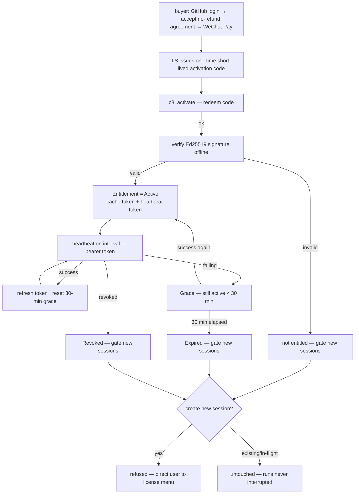

# Flow — Activation & Entitlement Lifecycle

**Scenario.** A buyer purchases c3, activates an installation, and that installation stays entitled
through periodic heartbeats — surviving transient outages within a 30-minute offline grace, and
gating only **new-session creation** (never running work) when entitlement lapses.

**Domains.** product-license · web-console · session-registry · license-server (external).

> **Status: planned (2026-06-16).** This flow documents the architecture/spec foundation
> ([ADR-0026](../architecture/adr/0026-product-licensing-separate-license-server.md)); no runtime
> yet. Steps reference `PL-R*` rules in
> [product-license spec](../domains/commerce/product-license/spec.md) and the
> [license-server API contract](../shared/api-conventions/license-server-api.md).

## Flow graph

## Purchase (license-server)

1. **buyer → license-server.** The buyer logs in via **GitHub OAuth**, **explicitly accepts the
   no-refund service agreement** (recorded with version + timestamp), then pays via **WeChat Pay**
   (`PL-R9`). Reaching payment without a recorded acceptance is refused.
2. **license-server → buyer.** A confirmed payment creates an **order** and issues a **one-time,
   short-lived activation code** (`PL-R1`). The product is a virtual/digital good with **no refund
   workflow** (`PL-R10`).

## Activation (c3)

1. **web-console → product-license.** The buyer enters the activation code in c3's license menu;
   c3 calls the LS **activate** endpoint with the code + an installation identifier (`PL-R1`).
2. **product-license → LS.** On success LS returns a **signed entitlement token**, a long-lived
   **heartbeat bearer token**, and a heartbeat interval. The activation code is **consumed**; c3
   discards it and **never** reuses it as a heartbeat credential (`PL-R2`).
3. **Offline verification.** c3 verifies the entitlement token's **Ed25519** signature against the
   **embedded public key** and confirms its validity window before honoring `active` (`PL-R5`). The
   verified token + heartbeat token are written to the small on-disk **entitlement cache**.

## Heartbeat & grace (c3)

1. **product-license → LS.** c3 heartbeats on the LS-dictated interval, presenting the heartbeat
   bearer token (`Authorization: Bearer …`) — never the activation code (`PL-R2`/`PL-R3`).
2. **Success.** The response carries the current status and may refresh the signed token; c3 caches
   it and **resets the 30-minute offline-grace deadline** (`PL-R3`).
3. **Failing (transient).** While heartbeats fail but the last success is **under 30 minutes** old,
   c3 stays in **Grace** and new sessions remain allowed (`PL-R4`). A later success returns to
   `Active`.
4. **Grace exhausted.** After **30 minutes** with no successful heartbeat, entitlement lapses to
   **Expired** (`PL-R4`).
5. **Revocation.** A successful heartbeat reporting `revoked` lapses entitlement to **Revoked**
   (`PL-R8`); a revoked installation cannot out-wait the grace window because succeeding heartbeats
   report the revocation.

## Gating (c3)

1. **session-registry consult.** Entitlement is consulted at exactly one point — **new-session
   creation**. When not entitled (`Unactivated` / `Expired` / `Revoked`), creation is **refused**
   and the user is directed to the license menu (`PL-R6`/`PL-R7`).
2. **Existing work preserved.** Existing sessions (incl. idle) stay fully usable and **in-flight
   runs are never interrupted** (`PL-R6`, consistent with ADR-0006).
3. **Surfacing.** Throughout, the **license badge** reflects state
   (entitled / grace / expired / unactivated / revoked) and the **license menu** offers activation,
   status, and the purchase link (`PL-R7`).

## Branches & exceptions (anti-scenarios)

- **No new session when gated.** A new session must **never** be created while `Unactivated`,
  `Expired`, or `Revoked` (`PL-R6`).
- **Never interrupt current work.** Gating must **never** interrupt an in-flight run or make an
  existing session unusable (`PL-R6`).
- **Trust the signature, not the channel.** c3 must **never** honor `active` from a token whose
  Ed25519 signature does not verify against the embedded public key, regardless of HTTP success
  (`PL-R5`).
- **Code is not a heartbeat credential.** An activation code must **never** be accepted as a
  heartbeat credential or reused after consumption (`PL-R1`/`PL-R2`).
- **Secrets stay in LS.** No signing key, OAuth secret, or payment credential ever ships in the c3
  binary or rests in its config/cache — only the public verification key (`PL-R12`).
- **No payment without agreement.** A buyer must **never** reach payment without recording
  acceptance of the no-refund agreement (`PL-R9`).
- **Fail-soft.** A failed activation/heartbeat must **never** crash c3 or interrupt running work; it
  affects only whether new sessions may be created once the grace window is exhausted (`PL-R13`).
