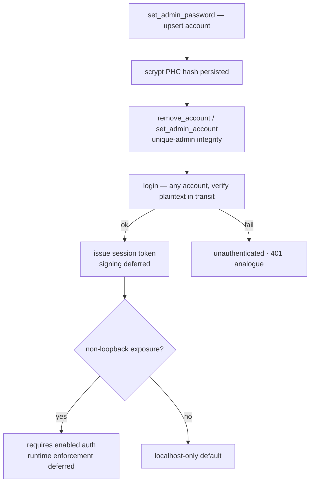

# Flow — Auth Login Gate

**Scenario.** Before a connection may drive agents, it authenticates. This is the mandatory
precondition for exposing c3 beyond localhost (constitution C-SEC-5, ADR-0023).

**Domains.** auth · web-console · system-config.

> **Status: partial runtime (2026-06-16).** The boundary + contracts and a **`basic` provider** are
> live (real scrypt-PHC hashing, real `login` verification, multi-account + unique-admin management).
> **Still deferred:** token signing/verification, request-level auth middleware, and the
> "enabled auth ⇒ may bind non-loopback" enforcement — so the server's bind address is **unchanged,
> still localhost-only**. See [auth-overview](../domains/core/auth/auth-overview.md) _Roadmap_. This
> flow documents the live slice and marks deferred steps inline.

## Flow graph

## Configure accounts + the single admin (bootstrap)

1. **web-console → auth.** In the System Settings auth panel the operator picks the `basic` provider
   and adds one or more accounts via `set_admin_password { username, password, currentPassword? }`
   (it **upserts**: a new username adds an account, the first one becoming the admin; an existing one
   changes its password). The plaintext is hashed **server-side** (scrypt PHC) and only the hash is
   persisted (`AUTH-R3`/`AUTH-R7`). Every account may sign in; the admin is the config authority, not
   a login privilege (no RBAC).
2. **Change-password gate.** Changing an existing account's password requires proving that account's
   current password (`currentPassword` verified against its stored hash) ⇒ `not_authenticated` on
   mismatch (`AUTH-R8`). Adding a new account is exempt — the localhost-only default trusts the local
   operator (request-level authz deferred).
3. **Unique-admin integrity.** `set_admin_account { username }` designates the single admin;
   `remove_account { username }` deletes an account but refuses to orphan the admin reference —
   removing the admin while other accounts remain returns `admin_must_reassign` (designate a new admin
   first); removing the only account empties the store back to the unconfigured state (`AUTH-R9`).
   `basic.enabled` is derived: true ⇔ accounts non-empty and `adminUsername` references one.
4. **Account-store ownership.** The whole `basic` account set is mutated **only** by these dedicated
   messages; a generic `save_settings` never touches it — the server forces the entire basic provider
   back to the on-disk value (`preserveBasicProvider`), so a stale/empty client draft cannot wipe,
   reassign, or overwrite accounts (`AUTH-R7`). OAuth's `adminEmail` (which flows through `save_settings`)
   must be non-empty and a member of `allowedEmails`, else the save is rejected (`auth.oauthAdminInvalid`).

## Login

1. **web-console → auth.** The login page sends `login` (`AuthLoginRequest`). The server looks up the
   account by username in `accounts` and verifies the plaintext against that account's stored hash;
   the plaintext exists in transit only, never persisted (`AUTH-R3`).
2. **Result.** `login_result` (`AuthLoginResult`) — success issues a provider-neutral
   `AuthSessionToken` (`{ tokenId, subject, issuedAt, expiresAt }`); the token signing secret is
   referenced by `signingKeyRef`, never persisted in `settings.json` (`AUTH-R4`). **Token
   signing/verification is deferred.**
3. **Unauthenticated.** `unauthenticated` is the WS analogue of HTTP 401; `logout` ends a session.
   **Request-level enforcement is deferred** — today the gate is UI-level only.

## Exposure precondition

A non-loopback `exposure.bindAddress` (e.g. `0.0.0.0`) expresses intent to expose c3 to a network,
which **requires** enabled auth (`AUTH-R6`, C-SEC-5). Today the panel only gates the toggle in the
UI (an admin must be configured before exposure can be enabled); **runtime enforcement of the bind
relaxation is deferred** — the server still binds localhost-only.

## Branches & exceptions (anti-scenarios)

- **Default = disabled, fail-soft.** `SystemSettings.auth` absent / `enabled: false` / a provider
  that fails validation ⇒ "no auth", the localhost-only default. `normalize()` drops a malformed
  `auth` block to `undefined` and never throws — an invalid config can never lock the user out or
  break boot (`AUTH-R1`).
- **Backward compatible.** An existing `settings.json` with no `auth` field round-trips with
  identical (no-auth) behaviour (`AUTH-R2`).
- **Never plaintext.** No type, example, or test carries a real plaintext password as a stored
  value; only the PHC hash is persisted (`AUTH-R3`).
- **Provider-neutral.** A future OAuth/SSO/multi-user provider adds only an `AuthProvider` arm + a
  server zod arm; the session model and wire messages are untouched (`AUTH-R5`).
