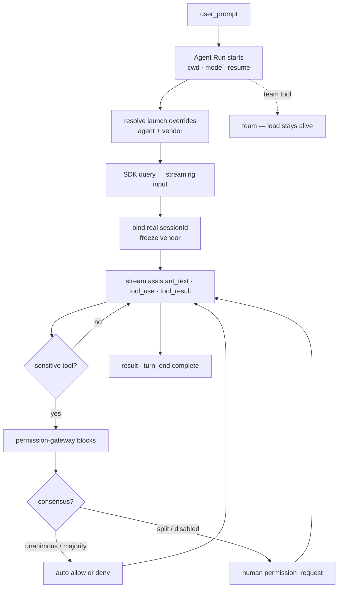

# Flow — Prompt → Gated Run

**Scenario.** The user types a prompt in the browser and submits it against the viewed session.
The agent runs to completion; every sensitive tool is gated through the browser; assistant text
and tool activity stream back live.

**Domains.** web-console · session-registry · agent-config · agent-session · permission-gateway.

This is c3's central loop — the reason the product exists ([project.md](../project.md)). Every
other flow either feeds it (intent, schedule, discussion) or hardens it (run resilience).

## Flow graph

## Preconditions

- A session is the connection's **viewed session** (real or `pending:`), seeded by
  [workspace & session lifecycle](flow-workspace-session-lifecycle.md).
- The session's `cwd`, permission mode, and `resume` id are owned by the Session Runtime
  (`AS-R1`); its agent (and frozen vendor) by agent-config (`AC-R4`, `AC-R6`).

## Main path

1. **web-console → agent-session.** The browser sends `user_prompt`. The runtime starts a new
   Agent Run for the viewed session with that session's `cwd`, mode, and (for a real id) `resume`
   (`AS-R1`). The prompt is echoed as `user_text` so all viewers and switch-back replay see it.
2. **agent-config → agent-session.** `resolveSessionLaunch` supplies the run's launch overrides —
   the bound agent's vendor + `model`/`baseUrl`/`apiKey`/`envOverrides`, else the default agent's
   (`AC-R4`/`AC-R6`). `claude` runs the reference path; `codex`/`opencode` fork to the neutral
   driver (`AS-R*` vendor note, ADR-0011).
3. **agent-session → SDK.** The run drives `query()` in **streaming-input mode** (`AS-R13`), keeping
   the control channel live so `set_mode`/stop reach it.
4. **agent-session → session-registry.** The first `init` message reports the SDK session id; a
   pending session **binds** to the real id (`AS-R10`, `SR-R7`) and **freezes** its vendor
   (`AC-R16`). `session_started` is emitted; the runtime re-keys.
5. **SDK → agent-session → web-console.** Model text, tool-use, and tool-result blocks map to
   `assistant_text` / `tool_use` / `tool_result` (`AS-R9`); other SDK kinds are ignored. Every event
   is buffered for replay and fanned out to viewers (`AS-R11`).
6. **Sensitive tool → permission-gateway.** When the active mode (`AS-R5`) classifies a tool as
   sensitive, the SDK's `canUseTool` invokes the gateway, which produces exactly one Permission
   Request and **blocks the run** (`PG-R1`/`PG-R2`). Runtime status → `awaiting_permission`
   (`AS-R12`).
   - **6a. Consensus pre-step (if enabled).** With `consensus.enabled` and ≥1 same-vendor peer,
     the request is first put to those peers; a unanimous (or, under the majority toggle, a strict
     majority) verdict auto-resolves via `consensus_auto` (`PG-R9`, `PG-R13`,
     [consensus.md](../domains/core/permission-gateway/consensus.md)). A split/abstention falls back
     to the human prompt with the opinions attached.
   - **6b. Human prompt.** Otherwise `permission_request` reaches the browser; the human answers
     `permission_response` (allow → original input unchanged, `PG-R6`; deny → `PG-R7`). Default is
     **deny** (`PG-R4`).
7. **Tool runs, loop continues.** On `allow` the SDK proceeds; steps 5–6 repeat until the SDK
   produces a `result`.
8. **agent-session → web-console.** `result` ends the turn: `turn_end { reason: 'complete' }`
   (`AS-R7`). A non-team run closes its input stream (next prompt resumes a fresh process,
   `AS-R15`); the runtime settles to `idle`.

## Branch — agent team

A run that uses a **team tool** (`TeamCreate` / `SendMessage` / background `Agent`) is recognized
as a persistent team mid-turn: marked `team` once, `team_upgraded` broadcast (`AS-R14`). On
`result` the lead process **stays alive** (`AS-R15`); a further `user_prompt` is **pushed** into
the live lead session (no new process, no `resume`) instead of starting a second run (`AS-R17`).
The team ends **only** on explicit stop (`AS-R16`). Teams are **Claude-locked** — only a vendor
with `streamingPush` can host a lead (`AS-R21`).

## Branch — background execution & replay

The run is **not** bound to the connection that started it (ADR-0006). Closing the socket or
switching the view only unsubscribes; the run continues in its runtime (`AS-R8`). A returning view
replays `baseline + buffer` with no duplication (`AS-R11`) and resumes live delivery. A pending
permission survives the switch — it is keyed by `requestId`, answerable on return (`PG-R3`).

## Branches & exceptions (anti-scenarios)

- **Serial within a session.** A second `user_prompt` while a turn is in flight is rejected with
  `error` and starts nothing (`AS-R2`) — except a `team` session, where it is pushed (`AS-R17`).
- **Switch / close never stops a run.** Only `stop_run` / `delete_session` / `remove_workspace`
  may (`AS-R6`/`AS-R8`).
- **Default-deny is absolute.** Absence of an explicit allow ⇒ deny; a stopped run resolves the
  pending request as deny (`PG-R4`). No timeout on the in-loop (Claude) path (`PG-R2`).
- **No silent sensitive execution.** A tool the SDK deems sensitive never runs without a browser
  decision unless an explicit mode authorizes it (`AS-R5`; `bypassPermissions` requires explicit
  user selection, constitution C-SEC-2/SEC-7).
- **Pre-approved ≠ c3-decided.** A vendor rule-engine auto-allow c3 never decided is audited via
  `preApproved`, surfaced distinctly in the console — never a second decision channel (`PG-R12`).
