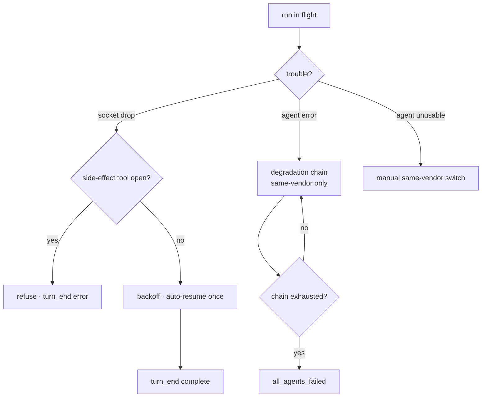

# Flow — Run Resilience

**Scenario.** A run hits trouble that is not the user's fault — the agent's transport socket drops,
the current agent can't work (token-exhausted / rate-limited / host-binary blip), or a vendor's
server is unreachable. c3 recovers without losing context, or fails honestly and never hangs.

**Domains.** agent-session · agent-config · permission-gateway.

This flow hardens [prompt → gated run](flow-prompt-to-gated-run.md). Its overriding invariant: a
run **never silently hangs** — it always reaches a terminal `turn_end` or self-heals
(AVAIL-1/AVAIL-7).

## Flow graph

## Branch A — socket disconnect (prevent, then recover)

1. **Prevent (env injection).** Every Claude child a run spawns receives keepalive transport env
   (`CLAUDE_CODE_REMOTE_SEND_KEEPALIVES`, Bun HTTP idle/retry) at **lowest priority** — a
   user/agent value wins (`AS-R20`). This lowers the rate of `socket connection was closed
unexpectedly` at the source; it is decoupled from recovery.
2. **Detect side-effect safety (the gate).** On disconnect, c3 pairs `tool_use`↔`tool_result` to
   infer mid-turn state. If a **side-effect-class** tool is still open (no result yet), auto-resume
   is **refused** — a write may have half-applied (`AS-R19`). Classification is conservative: only a
   fixed read-only set is side-effect-free; everything else (incl. unknown/MCP) counts as a
   side-effect.
3. **Recover (bounded auto-resume).** For a **normal** session with a clear gate, the run backs off
   3–5s (status `reconnecting`, `AS-R12`) and auto-`resume`s the **same** run **once** with
   `resume: runId`, preserving full context (`AS-R18`). Success ⇒ `turn_end` carries
   `reconnect_attempted: true`.
4. **Fail honestly.** If auto-resume is refused (`AS-R19`), disabled, has no real id, the session is
   a `team`/`intent`, or the single retry is spent, the turn ends `turn_end { reason: 'error' }`
   (carrying `original_error` + gate verdict) and settles to `idle`. The user continues manually — a
   normal `user_prompt` resumes the same session (`AS-R18`).

## Branch B — agent failure → degradation chain

1. **Collect.** A degradable agent error is collected at `onDegradableError`; the launcher publishes
   `agent:error` on the kernel event bus **in addition to** the existing wire frames (`AS-R25`,
   ADR-0018).
2. **Fall back — same vendor only.** `buildAgentsToTry` keeps only **same-vendor** chain agents;
   a different-vendor entry is **skipped, never launched** (`AS-R22`) — a Claude session cannot
   `resume` into Codex. Each fallback advance emits `agent_failed` + publishes `agent:fallback`. A
   fallback opens a **fresh** same-vendor session (degradation never resumes).
3. **Exhaust.** On chain exhaustion the launcher emits `all_agents_failed` (carrying the failure
   list + any `crossVendorSkipped`) and publishes `agent:all_failed`, so the console states honestly
   that cross-vendor candidates were not tried (`AS-R22`, `AS-R25`).

## Branch C — manual same-vendor agent switch

When the current agent is unavailable, the user re-targets the session via the title-bar switcher
(`set_session_agent`). Candidates come from the **same** vendor-homogeneous rule as the chain and
consensus voters (`sameVendorEnabledAgents`, `AC-R19`): only same-vendor, host-binary-present,
enabled peers; a cross-vendor change is rejected (`AS-R23`, `AC-R17`). The switch rewrites the fact
only — it does **not** relaunch; the next `user_prompt` resumes the same run with the new agent via
the unchanged launch path (`AS-R23`). The candidate set rides `session_selected.agentSwitch`.

(`AS-R24`). `select_session` lazily (re)starts it within a 2–10s grace window. A down server
**degrades honestly and self-heals** via background backoff — reachability flips to
overlays from the same source. It is **never fatal** (`AS-R24`).

## Branches & exceptions (anti-scenarios)

- **Never auto-resume after a possible write.** An open `Edit`/`Write`/`Bash`/unknown tool at
  disconnect ⇒ `side_effect_pending`, refuse, end the turn `error` (`AS-R19`). Bias: rather miss an
  auto-resume than wrongly replay a write.
- **Bounded reconnect.** At most **one** auto-resume per turn; a refused/exhausted disconnect must
  never hang — always a terminal `turn_end` (`AS-R18`, AVAIL-1/AVAIL-7).
- **No cross-vendor degradation/switch.** Vendor is frozen (`AC-R17`); a different-vendor chain
  entry or manual switch is skipped/rejected, never launched (`AS-R22`, `AS-R23`).
- **Subscriber isolation.** A kernel-bus subscriber throw is caught per-handler and never reaches
  the run loop (`AS-R25`, ADR-0018); the degradation chain's behaviour is unchanged by eventization.
