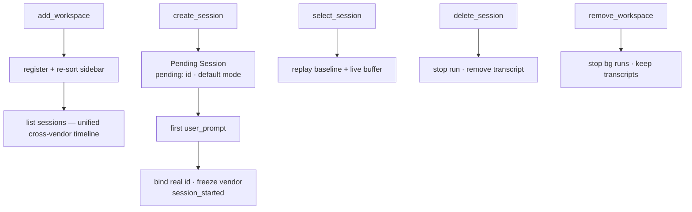

# Flow — Workspace & Session Lifecycle

**Scenario.** The user manages the sidebar: registers a project directory, creates a new session,
selects an existing one (replaying its history), renames or deletes it. The first run of a new
session binds it to a real SDK id and freezes its vendor for life.

**Domains.** web-console · session-registry · agent-session · agent-config.

This flow produces the **viewed session** that [prompt → gated run](flow-prompt-to-gated-run.md)
consumes. It is pure registry/binding work — it never drives `query()` and never stops a run.

## Flow graph

## Add a workspace

1. **web-console → session-registry.** `add_workspace { path }`. A non-directory is rejected with
   `error`, changing nothing (`SR-R1`).
2. The workspace is registered, the sidebar re-sorts by `lastAccessed` descending (`SR-R2`, this
   one is now most-recent), and its session list is returned (`workspaces`, `sessions`).
3. Sessions are listed from the `work_session_metadata` projection, newest-first, one unified
   cross-vendor timeline deduped by `c3_id` (`SR-R4`, `SR-R12`). Each row carries its owning
   `vendor` tag and `state`.

## Create → bind a session

1. **web-console → session-registry.** `create_session` (optionally `{ agentId }`) makes a
   **Pending Session** the viewed session: empty history, a `pending:` id, the per-vendor default
   mode (`SR-R6`, `AC-R8`). An `agentId` is recorded as the session's **intent** (`AC-R18`,
   `AC-R6`); absent ⇒ Auto (resolves `defaultAgentId` at run time). It is not on disk and stops no
   other run.
2. **First `user_prompt`** starts the run ([prompt → gated run](flow-prompt-to-gated-run.md)).
3. **agent-session → session-registry → agent-config.** The run's `init` binds the `pending:` id to
   the real SDK `sessionId` (`SR-R7`, `AS-R10`): the registry persists the mode under the real id,
   the runtime re-keys, and the pending **intent becomes a fact** whose **vendor is frozen**
   (`AC-R16`). `session_started` is emitted; the projection is stamped with the bind time so the
   row sorts to the **top** (`SR-R13`). A pending session that never runs leaves only a mutable
   intent, reaped after 7 days (`AC-R17`).

## Select / view a session

1. **web-console → session-registry.** `select_session` makes it the viewed session and replays its
   full record: `session_selected.history` (on-disk baseline) + the runtime's live buffer tail for
   any in-flight/background turn (`SR-R8`). It reports the stored mode and authoritative runtime
   `status` so the composer locks immediately (`SR-R8`). It stops no run (`AS-R8`).
2. **Resume-only vendors.** A tracked Codex session (`read: 'none'`) replays an **empty baseline +
   live buffer** with a "cannot back-read history" banner (`SR-R8` Codex scenario, WC-R23). c3
   never persists such a vendor's transcript content.
3. **Selecting another session** unsubscribes the old view and subscribes the new; the old run keeps
   running in the background (`SR-R8`, `AS-R8`).

## Rename / delete / remove

- **rename_session** updates the title only.
- **delete_session** stops the session's run, removes the transcript via the SDK, drops its mode
  entry, and clears it if it was viewed/last-active (`SR-R9`).
- **remove_workspace** unregisters the directory and stops any background runs under it, but
  **never** deletes on-disk transcripts (`SR-R10`); a viewed session in it is cleared.

## Branches & exceptions (anti-scenarios)

- **Per-session mode isolation.** Changing mode on session A must never change B's (`SR-R5`).
- **Switch / create never stops a run.** `select_session` / `create_session` must never stop
  another session's run (`SR-R6`/`SR-R8`, `AS-R8`).
- **Vendor is immutable once frozen.** Re-targeting a real session's agent succeeds only within the
  same vendor; a cross-vendor change is rejected (`AC-R17`) — its transcript lives only in that
  vendor's native store.
- **No permission state persisted.** Only workspace/session metadata is persisted; decisions and
  approvals never are (`SR-R11`, ADR-0004/0001).
- **Remove ≠ delete.** `remove_workspace` preserves on-disk sessions (`SR-R10`).
